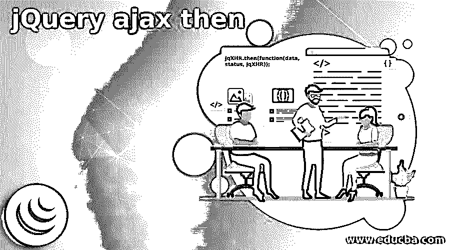
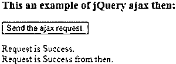
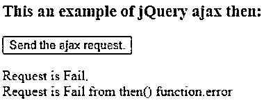

# jQuery ajax

> 原文：<https://www.educba.com/jquery-ajax-then/>




## jQuery ajax 简介

jQuery ajax 是一个 ajax 事件，只有在请求解决、失败或仍在进行中时才会被调用。ajax 是一个全局事件，在文档上触发调用处理函数，它可能正在监听。然后可以在 then()函数的帮助下执行 ajax。jQuery jqXHR.then()函数是 jQuery 中的内置函数。该函数由 jqXHR 指定。当请求完成、失败或正在进行时，将调用 then()函数。

我们可以在 JavaScript promise 对象上使用 jqXHR.then()回调函数(jqXHR 对象通过$。ajax()函数)在 ajax 请求上运行特定的函数。jqXHR.then()回调函数集成了。fail()和。done()函数。

<small>网页开发、编程语言、软件测试&其他</small>

**jQuery jqxhr . then()函数的语法:**

```
jqXHR.then(function(data, status, jqXHR));
```

**参数:**

*   **function(data，status，jqXHR):** 这不是可选参数。它指定当发送的请求完成、失败或正在进行时执行的回调函数。它接受三个参数 data、status 和 jqXHR。data 参数指定从服务器返回的数据，根据 dataType 参数格式化。参数 status 表示请求的状态。参数 jqXHR 表示由＄返回的 XMLHttpRequest 对象。ajax()函数。

### jqXHR.then()函数的工作原理

*   jQuery jqXHR.then()函数接受三个参数。假设我们必须执行异步 HTTP GET 请求来从服务器加载数据，并且在请求成功或失败的任何状态下，调用函数来显示一些消息来通知请求。
*   所以我们可以用 jqXHR.then()函数作为“ajxReq.then(function(data，status，jqXhr){ $(“p”)。追加("
    )请求从此成功。");}，function(data，status，jqXhr){ $(“p”)。append( "
    )请求因 then()函数而失败。");});"，它将显示请求成功或失败的具体消息。

### jQuery jqXHR.then()的示例

下面给出了 jQuery jqXHR.then()的例子:

#### 示例#1

jQuery jqXHR.then()函数示例，用于在 ajax 请求成功时调用处理函数。

**代码:**

```
<!doctype html>
<html lang = "en">
<head>
<meta charset = "utf-8">
<script type = "text/javascript" src = "https://ajax.googleapis.com/ajax/libs/jquery/1.11.2/jquery.min.js">
</script>
<title> This is an example for jQuery ajax then</title>
</head>
<body>
<h3> This an example of jQuery ajax then: </h3>
<button id = "Btn" > Send the ajax request. </button>
<br>
<p style = "color : red"> </p>
<script type = "text/javascript">
$(document).ready( function () {
$('#Btn').click( function(){
// url is correct to get the data
var request = $.ajax( 'http://time.jsontest.com', { dataType: "json" } ),
chained = request.then(function( data ) {
$( "p" ).append( "The request is :" +JSON.stringify( data));
return $.ajax( 'http://time.jsontest.com', { data: { user: data.date } } );
});
});
});
</script>
</body>
</html>
```

**输出:**


**一旦我们点击按钮，输出是:**


在上面的代码中，当我们单击按钮时，ajax()函数将调用，它将 HTTP GET 请求发送到服务器以获取数据。第一个参数提到了从中获取数据的 URL，第二个参数提到了数据类型，以指定期望从服务器得到的响应。接下来，在 ajax()函数的返回对象上使用 jqXHR.then()函数，如果请求成功，jqXHR.then()函数运行处理程序并显示接收到的数据，正如我们在输出中看到的。

#### 实施例 2

jQuery jqXHR.then()函数示例，显示 ajax 请求成功时的通知消息。

**代码:**

```
<!doctype html>
<html lang = "en">
<head>
<meta charset = "utf-8">
<script type = "text/javascript" src = "https://ajax.googleapis.com/ajax/libs/jquery/1.11.2/jquery.min.js">
</script>
<title> This is an example for jQuery ajax then</title>
</head>
<body>
<h3> This an example of jQuery ajax then: </h3>
<button id = "Btn" > Send the ajax request. </button>
<br>
<p style = "color : red"> </p>
<script type = "text/javascript">
$(document).ready( function () {
$('#Btn').click( function(){
// url is correct to get the data, the first handler function of the then() function execute
var ajxReq = $.ajax( 'http://time.jsontest.com', {
contentType : 'application/json',
dataType : 'json'
});
ajxReq.success( function ( data, status, jqXhr ) {
$( "p" ).append( "Request is Success." );
});
ajxReq.error( function ( jqXhr, textStatus, errorMessage ) {
$( "p" ).append( "Request is Fail.");
});
ajxReq.then( function ( data, status, jqXhr ) {
$( "p" ).append( "<br> Request is Success from then. ");
}, function ( data, status, jqXhr ) {
$( "p" ).append( "<br> Request is Fail from then() function." +status);
});
});
});
</script>
</body>
</html>
```

**输出:**


**一旦我们点击按钮，输出是:**




在上面的代码中，当我们单击按钮时，ajax()函数将调用，它将 HTTP GET 请求发送到服务器以获取数据。第一个参数是从中获取数据的 URL 第二个参数是数据类型，用于指定期望从服务器得到的响应。接下来，在 ajax()函数的返回对象上使用 jqXHR.then()函数。jqXHR.then()函数有两个处理函数；如果请求成功，则执行第一个处理函数，如果请求失败，则执行第二个处理函数。在上面的例子中，请求是成功的，所以第一个处理函数执行并显示相应的消息，正如我们在输出中看到的。

#### 实施例 3

重写上面的程序 2，在 ajax 请求失败时显示通知消息。

**代码:**

```
<!doctype html>
<html lang = "en">
<head>
<meta charset = "utf-8">
<script type = "text/javascript" src = "https://ajax.googleapis.com/ajax/libs/jquery/1.11.2/jquery.min.js">
</script>
<title> This is an example for jQuery ajax then</title>
</head>
<body>
<h3> This an example of jQuery ajax then: </h3>
<button id = "Btn" > Send the ajax request. </button>
<br>
<p style = "color : red"> </p>
<script type = "text/javascript">
$(document).ready( function () {
$('#Btn').click( function(){
// url is incorrect to get the data, so, the second handler function of the then() function execute
var ajxReq = $.ajax( 'http://jsontest.com', {
contentType : 'application/json',
dataType : 'json'
});
ajxReq.success( function ( data, status, jqXhr ) {
$( "p" ).append( "Request is Success." );
});
ajxReq.error( function ( jqXhr, textStatus, errorMessage ) {
$( "p" ).append( "Request is Fail.");
});
ajxReq.then( function ( data, status, jqXhr ) {
$( "p" ).append( "<br> Request is Success from then. ");
}, function ( data, status, jqXhr ) {
$( "p" ).append( "<br> Request is Fail from then() function." +status);
});
});
});
</script>
</body>
</html>
```

**输出:**


**一旦我们点击按钮，输出是:**




在上面的代码中，请求失败，因此执行第二个处理函数，并显示来自 jqXHR.then()函数的失败消息，正如我们在输出中看到的。

### 结论——jQuery Ajax

jQuery jqXHR.then()函数是 jQuery 中的内置函数，用于指定 ajax 请求成功、失败或正在进行时要运行的特定处理函数。

### 推荐文章

这是 jQuery ajax 的指南。这里我们分别讨论 jqXHR.then()函数的介绍、工作原理和实例。您也可以看看以下文章，了解更多信息–

1.  [jQuery 选择选项](https://www.educba.com/jquery-select-option/)
2.  [jQuery zindex](https://www.educba.com/jquery-zindex/)
3.  [jQuery 宽度](https://www.educba.com/jquery-width/)
4.  [jQuery id 选择器](https://www.educba.com/jquery-id-selector/)


