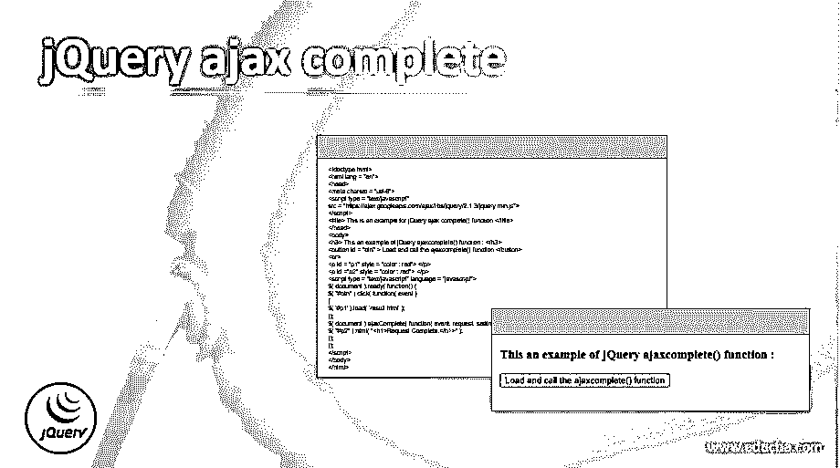
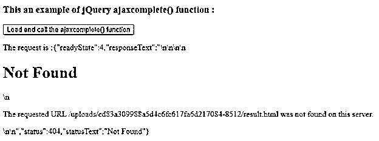

# jQuery ajax 完成

> 原文：<https://www.educba.com/jquery-ajax-complete/>




## jQuery ajax 简介完成

jQuery ajaxComplete()函数用于指定 ajax 请求完成时要运行的处理函数。jQuery ajaxComplete()函数是 jQuery 中的内置函数。ajaxComplete()函数指定的函数要么在 ajax 请求完成时调用，即使没有成功完成，这与 ajaxSuccess()函数不同。

**jQuery Ajax complete()函数的语法—**

<small>网页开发、编程语言、软件测试&其他</small>

```
$(document).ajaxComplete(function( event, xhr, options));
```

**参数—**

**URL–**这不是可选参数。它指定请求被发送到的获取数据的位置或 URL。

**function(event，xhr，options)**–这不是可选参数。它指定了回调函数，该函数将在发送的请求完成时执行。它接受三个参数 event、xhr 和 options。event 参数表示事件对象。参数 xhr 表示 XMLHttpRequest 对象。最后一个参数选项表示 ajax 请求中使用的选项。

**返回值-**

这个函数的返回值是 XMLHttpRequest 对象。

### ajaxComplete()函数的使用

jQuery ajaxComplete()函数接受三个参数。假设我们必须执行异步 HTTP GET 请求来从服务器加载数据，并在请求完成时(可能成功完成，也可能未成功完成)调用函数来显示一些消息以通知请求完成。所以我们可以用 ajaxComplete()函数作为$( document)。ajaxComplete( function(event，request，settings) { $( "#p2 ")。html( "

# )请求完成。

”；});”，在请求完成时显示消息“请求完成”。

### jQuery ajaxComplete()函数的示例

下面举几个例子

#### 示例#1

jQuery ajaxComplete()函数示例，使用 ajax 请求从指定位置加载数据，并在请求完成时显示通知消息

**代码:**

```
<!doctype html>
<html lang = "en">
<head>
<meta charset = "utf-8">
<script type = "text/javascript"
src = "https://ajax.googleapis.com/ajax/libs/jquery/2.1.3/jquery.min.js">
</script>
<title> This is an example for jQuery ajax complete() function </title>
</head>
<body>
<h3> This an example of jQuery ajaxcomplete() function : </h3>
<button id = "btn" > Load and call the ajaxcomplete() function </button>
<br>
<p id = "p1" style = "color : red"> </p>
<p id = "p2" style = "color : red"> </p>
<script type = "text/javascript" language = "javascript">
$( document ).ready( function() {
$( "#btn" ).click( function( event )
{
$( '#p1' ).load( 'result.html' );
});
$( document ).ajaxComplete( function( event, request, settings ) {
$( "#p2" ).html( "<h1>Request Complete.</h1>" );
});
});
</script>
</body>
</html>
```

**上述代码的一个输出是-**


一旦我们点击“加载并调用 ajaxcomplete()函数”按钮，输出是


在上面的代码中，当我们单击按钮时，load()函数将调用，该函数向服务器发送 ajax 请求以获取数据。load()函数从服务器加载数据，并将加载的数据放到所选的元素中。load()函数参数用文件名提到了从哪里获取数据的位置。请求完成后，ajaxComplete()函数将通知消息显示为$(document)。ajaxComplete( function(event，request，settings) { $("#p2 ")。html( "

# )请求完成。

”；});".因此，一旦 ajax 请求完成了“请求完成”。”消息将会显示出来，正如我们在上面的输出中所看到的。

重写上面的 jQuery ajaxComplete()函数示例，通过使用来自指定位置的 ajax 请求来加载数据，并在请求完成时显示请求信息

#### 实施例 2

**代码:**

```
<!doctype html>
<html lang = "en">
<head>
<meta charset = "utf-8">
<script type = "text/javascript"
src = "https://ajax.googleapis.com/ajax/libs/jquery/2.1.3/jquery.min.js">
</script>
<title> This is an example for jQuery ajax complete() function </title>
</head>
<body>
<h3> This an example of jQuery ajaxcomplete() function : </h3>
<button id = "btn" > Load and call the ajaxcomplete() function </button>
<br>
<p id = "p1" style = "color : red"> </p>
<p id = "p2" style = "color : red"> </p>
<script type = "text/javascript" language = "javascript">
$( document ).ready( function() {
$( "#btn" ).click( function( event){
$( '#p1' ).load( 'result.html' );
});
$( document ).ajaxComplete( function( event, request, settings) {
$( "#p2" ).html( "The request is :" + JSON.stringify( request) );
});
});
</script>
</body>
</html>
```

**上述代码的一个输出是-**


一旦我们点击“加载并调用 ajaxcomplete()函数”按钮，输出是




在上面的代码中，当我们单击按钮时，load()函数将调用，它将 ajax 请求发送到服务器以获取数据。load()函数从服务器加载数据，并将加载的数据放到所选的元素中。load()函数参数用数据中的文件名提到了位置。请求完成后，函数显示请求信息，比如请求是否成功，请求是什么，请求的状态以及所有的信息。ajaxComplete( function(event，request，settings) { $("#p2 ")。html("请求为:"+JSON . stringify(request))；});".所以，一旦 ajax 请求完成，请求信息就会显示出来；正如我们在上面的输出中看到的，请求没有成功。

### 结论 jQuery ajax 完成

jQuery ajaxComplete()函数是 jQuery 中的一个内置函数，它指定当 ajax 请求成功或失败时运行的处理函数。而 ajaxSuccess()函数只有在 ajax 请求完成时才运行。

### 推荐文章

这是一个关于 jQuery ajax 的完整指南。这里我们讨论 jQuery ajaxComplete()函数的工作原理和示例。您也可以看看以下文章，了解更多信息–

1.  [jQuery 属性对属性](https://www.educba.com/jquery-prop-vs-attr/)
2.  [jQuery 可见性](https://www.educba.com/jquery-visibility/)
3.  [jQuery 替换 div 内容](https://www.educba.com/jquery-replace-div-contents/)
4.  [jQuery grep](https://www.educba.com/jquery-grep/)


