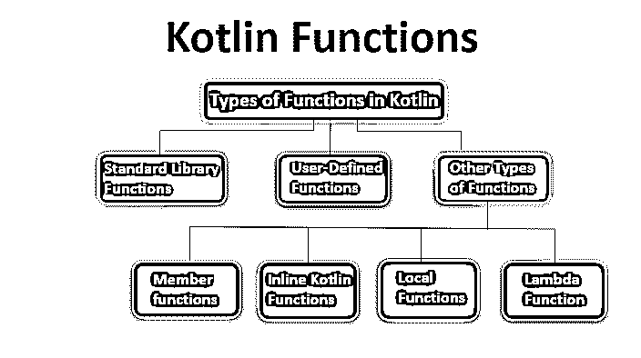

# 科特林函数

> 原文：<https://www.educba.com/kotlin-functions/>




## Kotlin 函数简介

就像大多数其他的[编程语言](https://www.educba.com/what-is-a-programming-language/)一样，你可以在 Kotlin 中创建和利用函数。您可以将函数视为任何程序的基本构件。这些用于简化代码和节省时间。程序中的函数是一组完成特定任务的相关语句和指令。一旦一个函数被制作出来，我们就可以在程序中随时调用它；这消除了在一个程序中多次编写相同语句的繁琐。函数是将任何 Kotlin 代码分解成模块块的好方法。它有助于减小程序的大小，但也会使代码更具可重用性。

在 Kotlin 中，我们可以通过使用关键字“fun”来声明一个函数。如您所料，我们可以向它传递参数，并且需要用 Kotlin 中的函数设置一个返回类型。

<small>网页开发、编程语言、软件测试&其他</small>

### Kotlin 中的函数

在 Kotlin 中声明函数的一般语法如下:

`fun nameOfFunction(param1: Type1, param2: Type2,..., paramN: TypeN): Type {
// Body of the method here
}`

**换句话说:**

```
fun nameOfFunction (arguments_here): return_type {
// function body
}
```

例如，下面是一个函数，我们可以用它来计算两个数字的平均值:

**代码:**

```
fun avg(a: Double, b: Double): Double {
return  (a + b)/2
}
```

调用函数和其他语言一样简单:

平均值(10.0，20.0)

如您所料，运行代码的结果是 15。

### Kotlin 中的函数类型

根据函数的来源，我们可以将其分为两种类型。

*   科特林标准库函数
*   用户定义的 Kotlin 函数

#### 1.标准库函数

为了节省用户执行常见任务的时间， [Kotlin](https://www.educba.com/what-is-kotlin/) 提供了一些标准库函数，用户无需定义即可在程序中使用。比如说。Print()是一个常用功能，用于向显示器显示消息。类似地，sqrt()是一个标准库函数，用于计算所提供数字的平方根。

**举例:**

**代码:**

```
fun main(args: Array<String>){
var number = 100
var result = Math.sqrt(number.toDouble())
print("The root of $number = $result")
}
```

在这里，sqrt()不必在使用之前声明。

以下是 Kotlin 中一些常见的标准库函数:

*   **print()** :将消息打印到输出端。
*   **printIn()** :打印消息，然后将光标移动到下一行。
*   **dec()** :将给定数字的值减一。
*   **plus()** :用于将两个数值相加。
*   **minus()** :用于将两个 1 值相减。
*   **div()** :将一个值与另一个值相除。
*   **plusAssing()** :将一个数字与另一个数字相加，然后将求和结果赋给第一个数字的位置。
*   **sqrt()** :正如我们已经看到的，它用于计算给定数字的平方根。

#### 2.用户定义的函数

虽然标准库有一些通用函数来完成一些基本的和重复的任务，但最终，您会发现需要声明自己的函数。由用户声明和定义的函数称为用户定义函数。我们已经在这里看到了声明 Kotlin 函数的语法；让我们看看另一个将两个数相加的例子。

**代码:**

```
fun main(args: Array<String>){
sum()
print("Addition Done")
}
fun sum(){
var num1 = 55
var num2 = 30
println("Answer of addition = "+(num1+num2))
}
```

**输出:**

加法答案= 85

添加完成

根据它们的制作方式，以下是一些其他类型的函数:

#### 3.成员函数

正如你所猜测的，成员函数是在一个对象、接口或类内部定义的。这些用于将模块化带入另一个层次:

**代码:**

```
class draw_Circle {
fun areaCalculate(radius: Double): Double {
require( radius > 0, { " Please pick radius more than zero " } )
return Math.PI * Math.pow(radius, 2.0)
}
}
```

上面有一个成员函数 areaCalculate()，需要一个半径来计算圆的面积。

#### 4.内联 Kotlin 函数

当一个函数在 main()函数中声明时，我们称之为内联函数。这些都是用一些时间来节省时间的。下面是 Kotlin 中一个内联函数的例子，它取两个整数值 int1 和 int2，然后将它们相加。

**代码:**

```
fun main(args : Array < String > ) {
val sum = {int1: Int, int2: Int -> int1+ int2 }
println (" 5 + 6 = ${sum(5,6)} ")
}
```

**输出:**

5 + 6 = 11

#### 5.本地功能

我们可以在 Kotlin 中的函数内部声明函数；这些被称为局部函数。

**代码:**

```
fun outerFunction(param: String) {
fun localFunction(innerParam: String) {    // This is the local function
println(innerParam)
println(param)
}
}
```

#### 6.λ函数

λ是 Kotlin 中的高级函数。简而言之，它是一个匿名函数。我们可以在 Kotlin 中定义自己的 Lambda，并将其传递给函数。

**代码:**

```
fun main(args: Array<String>) {
val myfunctionlambda :(String)->Unit = {s:String->print(s)}
val v:String = "educba.com"
myfunctionlambda (v)
```

正如你在上面看到的，我们将自己的 lambda 命名为“myfunctionlambda”，然后，我们传递了一个字符串类型的变量，它的值是“educba.com”

**输出:**

执行后，上面的代码将显示以下结果:

educba.com

### 结论

现在您已经熟悉了上面的内容、它们的用途和类型，您可以在您的程序中声明和使用它们了。函数不仅有助于保持代码整洁；在大型程序的情况下，您还会看到这些是编程的核心支柱，使开发变得更加容易。编写您自己的函数以便在代码中重用，并使用标准库函数将对您的编程生涯大有帮助。

### 推荐文章

这是 Kotlin 函数的指南。这里我们已经通过例子讨论了 Kotlin 中不同类型的函数。您也可以看看以下文章，了解更多信息–

1.  [C++字符串函数](https://www.educba.com/c-plus-plus-string-functions/)
2.  [c++中运算符的类型](https://www.educba.com/c-plus-plus-operators/)
3.  [科特林算子](https://www.educba.com/kotlin-operators/)
4.  [安装 Kotlin](https://www.educba.com/install-kotlin/)


