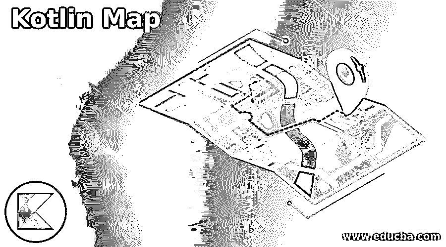
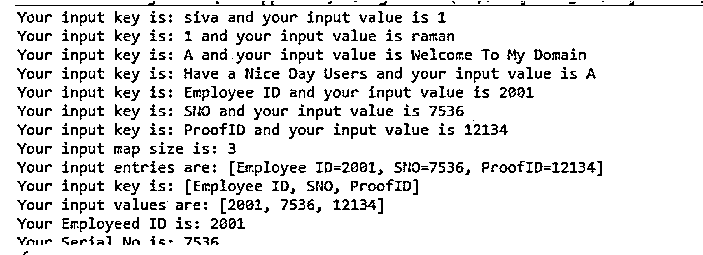
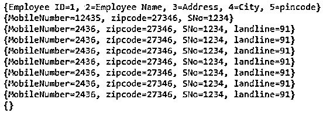

# 这是一个锅的地图。这是一个锅的地图。这是一个锅的地图，这是一个锅的地图，这是一个锅的地图，这是一个锅的地图

> 原文：<https://www.educba.com/kotlin-map/>




## 科特林地图简介

科特林地图是其中一个功能，它是通用的集合接口。它用于存储键值对中的元素，类似于 java 对映射条目的基于键的访问是通过各种特定于映射的值来实现的，并且键必须是唯一的，它保存具有单个值的每个键，并且它还喜欢不同的对，例如整数与字符串的组合、整数和字符等。地图接口是可变的，所以它不能被改变，固定的大小和方法只是读访问。

**语法:**

<small>网页开发、编程语言、软件测试&其他</small>

kotlin 语言使用了许多与 java 相似的特性，如集合、util 包甚至其他包类，其方法行为与 java 相同。map 是可以像 java 一样将数据保存为键值对的接口之一。

```
fun main(args:Array<String>)
{
val vars:Map<Int,String> = mapOf<Int,String>(key to value)
-----some coding logics it depends upon the application requirement---
}
```

以上代码是在 kotlin 上使用地图界面的基本语法。映射接口使用任何类型，如整数、字符串、字符作为参数类型。

### Kotlin 中的地图功能是如何工作的？

*   映射是用于将数据存储为键值对的接口。像 java 一样，它可以是相同的类型和特性。在科特林成功了。这个键是唯一的，它只为每个键保存一个值；它也不同的配对和互相结合。它是不可变的，而且是固定大小的，所以在声明了映射大小之后，静态和动态都不能改变。来自地图接口的成员是可读的，所以我们不能编辑和改变。如果我们使用 mutablemap 接口，它支持读写访问。
*   键类型是不变的，它作为参数被接受；它使用类似 containsKey()的方法，并且返回密钥集。像映射值也是协变的，如果需要，它的值类型也可以改变。在映射接口上使用的类可以是任何类型；这是因为 kotlin 包内部使用的类。该地图是科特林语言中的任何类型；键和值元素将存储为单独的索引；它接受谓词参数，过滤条件将是负类型，键将是唯一的，它有许多值。

### 科特林地图示例

以下是科特林地图的示例:

#### 示例#1

**代码:**

```
package one;
fun main(args: Array<String>)
{
val map = mapOf(1 to "Siva", 2 to "raman" , 3 to "Welcome", 4 to "To", 5 to "My Domain", 12 to "Its the twelth index and key value", 13 to "Its the thirteen index and key value", 14 to "Its the fourteen index and key value", 15 to "Its the fifteen index and key value")
println( map)
println("Its the first example for reagrding the kotlin map interface we used different classes and methods that can be related to the interface")
val map1 = mapOf(6 to "Have a Nice Day users", 7 to "Its the Seventh index and key value" , 8 to "Its the eigth index and its key value", 9 to "Its the ninth index and its key value", 10 to "Its the tenth index and its key value", 11 to "Its the eleventh index and its key value")
println("Thank you users for to spenting the time with our application your entries are : "+map1)
println("Its the keys entries and it is used to store the variable : "+map1.keys )
println("Its the values the entries are used to store as the separate variable "+map1.values )
}
```

**输出:**


在上面的例子中，我们使用了一个 map 接口，它将用户输入存储为键值对。我们可以使用 mapOf()方法来设置键值并相应地打印它们。

#### 实施例 2

**代码:**

```
package one;
fun main(args: Array<String>)
{
val first = mapOf("siva" to 1, 1 to "raman", 'A' to "Welcome To My Domain", "Have a Nice Day Users" to 'A')
val second = mapOf<String, Int>("Employee ID" to 2001, "SNO" to 7536, "ProofID" to 12134)
for ((k,v) in first) {
println("Your input key is: $k and your input value is $v")
}
second.forEach { (k, v) ->
println("Your input key is: $k and your input value is $v")
}
val third = mapOf<String, Int>("Employee ID" to 2001, "SNO" to 7536, "ProofID" to 12134)
println("Your input map size is: ${third.size}")
println("Your input entries are: ${third.entries}")
println("Your input key is: ${third.keys}")
println("Your input values are: ${third.values}")
println("Your Employeed ID is: ${third.get("Employee ID")}")
println("Your Serial No is: ${third["SNO"]}")
println("Your proofs are: ${third.getValue("ProofID")}")
println("Your Employeed ID contains: ${third.containsKey("Employee ID")}")
println("Your Serial No contains: ${third.contains("SNO")}")
println("Your ProofID contains: ${"Chemistry" in third}")
println("If any of the columns or attributes missing please add it separately: ${third.containsValue(1234566)}")
println("The Additional or Missing attribute inputs are: ${third.getOrDefault("pincode",600063)}")
}
```

**输出:**




在第二个例子中，我们在 mapOf()方法中使用了键值条目，并且使用 for 循环，我们可以迭代键值条目并在控制台上打印它们。

#### 实施例 3

**代码:**

```
package one;
fun main(args: Array<String>)
{
val third = mutableMapOf("Employee ID" to 1, 2 to "Employee Name", 3 to "Address", 4 to "City", 5 to "pincode")
val four = mutableMapOf<String, Int>("MobileNumber" to 12435, "zipcode" to 27346, "SNo" to 1234)
println(third)
println(four)
val five = mutableMapOf<String, Int>("MobileNumber" to 2436, "zipcode" to 27346, "SNo" to 1234, "landline" to 91)
five.put("zipcode", 27346)
println(five)
five["SNo"] = 1234
println(five)
five.putIfAbsent("landline", 91)
five.putIfAbsent("MobileNumber", 2436)
println(five)
five.replace("Employee ID", 1)
println(five)
five.replace("Employee Name", 2, 3)
println(five)
five.remove("Address")
println(five)
five.remove("City", 4)
println(five)
five.clear()
println(five)
}
```

**输出:**




在最后一个例子中，我们使用了一个可变的 map 接口来存储键值对的用户输入。我们使用 remove()、replace()、clear()等附加方法来执行操作。

### 结论

在 kotlin 中，我们使用了大量的 collection util 包来存储、提取和检索数据。根据需求，我们使用特定的 util 包，如 map、list in a map，我们使用一组不同的接口及其方法来实现取决于用户需求的应用程序。

### 推荐文章

这是科特林地图指南。这里我们讨论一下入门，如何在 Kotlin 中映射函数作品？和示例。您也可以看看以下文章，了解更多信息–

1.  [科特林范围](https://www.educba.com/kotlin-range/)
2.  [科特林循环](https://www.educba.com/kotlin-loops/)
3.  [科特林构造函数](https://www.educba.com/kotlin-constructors/)
4.  [马尔可夫逻辑网络](https://www.educba.com/markov-logic-network/)


