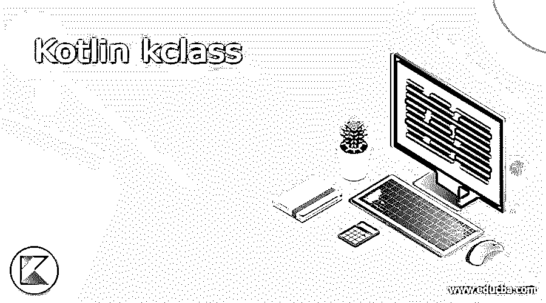

# 科特林 kclass

> 原文：<https://www.educba.com/kotlin-kclass/>




## Kotlin kclass 简介

kotlin kclass 是 java.lang 包之类的语言中的一种类型，它主要用于保存 kotlin 类的引用。使用这些类，反射概念将发挥广泛的作用，使用指定类(如 kclass)的类型参数，它可以通过使用引用来引用，因此 KClass 被称为 lang 包的对等物，它也可以被枚举和访问 所有可能包含子类和父类的方法声明，我们通过调用 class name:: class model 来获得 KClass 的实例。

**语法:**

<small>网页开发、编程语言、软件测试&其他</small>

在 kotlin 语言中，类是实现应用程序最重要的部分，我们在应用程序的任何区域调用它的方法和属性。我们可以使用许多 api 来表示这些类。就像那样，KClass 是可以充当数据类型的类型之一。

```
class name
{
val variablename= name();
val varname= variablename.javaClass.kotlin
-----some logics depends on the requirement—
}
interface kclass<>{
val vars:String // any datatype
-------some declaration codes ---
}
```

以上代码是在类和接口上使用 kclass 的基本语法。我们可以用特定的数据类型声明变量，并且可以通过 kclass 类型调用它。

### kclass 在科特林是如何工作的？

一般来说，kotlin 类可以处理许多场景来实现应用程序。我们可以使用许多方法来执行用户操作，并且可以借助类对象调用 main 方法。kclass 类型与超类和接口一起被映射和序列化，成为 java lang 包的对应物。它是与类相关的任何类型，在创建类的对象时，它保存每个 kotlin 类的引用，它允许您在反射端处理这些类，它指定哪个 kotlin 类和它可以被任何引用引用。我们使用 java 方法获取类实例，同时使用 Class.forName 方法，然后它将它转换为 KClass 例程。我们也传递类和列表类型的参数，它不包括内部和外部类的类型参数。参数实参类似于 KTypeParameters，它可以传递给抽象和非抽象的类和方法。我们还从 JVM(java 虚拟机)在运行时对 KClass 类型上的类进行了分类。

#### 示例#1

```
`package one
import java.io.Serializable
import kotlin.reflect.full.superclasses
class Test:Serializable{
}
fun main(args: Array<String>) {
val eg = Test::class
println(eg.superclasses)
val p: Int = 54
val q: Int = 76
val sum = p + q
println("The total sum is: $sum")
val r = listOf("jan", "feb", "mar", "apr", "may", "jun", "jul", "aug", "sep", "oct")
val s = r.groupingBy { it.first() }
.fold({ key, _ -> key to mutableListOf<String>() },
{ _, accumulator, element ->
accumulator.also { (_, list) -> if (element.length % 2 == 0) list.add(element) }
})
val t = s.values.sortedBy { it.first }
println(t)
val v = listOf("jan", "feb", "mar", "apr", "may", "jun", "jul", "aug", "sep", "oct")
val u = r.groupingBy { it.first() }
.fold(listOf<String>()) { acc, e -> if (e.length % 2 == 0) acc + e else acc }
println(u)
val fd = listOf(32, 35, 73, 12, 17, 212, 31, 53, 84)
val rf = fd.reduce { rf, vars -> rf + vars }
val mp = HashMap<Int, String>()
mp.put(1, "siva")
mp.put(2, "raman")
mp.put(3, "welcome")
mp.put(4, "users")
mp.put(5, "have")
mp.put(6, "a")
mp.put(7, "nice")
mp.put(8, "day")
val akeys = ArrayList(mp.keys)
val avalues = ArrayList(mp.values)
println("Your input keys are : $akeys")
println("Your input values are: $avalues")
val y = listOf("mar", "apr", "may", "jun", "jan", "jul", "aug", "sep", "oct")
val out= y.reduceRight{ news, eg -> "$eg-$news" }
println(out)
}`
```

**样本输出:**


在上面的例子中，我们使用 KClasses 和 hashmap 这样的集合概念，通过键值对来存储数据。

#### 实施例 2

```
`package one
import java.lang.reflect.*
import kotlin.reflect.KClass
import kotlin.reflect.KType
import kotlin.reflect.KTypeProjection
import kotlin.reflect.KVariance
import kotlin.reflect.full.createType
inline fun <reified T : Any> getKType(): KType =
object : demos<T>() {}.first()
@Suppress("unused")
open class demos<T>
fun demos<*>.first(): KType =
javaClass.genericSuperclass.toKType().arguments.single().type!!
fun KClass<*>.toInvariantFlexibleProjection(arguments: List<KTypeProjection> = emptyList()): KTypeProjection {
val eg = if (java.isArray()) listOf(java.componentType.kotlin.toInvariantFlexibleProjection()) else arguments
return KTypeProjection.invariant(createType(eg, nullable = false))
}
fun Type.toKTypeProjection(): KTypeProjection = when (this) {
is Class<*> -> this.kotlin.toInvariantFlexibleProjection()
is ParameterizedType -> {
val p = (rawType as Class<*>).kotlin
p.toInvariantFlexibleProjection((p.typeParameters.zip(actualTypeArguments).map { (parameter, argument) ->
val projection = argument.toKTypeProjection()
projection.takeIf {
parameter.variance == KVariance.INVARIANT || parameter.variance != projection.variance
} ?: KTypeProjection.invariant(projection.type!!)
}))
}
is WildcardType -> when {
lowerBounds.isNotEmpty() -> KTypeProjection.contravariant(lowerBounds.single().toKType())
upperBounds.isNotEmpty() -> KTypeProjection.covariant(upperBounds.single().toKType())
else -> KTypeProjection.STAR
}
is TypeVariable<*> -> TODO()
else -> throw IllegalArgumentException("Thank you users It is a Unsupported format type: $this")
}
fun Type.toKType(): KType = toKTypeProjection().type!!
fun main(eg: Array<String>) {
println(getKType<List<Map<String, Array<Double>>>>())
println("Welcome To My Domain its a second example regarding the kotlin kclass type")
println(getKType<Array<*>>())
}`
```

**输出:**


在第二个例子中，我们使用了 KType 及其方法，这有助于利用和覆盖 KClasses。

#### 实施例 3

```
package one;
import java.io.Serializable
import kotlin.reflect.full.superclasses
class Third:Serializable{
fun eg1() {
println("Its a first method")
}
fun eg2() {
println("Its a second method")
}
fun eg3() {
println("Its a third method")
}
}
abstract class sample{
abstract fun eg4()
abstract fun eg5()
}
class new1 : sample() {
override fun eg4(){
val m=12
println(m)
}
override fun eg5(){
println("Its a second method which inherits from the new class")
}
}
fun main(args: Array<String>) {
val eg = Third::class
println(eg.superclasses)
val eg1= new1::class
println(eg1.superclasses)
}
```

**输出:**


在最后一个例子中，我们使用抽象类概念来实现应用程序，另外还使用了 class。

### 结论

在 Kotlin 语言中，我们使用了许多默认的类和方法来实现应用程序，克服了基于 java 的应用程序及其任务。就像 KClass 是用来存储类的引用的类型之一，它的方法用来覆盖程序员要求的方法。

### 推荐文章

这是 Kotlin kclass 的指南。在这里我们讨论介绍，语法，kclass 如何在 Kotlin 中工作？代码实现示例。您也可以看看以下文章，了解更多信息–

1.  [釜用 JSON](https://www.educba.com/kotlin-json/)
2.  [科特林元组](https://www.educba.com/kotlin-tuple/)
3.  [科特林滤波器](https://www.educba.com/kotlin-filter/)
4.  [科特林地图](https://www.educba.com/kotlin-mapof/)


