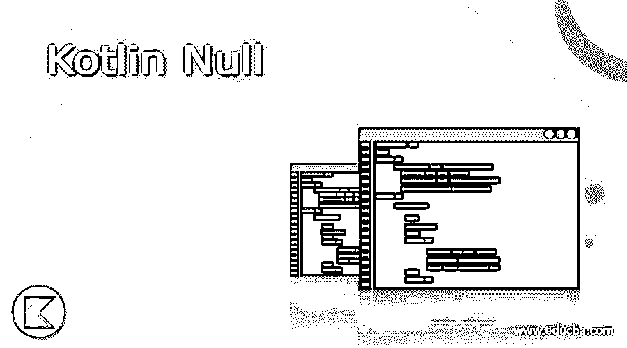
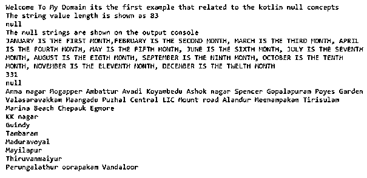
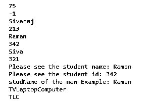

# Kotlin Null

> 原文：<https://www.educba.com/kotlin-null/>




## Kotlin Null 简介

Kotlin null 是引用值的类型它必须是 null 或没有值，并且不能使用正常的属性值来处理。不能保存 null 值的变量意味着它将在编译时抛出错误，因此 Kotlin 既不允许 null 值作为参数传递，也不允许 null 对象引用，除非它指定变量可以是编译器允许的 null 类型，并且它知道变量值可以是 null，这样的变量在 kotlin 中被称为可空值。

**语法:**

<small>网页开发、编程语言、软件测试&其他</small>

在 kotlin 语言中，我们使用了许多默认的类、方法和变量来实现应用程序。对于每个变量，我们指定类似数据类型的类型来声明和传递基于该数据类型的值。null 是引用的类型，因此它只接受可为 null 的值。

```
fun main()
{
var variablename: datatype = values // It is the regular initialization it accepts non-null values by default
variablename = null // It shows the compilation error
}
```

以上代码是在变量中声明和初始化空值的基本语法。

### null 在 Kotlin 中是如何工作的？

kotlin 语言有许多类型，它旨在消除可空变量引用的危险。许多语言都是分流访问空引用的成员，会导致空引用异常。与 java 语言一样，这相当于导致 kotlin 语言的 NullPointerException。我们用了"！!"运算符，并显式调用和以在应用程序控制台中引发 NullPointerException()。一般来说，数据不一致被认为是为了初始化和未初始化的构造函数使用“this”关键字和传递的值。超类构造函数调用在派生类部分实现的开放类型的成员函数，并且使用未初始化状态。尝试访问平台类型的空引用成员的互操作和泛型类型的可空性问题，它正用于 java 互操作。它看起来像是一段代码，可以根据需求将空值添加到 kotlin 集合和其他 util 包中。但其余的事情是由区分引用的外部代码类型引起的，它可以保存可空引用和非空值。使用用于迭代和验证代码中的空值的条件语句和循环。

#### 示例#1

```
fun main(args: Array<String>) {
var str: String? = "Welcome To My Domain its the first example that related to the kotlin null concepts"
println(str)
if (str != null) {
println("The string value length is shown as ${str.length}")
} else {
println("The null strings are shown on the output console")
}
str = null
println(str)
if (str != null) {
println("The string value length is shown as ${str.length}")
} else {
println("The null strings are shown on the output console")
}
var str1: String? = "January is the first month,February is the second month, March is the third month, April is the fourth month, May is the fifth month, June is the sixth month, July is the seventh month, August is the eigth month, September is the ninth month, October is the tenth month, November is the eleventh month, December is the twelth month"
var str2: String? = null
println(str1?.toUpperCase())
println(str1?.length)
println(str2?.toUpperCase())
var str3: List<String?> = listOf("Anna nagar Mogapper Ambattur Avadi Koyambedu Ashok nagar Spencer Gopalapuram Poyes Garden","Valasaravakkam Maangadu Puzhal Central LIC Mount road Alandur Meenampakam Tirisulam Marina Beach Chepauk Egmore", null, "KK nagar", "Guindy", "Tambaram", "Maduravoyal","Mayilapur","Thiruvanmaiyur","Perungalathur oorapakam Vandaloor",null)
var str4 = listOf<String?>()
for (x in str3) {
x?.let { str4 = str4.plus(it) }
x?.also{it -> println(it)}
}
}
```

**输出:**




在上面的例子中，我们检查了空引用和集合列表来验证数据。

#### 实施例 2

```
interface Second {
val x : Int
val y : String
get() = "Welcome To My Domain its the second example that related to the kotlin null"
fun demo1()
}
class secondClass : Second {
override val x : Int
get() = 54
override fun demo1()
{
println("Have a Nice Day users please try again")
}
}
class Example
{
var studName: String = ""
var studId: Int = 0
fun studDetails(str1: String, in1: Int) {
studName = str1
studId = in1
println("Please see the student name: $studName")
println("Please see the student id: $studId")
}
}
fun main(args: Array<String>) {
var a : String? = "Welcome To My Domain its the second example that related to the kotlin null"
println(a?.length)
a = null
println(a?.length ?: "-1")
var std1 = Example()
val stdset=setOf("Sivaraj",213,"Raman",342,"Siva",321)
for(i in stdset){
println(i)
}
std1.studDetails("Raman", 342)
println("studName of the new Example: ${std1.studName}")
val nul1 = setOf("TV" , "Laptop", "Computer")
val nul2 = setOf( 'T' , 'L' , 'C' )
for(i in nul1)
print( i )
println()
for(i in nul2)
print( i )
println()
}
```

**输出:**




在第二个例子中，我们使用类、接口来实现带有空值引用的应用程序。

#### 实施例 3

```
sealed class Hospital{
class TMF(var hspId: Float): Hospital()
class Appolo(var hspId: Int): Hospital()
class Kauvery(var hspId: Int, var hspgst: Int): Hospital()
}
fun demo(h: Hospital) =
when (h) {
is Hospital.TMF ->println("TMF surface area is ${1*h.hspId*h.hspId}")
is Hospital.Appolo ->println("Appolo surface area is ${h.hspId*h.hspId}")
is Hospital.Kauvery ->println("Kauvery surface area is ${h.hspId*h.hspgst}")
}
fun main(args: Array<String>) {
var a : String? = "Welcome To My Domain its the third example that related to the kotlin null"
println(a!!.length)
a = null
var TMF = Hospital.TMF(32.23f)
var Appolo = Hospital.Appolo(4)
var Kauvery = Hospital.Kauvery(6,8)
demo(TMF)
demo(Appolo)
demo(Kauvery)
}
```

**输出:**


在最后一个例子中，我们验证了密封类使用的空检查。

### 结论

在 kotlin 语言中，我们使用了许多默认的类、方法和变量来实现应用程序，并且基于我们导入的包和类的需求，方法将在脚本中被调用。null 是关键字，它用于验证变量值，或者另一个验证取决于 null 引用的用法。

### 推荐文章

这是 Kotlin Null 的指南。在这里，我们讨论介绍，语法，如何在 Kotlin 空作品，代码实现的例子。您也可以看看以下文章，了解更多信息–

1.  [科特林代表](https://www.educba.com/kotlin-delegate/)
2.  [科特林拉姆达](https://www.educba.com/kotlin-lambda/)
3.  [科特林布尔](https://www.educba.com/kotlin-boolean/)
4.  [科特林静态函数](https://www.educba.com/kotlin-static-function/)


