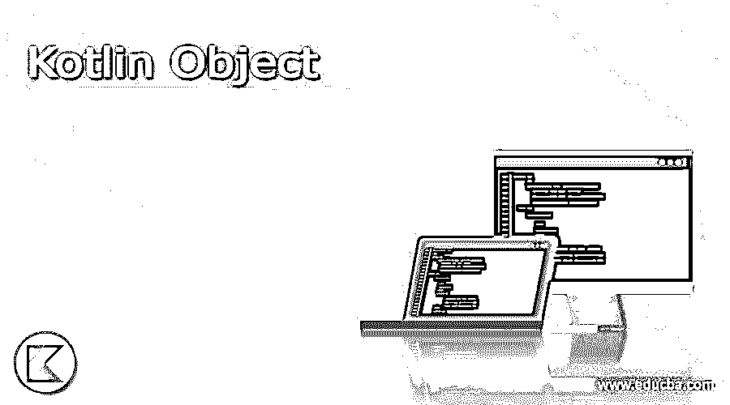
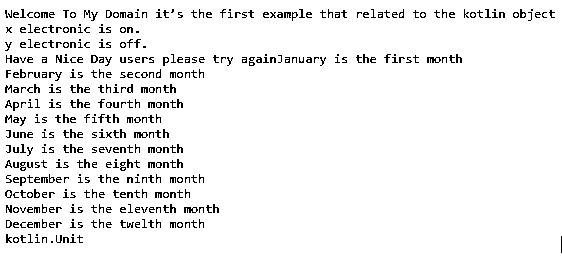

# 科特林物体

> 原文：<https://www.educba.com/kotlin-object/>




## Kotlin 对象简介

Kotlin object 是一个关键字，它既声明了类，又创建了一个用户操作到另一个用户操作的实例。它可以是嵌套类，可以包含与外部类相关的成员，这些成员不需要外部类的实例。kotlin object 还创建了匿名类型的类，它被称为匿名对象，用于创建对某些类型的类和接口稍作修改的对象，而无需声明子类。

**语法:**

<small>网页开发、编程语言、软件测试&其他</small>

在 kotlin 中，object 是 main 关键字，可用于创建类和表达式的实例，以满足在不声明子类的情况下创建某些类和接口的需要。

```
object objectName
{
var VarName: datatype
fun method()
{
VarName = values
}
}
fun main(args:Array<String>)
{
val vars: datatype
vars = objectName.method()
}
```

上述代码是用于在 kotlin 应用程序中创建对象的基本语法，它取决于代码中使用和调用的类和方法的要求。

### Kotlin 中的对象如何工作？

kotlin 提供了一种使用 object 关键字创建对象声明特性的简单方法。基本上，对象声明包含属性、方法等。根据 kotlin，object 是一个特殊的类，它只包含一个实例，如果我们用 object 关键字创建这个类，就可以用它来代替这个类。还有 kotlin 编译器，它创建对象的构造函数，可以是任何修饰符，比如 public-private，甚至 protected for，它创建对象的静态引用，并初始化静态块中的引用。使用 new 运算符和关键字需要创建类的实例，还需要调用构造函数的 single 和 postfix 参数。将使用类的名称提供构造函数的名称，该类可以使用对象创建来实例化。实例主要指的是类的内存区域和它的地址，一旦类被实例化，使用一个新的关键字成为对象。因此实例化也被称为构造，并不是所有的类都可以被实例化，所以它主要被称为抽象类，可以被实例化的类被称为具体类。

#### 示例#1

```
class Example1
{
private var Active: Boolean = true
fun RobotMode() {
Active = true
}
fun RobotModeOff() {
Active = false
}
fun RobotOperations(electronic: String) {
if (Active == true)
println("$electronic electronic is on.")
else
println("$electronic electronic is off.")
}
class subClass {
fun month() = "Have a Nice Day users please try again"
}
private val strs: String = "Please see below list of months in the year"
inner class exam1 {
fun mnths() = strs
fun exm2()
{
println("January is the first month")
println("February is the second month")
println("March is the third month")
println("April is the fourth month")
println("May is the fifth month")
println("June is the sixth month")
println("July is the seventh month")
println("August is the eight month")
println("September is the ninth month")
println("October is the tenth month")
println("November is the eleventh month")
println("December is the twelth month")
}
}
}
fun main(args: Array<String>) {
println("Welcome To My Domain it’s the first example that related to the kotlin object")
val x = Example1()
val y = Example1()
x.RobotMode()
y.RobotModeOff()
x.RobotOperations("x")
y.RobotOperations("y")
val z = Example1.subClass().month()
print(z)
val demo1 = Example1().exam1().exm2()
print(demo1)
}
```

**输出:**




在上面的例子中，我们使用对象创建来执行机器人和电子设备操作。

#### 实施例 2

```
fun main(args: Array<String>) {
var Electricals :Devices = object:Devices {
override fun TV() {
println("Welcome To My Domain its the second example that related to the kotlin object ")
println("Some of the tv companies are Samsung, Onida, BPL, EAirtec, Airtel, Vu,Sony, Oscar, TCL, LG, Panasonic, Xiaomi")
}
}
Electricals.TV()
Amounts()
var amt= Amounts()
amt.mthd1(426365,"Sivaraman",5653f)
println("${amt.name}")
}
interface Devices {
fun TV()
}
class Amounts {
var inv_no: Int = 0
var name: String = ""
var amnt: Float = 0.toFloat()
fun mthd1(inv: Int,n: String, am: Float ) {
inv_no=inv
name=n
amnt=am
println("Your total amount is calculated and see the format ${inv_no} holder :${name} amnt :${amnt}")
}
fun PC() {
println("Some of the PC manufacturer companies are: Sony, Dell, Lenovo, HCL, Infosys, Apple, Wipro, Microsoft, Hewlett-Packard")
}
fun Fridge() {
println("some of the fridge manufacturer companies are: Godrej, Whirlpool, Bosch, Samsung, Siemens, Electrolux, Videocon, LG, Haier, Panasonic ")
}
fun Laptop() {
println("some of the laptop manufacturer companies are Dell, Lenovo, HCL, HP, Wipro, Thinkpad, Apple, Samsung, Sony, Acer, NEC, Fujiitsu")
}
}
```

**输出:**


在第二个例子中，我们使用类和接口方法计算电子设备成本。创建一个对象，并在 main 方法中调用每个方法。

#### 实施例 3

```
class thirdExample {
private var strs: String = "<DependencyPath Path=Child:Sizes/>"
private var strs1: String = "<Node Parameter=Type Op=EQ Value=Sample/Access Path=Child:SampleSRLineItem Right=Read/Attribute Id=Supplier Op=EQ Path=Child:__Parent__ RValue=C193465/>OrderByAttribute Id=Node Name Path=/>"
private var strs2: String = "<Attribute Id=State Op=EQ Value=SupplierRequestState:Issued Path=Child:SampleSRLineItem/Child:__Parent__/>Attribute Id=State Op=EQ Value=SupplierRequestState:Complete Path=Child:SampleSRLineItem/Child:__Parent__/>"
var str3:String="See video attached Why would this happen?Checked the OOTB and options are not the same. "
fun demos() {
print("The first string input values are"+strs)
print("The second string input values are"+strs1)
print("The third string input values are"+strs2)
print("The fourth string input values are"+str3)
}
}fun main(args: Array<String>) {
println("Welcome To My Domain its the third example that related to the kotlin object")
val vars = thirdExample()
vars.demos()
}
```

**输出:**


我们使用一些字符串数据类型值为方法创建对象的最后一个例子。

### 结论

在 kotlin 中，对象是最重要的对象，它在应用程序端执行用户操作时占主导地位。对于在后端堆栈内存上创建的每个任务，实例将被自动分配，并且通过其引用，值将作为单独的变量保存。

### 推荐文章

这是一个 Kotlin 对象的指南。这里我们讨论 Kotlin 中的介绍、语法、对象如何工作？代码实现示例。您也可以看看以下文章，了解更多信息–

1.  [科特林·塔克菲夫](https://www.educba.com/kotlin-takeif/)
2.  [岩洞地图](https://www.educba.com/kotlin-map/)
3.  [科特林阵](https://www.educba.com/kotlin-array/)
4.  [科特林三元](https://www.educba.com/kotlin-ternary/)


