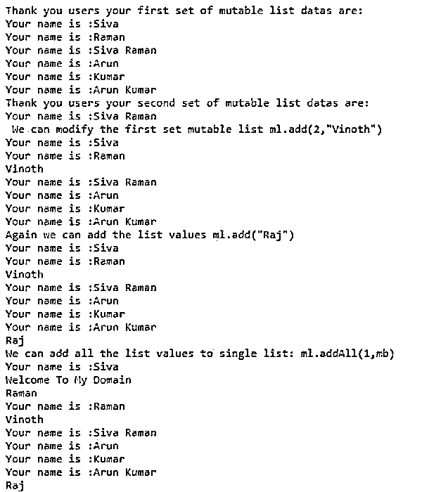
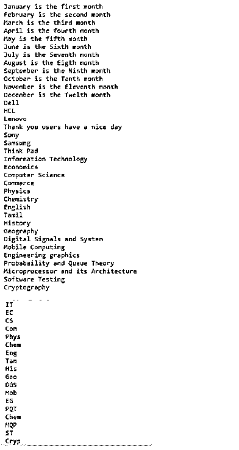

# 科特林可变列表

> 原文：<https://www.educba.com/kotlin-mutable-list/>

## Kotlin 可变列表简介

kotlin 可变列表是集合接口之一，它用于创建可以根据需要更改的数据列表。数据元素的通用集合，它将从集合<t>类中继承；可变列表接口的方法支持可读和可写功能。可变列表中的元素已经声明，也可以通过集合操作来执行，如通过使用 remove()方法来执行添加更多元素的可移除操作，并且它具有固定大小长度的 mutableListOf()和 mutableListOf <e>()以使用索引按顺序惰性化数据。</e></t>

**kot Lin 可变列表的语法**

<small>网页开发、编程语言、软件测试&其他</small>

在 kotlin 语言中，许多类和接口都使用泛型集合类型。其中一个可变列表是可以通过使用 mutuableListOf <int>()、mutuableListOf <any>()等方法实现的接口。它可以在接口中支持 n 种数据类型。</any></int>

`fun main(args:Array<String>)
{
var a: MutuableList<datatype> = mutuableListOf<datatype>()
a.add();
a.set();
a.distinct();
---some logic codes and default methods----
}`

以上代码是使用和创建 MutuableList 接口及其方法(如 mutuableListOf <datatype>)的基本语法。基于这个需求，我们可以使用默认的方法，比如 add()、distinct()等。</datatype>

### Kotlin 中的可变列表是如何工作的？

*   可变列表接口并且是使用数据元素的通用集合之一。它具有可变的性质，是从 collection <t>类继承的；可变列表接口的方法将支持读和写功能。一旦在接口中添加并声明了元素，它就会尝试使用 add()方法在内存堆栈中添加更多的元素。如果我们要以唯一的顺序执行用户输入的数据，那么它将是固定大小的长度，并且它是按顺序存储的，以便将值插入或存储在内存区域中。</t>
*   每个值必须有一个单独的索引，以便从后端到前端检索数据。几个方法被用来执行具有独立区域的可变接口，并且它依赖于其他子类属性数据来执行该操作。它满足了所有可变的集合操作，如 arrayListOf()、hashMapOf()和 hashSetOf()方法，以便在用户端实现这些操作。我们可以看到数组列表的简单实例< T >，它是列表接口的默认实现。实现细节应该遵循可变列表概念，所以它已经从集合类中抽象出来了。

### Kotlin 可变列表的示例

以下是 Kotlin 可变列表的示例:

#### 示例#1

**代码:**

`package one;
fun main(args: Array<String>){
var ml = mutableListOf<String>()
ml.add("Your name is :Siva")
ml.add("Your name is :Raman")
ml.add("Your name is :Siva Raman")
ml.add("Your name is :Arun")
ml.add("Your name is :Kumar")
ml.add("Your name is :Arun Kumar")
var ma = mutableListOf<String>("Welcome To My Domain","Siva")
var mb = mutableListOf<String>("Welcome To My Domain","Raman")
var mc = mutableListOf<String>("Welcome To My Domain","Siva","Raman")
println("Thank you users your first set of mutable list datas are:")
for(vars in ml){
println(vars)
}
println("Thank you users your second set of mutable list datas are:")
println(ml[2])
ml.add(2,"Vinoth")
println(" We can modify the first set mutable list ml.add(2,\"Vinoth\")")
for(vars in ml){
println(vars)
}
ml.add("Raj")
println("Again we can add the list values ml.add(\"Raj\")")
for(vars in ml){
println(vars)
}
ml.addAll(1,mb)
println("We can add all the list values to single list: ml.addAll(1,mb)")
for(vars in ml){
println(vars)
}
ml.addAll(ma)
println("We can add all the values and make it to the single list: ml.addAll(ma)")
for(vars in ml){
println(vars)
}
ml.remove("Arun")
println("We can remove the specified values: ml.remove(\"Arun\")")
for(vars in ml){
println(vars)
}
ml.removeAt(2)
println("We can remove the specified values using the index: ml.removeAt(2)")
for(vars in ml){
println(vars)
}
ml.removeAll(ma)
println("We can remove the specified values:ml.removeAll(ma)")
for(vars in ml){
println(vars)
}
println("We can remove the specified values: ml.set(2,\"Raman\")")
ml.set(2,"Fazil")
for(vars in ml){
println(vars)
}
println("We can retrieve the specified values: ml.retainAll(mc)")
ml.retainAll(mc)
for(vars in ml){
println(vars)
}
println("We can clear the cache datas: ma.clear()")
ma.clear()
for(vars in ma){
println(vars)
}
println("ma after ma.clear()")
println(ma)
println("We can calculate the sublist datas: ml.subList(1,3)")
println(ml.subList(1,3))
}`

**输出:**

在上面的例子中，我们使用了 mutableListOf()方法和 add()、remove()方法，通过使用索引来添加和删除值。

#### 实施例 2

**代码:**

`package one;
fun main(args: Array<String>){
var ml1 = mutableListOf("January is the first month","February is the second month","March is the third month","April is the fourth month","May is the fifth month","June is the Sixth month","July is the Seventh month","August is the Eigth month","September is the Ninth month","October is the Tenth month","November is the Eleventh month","December is the Twelth month")
ml1.add("Dell")
ml1.add("HCL")
ml1.add("Lenovo")
var ml2 = mutableListOf<String>()
ml2.add("Sony")
ml2.add("Samsung")
ml2.add("Think Pad")
var m23=mutableListOf("Information Technology","Economics","Computer Science","Commerce","Physics","Chemistry","English","Tamil","History","Geography","Digital Signals and System","Mobile Computing","Engineering graphics","Probabaility and Queue Theory","Microprocessor and its Architecture","Software Testing","Cryptography")
m23.add("IT")
m23.add("EC")
m23.add("CS")
m23.add("Com")
m23.add("Phys")
m23.add("Chem")
m23.add("Eng")
m23.add("Tam")
m23.add("His")
m23.add("Geo")
m23.add("DGS")
m23.add("Mob")
m23.add("EG")
m23.add("PQT")
m23.add("Chem")
m23.add("MQP")
m23.add("ST")
m23.add("Cryp")
for(i in ml1){
println(i)
}
println("Thank you users have a nice day")
for(i in ml2){
println(i)
}
for(i in m23){
println(i)
}
}`

**输出:**

在第二个例子中，我们使用了类似 add()的列表方法来添加内存中的值。使用 for 循环迭代数据并在控制台上打印出来。

#### 实施例 3

**代码:**

`package one;
fun main(args: Array<String>){
val Homethings = mutableListOf(1,"TV",2,"Fridge",3,"Wasing machine",4,"UPS",5,"Computer",6,"Laptop",7,"mobile",8,"Bureau",9,"Locker",10,"Dry Cleaner")
var jewelleryname = "Lalitha Jewellery,balu jewellery,kumaran jewellery,SJS jewellery, Anbu jewellery, saravana jewellery,kamal and co jewellery,pawn jewellery,kmt jewellery"
println("The list contains the element $jewelleryname or not?" +
" "+Homethings.contains(jewelleryname))
var num = 41
println("The list contains the element $num or not?" +
" "+Homethings.contains(num))
println("The list contains the given elements or not?" +
" "+Homethings.containsAll(setOf(1,3,"Robots")))
var newyears="Tamil New year, Telghu New year,Malyalam New year,Kannada New year,Odisan New year,Marathi New year,Bengali New year,Gujarathi new year"
println(Homethings.contains(newyears))
var machine="Fridge,Washing machine,Chairs,Table,TV,Computer,UPS,AC,Fan,Iron box,Grinder,Mixie"
println(Homethings.contains(machine))
}`

**输出:**

在最后一个示例中，我们使用了一些 mutableListOf()方法和 contains()等附加方法来检查和验证数据。

### 结论

可变列表中的接口用于执行操作，如通过调用特定类自己的构造函数来创建该类的实例。如果我们想创建一个可变列表，并且它关心用程序员指定的一些逻辑条件来添加和检索数据的实现。

### 推荐文章

这是一个 Kotlin 可变列表的指南。这里我们讨论一下入门，可变列表在 kotlin 中是如何工作的？和示例。您也可以看看以下文章，了解更多信息–

1.  [科特林内嵌函数](https://www.educba.com/kotlin-inline-function/)
2.  [科特林收藏馆](https://www.educba.com/kotlin-collections/)
3.  [科特林元组](https://www.educba.com/kotlin-tuple/)
4.  [科特林循环](https://www.educba.com/kotlin-loops/)

