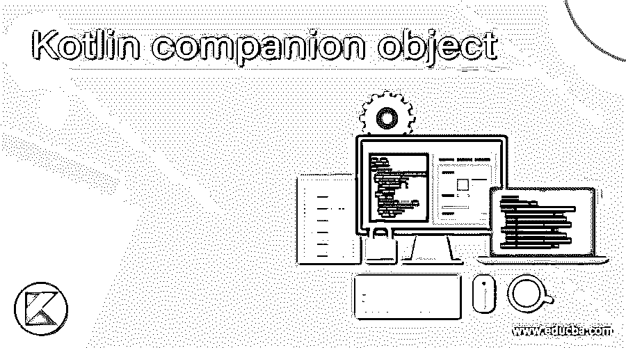

# 科特林伴星

> 原文：<https://www.educba.com/kotlin-companion-object/>




## Kotlin 伴随对象简介

kotlin companion 对象是关键字之一，它用于实现类， 与 java 或 C#或任何其他编程语言相比，它需要是一个通用的对象，或在该类的实例的帮助下通过整个包进行访问，它包含 static 关键字及其函数，就像 kotlin 没有 static 及其函数一样，因此它的名称与 kotlin 类名相似，而不是那个伴随对象，伴随对象及其类也可以在没有新关键字的情况下访问彼此的私有成员，我们可以创建该类的实例。

**语法:**

<small>网页开发、编程语言、软件测试&其他</small>

在 kotlin 语言中，有默认的关键字、变量和实现应用程序的方法。我们可以克服和替换方法来利用和满足用户需求，就像 java 中的静态概念一样，在 kotlin 语言中借助一个伴随对象来克服这个特性。

```
class name
{
companion object {
fun name()
{
---some logic codes depend upon the requirement---
}
}
}
```

以上代码是通过使用 kotlin companion 对象来利用和创建对象的基本语法。

### Kotlin 中的伴随对象是如何工作的？

伴随对象是另一种方法，也是创建对象并在包中的任何地方使用它的方法之一。我们可以通过使用 companion 对象来访问该类的私有成员。它有一个 object 关键字，结合了声明类和创建类的实例。它看起来并将定义称为单例类的概念，因此单个对象在整个应用程序包中起着至关重要的作用。尽管它为可以查看成员的定义了嵌套类特性，但它与类的外部区域相关。当我们调用和使用实例时，在 kotlin 语言的类的外侧会实现和使用工作流中的 object 关键字。每当我们使用 object 关键字时，它也会创建一个匿名类对象，称为匿名对象。如果我们想创建稍微修改的对象或某个类或接口，而不声明使用了子类或子类，这是可以实现的。在 kotlin 中，companion 对象也遵循类似于工厂方法的设计模式，更类似于 java 语言。

### 例子

下面提到了不同的例子:

#### 示例#1

```
package one;
fun main(args: Array<String>) {
var y = First.vars
First.vars = "Your companion object is called and used on this variable"
First.demos()
val x = second()
x.exam()
}
class First {
companion object Singleton
{
init {
println("Welcome To My Domain it’s a first example related to the kotlin companion object")
}
var vars = "Please enter your first input strings"
fun demos()
{
println(vars)
}
}
init {
println("This method is going to be start the task")
}
}
class second {
fun exam() = println("Have a nice day users please keep on continue to spent the tie with our application")
}
```

**输出:****T3】**


在上面的例子中，我们在一个伴随对象和单例概念的帮助下实现了 kotlin 应用程序。

#### 实施例 2

```
package one;
class Second {
var stdid:Int = 0
var stdName:String="sivaraman"
var stdRollno:Int=10
var stdAddress:String="Flat 12C, Aravind Enclave, Sathyamoorthy street, Srinivasa nagar, chengalpattu district, chennai-600009"
fun stddets(){
println("Welcome To My Domain this is the second example regarding the kotlin companion object")
println("${this.stdid}")
println("${this.stdName}")
println("${this.stdRollno}")
println("${this.stdAddress}")
println("We have entered the student details like student id, student name, student roll number, student Address etc the information’s are encrypted and it is stored in the separate database in cloud applications")
}
companion object Test{
var x: Int = 3
var empid:Int = 0
var empName:String="sivaraman"
var empSalary:Int=10000
var empAddress:String="Flat 12C, Sathya Enclave, Sathyamoorthy Nagar, Muthamizh Theru, chengalpattu district, chennai-600010"
fun details(){
println("Your details are: $x")
x++
}
fun empdetails(){
println("Welcome To My Domain this is the second example regarding the kotlin companion object")
println("${this.empid}")
println("${this.empName}")
println("${this.empSalary}")
println("${this.empAddress}")
println("We have entered the student details like employee id, employee name, employee salary, employee Address etc. the information’s are encrypted and it is stored in the separate database in cloud applications")
}
}
}
fun main() {
Second.details()
Second.Test.details()
Second.Test.empdetails()
println("Thank you users for spending the time with the companion object application")
}
```

**输出:**


在第二个例子中，我们在不同的概念中使用了同伴对象，比如学生和雇员的详细信息。我们通过使用伴随对象名来检索和调用这些方法。它将获取我们创建的任何数据。

#### 实施例 3

```
package one;
interface thirdInt {
val test: Int
fun eg() : String
fun dem() {
println("Welcome To My Domain its the third example that related to the kotlin compnion object")
}
}
class thirdInts : thirdInt {
override val test: Int = 12
override fun eg() = "Have a Nice day users"
}
interface infthird {
fun eg1() {
println("We created second interface infthird")
}
}
interface infythirds  {
fun eg2() {
println("We created third interface infythirds")
}
}
class thirdclass: infthird, infythirds
class third{
companion object demos{
var p: Int = 3
var empid:Int = 1
var empName:String="Arun"
var empSalary:Int=12000
var empAddress:String="5C, Sathya Enclave, Sathyamoorthy Nagar, Senthamizh Theru, chengalpattu district, chennai-600011"
fun details(){
println("Your details are: $p")
<u>p</u>++
}
}
}
fun main(args: Array<String>) {
val vars = thirdInts()
println("The third example related to the kotlin companion object= ${vars.test}")
print("Thank you for spenting the time: ")
vars.dem()
print("Keep on utilising and spenting the time to our application: ")
println(vars.eg())
val vars1 = thirdclass()
vars1.eg1()
vars1.eg2()
third.demos.details()
}
```

**输出:**


在最后一个例子中，我们在代码中使用了接口和类，并使用一个伴随对象为特定的类创建对象。

### 结论

kotlin 中的 companion 对象是可用于对象创建的额外层之一，就像 java 等其他语言中的静态概念一样。当我们使用 companion 对象时，它被用来在更高的层次上允许代码具有冗余，并以一种简单的方式相应地维护和工作。

### 推荐文章

这是 Kotlin 伴侣对象的指南。在这里，我们将讨论 Kotlin 中的伴随对象是如何工作的，以及示例和输出。您也可以看看以下文章，了解更多信息–

1.  [科特林循环](https://www.educba.com/kotlin-loops/)
2.  [科特林范围](https://www.educba.com/kotlin-range/)
3.  [科特林构造函数](https://www.educba.com/kotlin-constructors/)
4.  [安装 Kotlin](https://www.educba.com/install-kotlin/)


