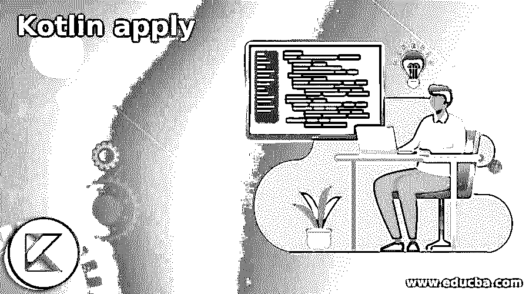
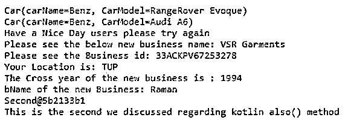

# 科特林应用

> 原文：<https://www.educba.com/kotlin-apply/>

## Kotlin 应用简介

Kotlin apply 是默认方法之一，它是 scope 函数。它也被称为对特定类型执行操作的扩展函数，它将作用域设置为也调用 apply 的对象 a。它会将对象引用运行到 any 表达式中，以便对象引用的返回值是完整的，并使它在模板类完成时返回一个对象引用，该模板类总是在其引用将被返回的类的范围内采用 lambda 表达式。

**语法:**

<small>网页开发、编程语言、软件测试&其他</small>

在 kotlin 语言中，它有许多函数、类和其他关键字，用于在应用程序中利用 kotlin 逻辑。与此类似，apply 是一个作用域函数，可用于配置初始化后的对象，并返回对象本身。

`class name{
var vars:datatype;
fun demo(){
///methodname
---some logic codes depends on the requirement—
}
}
name().apply{
---some codes---
}.demo()`

以上代码是在 kotlin 类对象初始化和返回类型中使用 apply()方法的基本语法。

### 如何在 Kotlin 中应用作品？

*   kotlin 应用程序有一些默认函数，可以用来访问文件中的顶级站点。需要它来在中创建类，以保存该类方法的引用。Kotlin apply 是一个扩展函数，可以在任何类型上使用，它在对象引用上运行，对象引用可以是表达式中的接收器格式，它返回对象引用。应用功能类似于运行功能，只是在提供空安全检查时使用“this”和其他关键字(如“it ”)来引用对象的上下文。
*   在许多情况下使用的 Apply 关键字可以用于各种场景，它应该与 Intent 实例和警告对话框等一起返回。当我们将应用程序中的特定属性添加到它们中时，可以通过改进的方法从代码片段中帮助避免变量名。冗余增强了代码的可读性和代码清理的原则。我们可以看到其他关键字和类似的方法，如接受 return 语句的 run，而不接受 return 对象的 apply。

### 科特林的例子适用

以下是 Kotlin 应用的示例:

#### 示例#1

**代码:**

`class Firstclass {
infix fun demo(s: String) {
}
fun example() {
this demo "Please enter your input types"
demo("Sivaraman")
}
}
class Worker {
var workerName: String = ""
var workerID: Int = 0
fun workerDetails(){
var lst=ArrayList<String>()
lst.add("Employee Name is: XX, Employee ID is:001")
lst.add("Employee Name is: XA, Employee ID is:001\n")
lst.add("Employee Name is: YB, Employee ID is:002\n")
lst.add("Employee Name is: YC, Employee ID is:003\n")
for(x in lst)
print("The employee lists are iterated and please find your output results $x ")
}
}
fun main(args: Array<String>)
{
Worker().apply{
this.workerName = "First Employee is Sivaraman"
this.workerID = 52
}.workerDetails()
data class First(var inp1 : String, var inp2 : String,var inp3 : String)
var first = First("Welcome To My Domain its the first example that related to the kotlin apply() function","Have a nice day users","Please try again")
first.apply { this.inp3 = "Welcome To My Domain its the first example that related to the kotlin apply() function" }
println(first)
with(first)
{
inp1 = "Please enter your input types"
inp2 = "Please enter your input types"
}
println(first)
}`

**输出:**

在上面的例子中，我们使用默认方法执行了雇员详细信息。

#### 实施例 2

**代码:**

`interface firstInterface {
val x : Int
val y : String
get() = "Welcome To My Domain its the second example that related to the kotlin also() method"
}
interface secondInterface {
fun Sample1(){
println("Your Sample1 Method")
}
}
class Second : firstInterface, secondInterface {
override val x : Int
get() = 52
override fun Sample1()
{
println("Have a Nice Day users please try again")
}
private val res = "firstInterface Second"
fun eg() = "This is the second we discussed regarding kotlin also() method"
}
class Business
{
var bName: String = ""
var GST: String = ""
var Location: String = ""
var year: Int = 0
fun enteredNewEmployees(bn: String, gst: String, loc: String, yr: Int) {
bName = bn
GST = gst
Location = loc
year = yr
println("Please see the below new business name: $bName")
println("Please see the Business id: $GST")
println("Your Location is: $Location")
println("The Cross year of the new business is : $year")
}
fun NewBusinessName(bn: String) {
this.bName = bn
}
}
fun main(args: Array<String>)
{
data class Car(var carName: String, var CarModel : String)
var nw = Car("Benz", "AMGE53")
nw.apply { CarModel = "RangeRover Evoque" }
println(nw)
nw.also { it.CarModel = "Audi A6" }
println(nw)
val ob = Second()
ob.Sample1()
var ob1 = Business()
var ob2 = Business()
ob1.enteredNewEmployees("VSR Garments", "33ACKPV67253278", "TUP", 1994)
ob2.NewBusinessName("Raman")
println("bName of the new Business: ${ob2.bName}")
val s = Second()
println(s)
println(s.eg())
}`

**输出:**

在第二个例子中，我们使用了接口、类和作用域方法，如()，apply()来实现应用程序。

#### 实施例 3

**代码:**

`fun main(args: Array<String>)
{
data class Third(var str1: String, var str2 : String)
var third = Third("Siva", "Raman")
println("Welcome To My domain its the third example that related to the kotlin apply() method")
third.apply { str2 = "Sivaraman" }
println(third)
third.also { it.str2 = "Dell" }
println(third)
with(third)
{
str1 = "Sivaraman is the Employee working in XX company"
str2 = "He is using the DELL Laptop which provided by his office"
}
}`

**输出:**

在最后一个示例中，我们使用了默认方法，如 also()、apply()和 with()方法来执行应用程序中的用户操作。

### 结论

在 kotlin 语言中有一些默认的作用域函数，用于执行 kotlin 应用程序中的操作。此外，它有一些默认的扩展函数，用于对对象做一些事情，并返回值。同样，如果我们需要在一个对象上执行一些其他的操作，并且它返回一些其他的对象，我们可以利用它。

### 推荐文章

这是一个科特林应用指南。这里我们讨论一下入门，apply 在 Kotlin 中是如何工作的？以及更好理解的例子。您也可以看看以下文章，了解更多信息–

1.  [科特林内嵌函数](https://www.educba.com/kotlin-inline-function/)
2.  [科特林收藏馆](https://www.educba.com/kotlin-collections/)
3.  [科特林元组](https://www.educba.com/kotlin-tuple/)
4.  [科特林循环](https://www.educba.com/kotlin-loops/)

