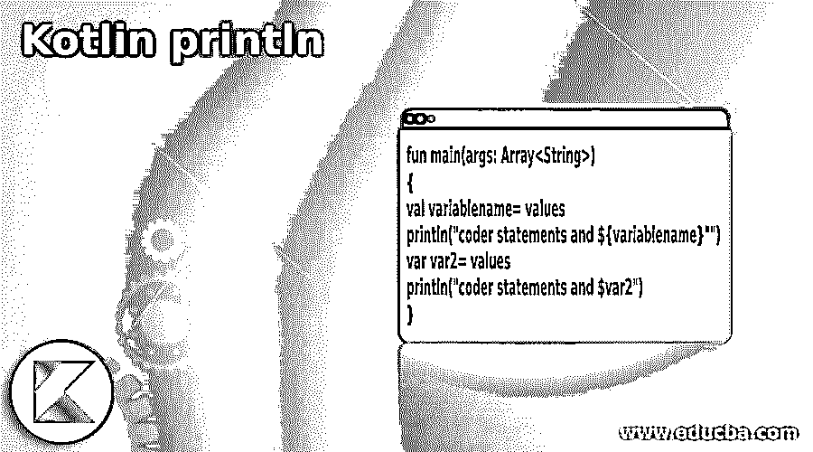
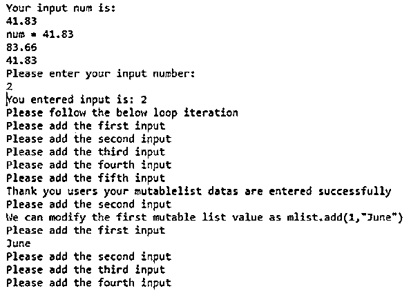
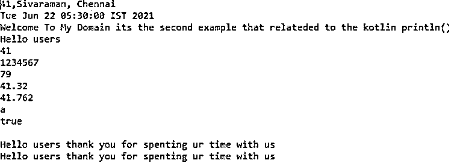

# 科特林印刷公司

> [https://www . educba . com/kot Lin-println/](https://www.educba.com/kotlin-println/)




## Kotlin println 简介

在 kotlin 中，println 是一个默认的语句，可以用来自动地一个接一个地打印语句，或者打印代码的下一行，在输出的末尾使用换行符，打印变量，使用“$”符号，后跟 var 和 val 类型变量，在双引号内使用字符串文字，它接受所有的数据类型参数，它将在控制台屏幕上打印输出，支持内部和外部的标准输出函数调用，并作为参数传递给数据，这与 java 语言类似。

**语法:**

<small>网页开发、编程语言、软件测试&其他</small>

kotlin 语言使用许多默认的关键字、变量和函数来实现基于移动设备的应用程序，并带有一些预定义的关键字，包括函数。与此类似，println()是处理和打印编码器声明的语句的默认函数。

```
fun main(args: Array<String>)
{
val variablename= values
println("coder statements and ${variablename}"")
var var2= values
println("coder statements and $var2")
}
```

以上代码是 kotlin 语言使用 println()方法及其语句的基本语法。然后，基于用户场景，我们可以在控制台屏幕上打印输出。

### println 在科特林是如何工作的？

*   使用 println()方法，编码器打印程序员输入的语句和输出，这取决于应用程序的观点。程序员输入了所有的代码，如关键字、变量、函数和类，它们既有主类也有次类。一些嵌套类的概念是用子类实现父类，然后由特定的包调用。对于每种方法，默认方法和定制方法都使用了 println()语句。
*   println()方法类似于 print()方法，但也有一些不同，例如 print()方法打印引号内的字符串，println()方法打印引号内的字符串，这类似于 print()方法，但鼠标光标会自动移动到控制台屏幕的下一行。我们可以在任何需要的时候使用表达式并捕获异常和错误实例，比如使用 try-catch 语句来处理异常块，但 catch 和 finally 块使用 print 和 println()方法来捕获和打印异常。此外，当我们想要在 println()方法中打印变量时，我们可以使用美元($)符号，后跟 var 和 val 名称以及双引号字符串文字。

### Kotlin println 示例

以下是 Kotlin println 的示例:

#### 示例#1

**代码:**

```
import java.util.Scanner
class examp1{
fun demo()
{
val strinp="Welcome To My Domain its the first example that related to the kotlin println() statement"
var mlist = mutableListOf<String>()
mlist.add("Please add the first input")
mlist.add("Please add the second input")
mlist.add("Please add the third input")
mlist.add("Please add the fourth input")
mlist.add("Please add the fifth input")
var finp = mutableListOf<String>("1","One")
var finp1 = mutableListOf<String>("2","Two")
var finp2 = mutableListOf<String>("3","Three")
println("Please follow the below loop iteration")
for(vlist in mlist){
println(vlist)
}
println("Thank you users your mutablelist datas are entered successfully")
println(mlist[1])
mlist.add(1,"June")
println("We can modify the first mutable list value as mlist.add(1,\"June\")")
for(vlist in mlist){
println(vlist)
}
mlist.add("July")
println("Again we can add one more list values mlist.add(\"July\")")
for(vlist in mlist){
println(vlist)
}
mlist.addAll(2,finp1)
println("We can add all the list values into the single list: mlist.addAll(1,finp1)")
for(vlist in mlist){
println(vlist)
}
mlist.addAll(finp)
println("We can add all the values and make it to the single list: mlist.addAll(finp)")
for(vlist in mlist){
println(vlist)
}
mlist.remove("July")
println("We can remove the specified values: mlist.remove(\"July\")")
for(vlist in mlist){
println(vlist)
}
}
}
fun main(args : Array<String>) {
val num = 41.83
println("Your input num is:")
println("$num")
println("num = $num")
println("${num + num}")
println(41.83)
val sc = Scanner(System.`in`)
print("Please enter your input number: ")
var il:Int = sc.nextInt()
println("You entered input is: $il")
var ob=examp1()
ob.demo()
}
```

**输出:**




在上面的例子中，我们使用了集合概念，比如 mutablelist class for 来添加和删除列表中的元素，结果打印在控制台上。

#### 实施例 2

**代码:**

```
import java.util.Date
import java.text.SimpleDateFormat
class Exam2() {
var id: Int = 0
var sname: String = ""
var city: String = ""
fun demo2(){
val sinp="41,Sivaraman, Chennai"
println(sinp)
}
}
enum class Second(var sec: String) {
demo("Welcome To My Domain its the second example that related to the kotlin println()"){
override fun sample() {
println("Thank you users have a nice day")
}
},
demo1("We can override the sample method"){
override fun sample() {
println("Current month is june")
}
},
demo2("Again we override the sample method"){
override fun sample() {
println("Next month is july")
}
};
abstract fun sample()
fun demo1(svalues: String): String{
return "Have a Nice day users"
}
}
fun main(args: Array<String>) {
val inp1 = Exam2()
var sinp=inp1.demo2()
println(SimpleDateFormat("yyyy-MM-ddX").parse("2021-06-22+00"))
println("Welcome To My Domain its the second example that related to the kotlin println() method, $sinp")
println("Hello users")
println(41)
println(1234567L)
println(0b01001111)
println(41.32)
println(41.762F)
println('a')
println(true)
println()
var st = "Hello users thank you for spenting ur time with us"
println(st)
println(st)
}
```

**输出:**




在第二个示例中，我们使用了 kotlin 代码中使用的日期格式包，并在输出控制台上打印了一些操作，如整数、字符串、浮点、双精度和布尔数据类型值。

#### 实施例 3

**代码:**

```
import java.util.Scanner
fun main(args: Array<String>) {
try {
val inpread = Scanner(System.`in`)
println("Welcome To My Domain its the third example that related to the kotlin println()")
println("Please enter your inputs")
var id = inpread.nextInt()
println("Your input id is "+id)
val lamb: (Int) -> Unit= {st: Int -> println(st) }
demo(41,83,lamb)
val inpdata = 12 / 4
println(inpdata)
}
catch (e: NullPointerException) {
println(e)
} finally {
println("finally block always executed whenever try is executing")
}
println("Have in Nice Day users please try again")
}
fun demo(in1: Int, in2: Int,lamb: (Int) -> Unit){
val result = in1 + in2
println(result)
}
```

**输出:**


在最后一个例子中，我们使用 try-catch 块处理异常，并使用 lambda 表达式执行算术运算。

### 结论

在 kotlin 语言中，我们使用许多默认的方法、类和关键字来实现应用程序。所以所有的编程逻辑都将使用类和方法之类的代码来实现。尽管执行了一些额外的操作，但是通过使用 print()和 println()方法将结果打印在输出控制台上。

### 推荐文章

这是 Kotlin println 指南。这里我们讨论一下入门，println 在 Kotlin 中是如何工作的？以及更好理解的例子。您也可以看看以下文章，了解更多信息–

1.  [科特林内嵌函数](https://www.educba.com/kotlin-inline-function/)
2.  [科特林收藏馆](https://www.educba.com/kotlin-collections/)
3.  [科特林元组](https://www.educba.com/kotlin-tuple/)
4.  [科特林循环](https://www.educba.com/kotlin-loops/)


