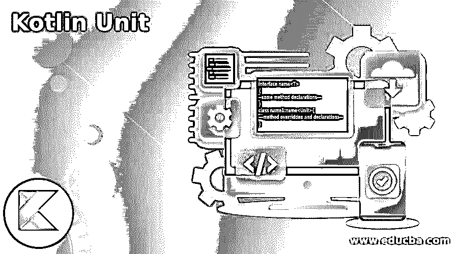
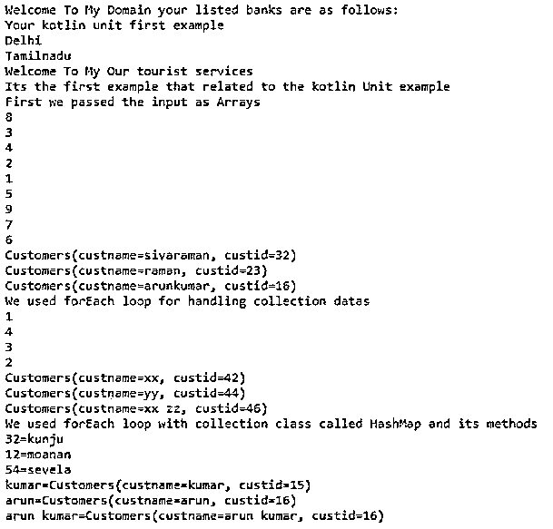

# 科特林单位

> 原文：<https://www.educba.com/kotlin-unit/>




## 科特林单位简介

Kotlin unit 是一种返回类型，它返回 null 值，类似于 void，但 unit 用于不返回任何值的任何函数的返回类型，它是可选的，所以在返回类型中提到值时，除了 void 之外，Unit 是真正的类，也称为 Singleton，所以只要有一个实例就可以访问应用程序，只要它需要 Unit 和 Kotlin 库，这样 Unit 就适用于一个值的参数类型。

### 科特林单位的语法

Kotlin 有许多用于实现应用程序的默认关键字、类和方法。比如，单元是类的类型之一，它被用在对象类中，这意味着它在只有一个对象的单例类中。

<small>网页开发、编程语言、软件测试&其他</small>

```
interface name<T>
{
--some method declarations---
}
class name1:name<Unit>{
---method overridden and declarations—
}
```

上述代码是利用 unit 关键字的基本语法，用于脚本中类和函数的返回类型。

### Kotlin 中的 Unit 是如何工作的？

*   kotlin it 中的单元对应于类似于 java 语言的 void 返回类型。通常，void 意味着它返回 null 值，并且它作为参数类型和返回类型传递。Unit 是任何不返回任何有意义的值的函数的返回类型，在 kotlin 函数中可以选择将 Unit 作为返回类型。
*   与 void 不同的是，返回类型和单元是真正的类，它被称为单例实例，只有一个实例可以调用应用程序中的整个区域。此外，unit 相当于 java 语言中的 void 类型，因此我们可以显式地将 Unit 添加为函数的返回类型，返回 null 作为 kotlin 代码的其他区域使用的值和参数。
*   主要是单元类不能用其他类型和类来扩展，不管是否需要，没有选项来执行这个特性，所以它完全充当私有修饰符。因此，该单元是默认的返回类型，它被声明为可选的，因此，该函数也是有效的，并在其他领域调用。单元已经执行了所有类型的 jvm 和 js，只使用单元对象的一个值。

### 科特林单位示例

下面是提到的例子:

#### 示例#1

```
class States(val statename : String, val statecapital : List<Tourist>)
class Tourist(val touristname : String, val touristcities : List<String>)
class TouristMonths {
val mnths = listOf("January", "February","March","April","May","June","July","August","September","October","November","December")
val elects = listOf("Ups","Inverters","Gadgets","Desktop PCs","Microwave Oven","Fridge","Washing Machine","mobile")
val lap = listOf("Dell latitude", "dell inspiron","sony","acer","samsung","lenovo","apple")
val placesvisited = listOf(
States("Delhi", listOf(Tourist("Noida", lap),
Tourist("Darjeeling", mnths))),
States("Tamilnadu", listOf(Tourist("Chennai", elects))))
}
data class Customers(
val custname: String,
val custid: Int
)
enum class Banks (
val names: String, val id:Int, val sno:Int
) {
First("PNB",1,123), Second("IOB",2,466),
Third("SBI",3,7898), Four("RBL",4,7885), Five("Indian",5,798),
Six("Indusland",6,124453), Seven("HDFC",7,984);
}
fun operations(): Unit {
println("Your kotlin unit first example ")
}
fun main (args: Array<String>) {
println("Welcome To My Domain your listed banks are as follows:")
operations()
var trt=TouristMonths()
trt.placesvisited.forEach { c -> println(c.statename) }
println("#############################################################")
println("Welcome To My Our tourist services")
println("Its the first example that related to the kotlin Unit example")
println("#############################################################")
println("First we passed the input as Arrays")
val arnum = arrayOf(8, 3, 4, 2,1,5,9,7,6)
arnum.forEach { println(it) }
val usr = arrayOf(Customers("sivaraman", 32),
Customers("raman", 23),
Customers("arunkumar", 16))
usr.forEach { println(it) }
println("We used forEach loop for handling collection datas")
val inp = listOf(1, 4, 3, 2)
inp.forEach{println(it)}
val numusras = listOf(Customers("xx", 42),
Customers("yy", 44),
Customers("xx zz", 46))
numusras.forEach { println(it) }
println("We used forEach loop with collection class called HashMap and its methods")
val hshmap = hashMapOf(32 to "kunju", 12 to "moanan", 54 to "sevela" )
hshmap.forEach{ println(it) }
val map2 = hashMapOf("kumar" to Customers("kumar", 15),
"arun" to Customers("arun", 16),
"arun kumar" to Customers("arun kumar", 16))
map2.forEach{ println(it) }
}
```

**输出:**




在上面的例子中，我们使用了 kotlin 代码，但是在输出控制台屏幕上返回了 Unit 类型。这里我们使用了一些枚举，类和类集合。使用枚举，我们可以声明值，并根据需要在 main 方法中使用这些值。列表接口是集合接口，它存储和检索数据。

#### 实施例 2

**代码:**

```
val mnthstrs = "January is the first month, February is the second month, march is the third month, april is the fourth month, may is the fifth month, june is the sixth month, july is the seventh month, august is the eight month, September is the ninth month, october is the tenth month, November is the eleventh month, december is the twelth month"
fun operations(): Unit {
println("The month details are: " + mnthstrs)
}
fun main() {
println("Welcome To My Domain its the second example that related to the kotlin unit")
operations()
}
```

**输出:**


在第二个例子中，我们使用 Kotlin Unit 作为类型，以避免返回值为 Unit。我们可以将该单元实现为 operations()方法，它将主要调用。

#### 实施例 3

**代码:**

```
fun firstMethod(str:String): Unit{
println("Your first kotlin method for the Unit concept")
println(str)
}
fun secondMethod( str1 : String, demo: (String) -> Unit){
println("Your second method for the Unit")
demo(str1)
}
fun main(args: Array<String>) {
println("Welcome To My Domain its the third example that related to the kotlin Unit")
secondMethod("Your input key is string: Thank you users for spending the time",::firstMethod)
}
```

**输出:**


在最后一个示例中，我们使用 Unit type 将值转换为 string 类型。这里我们使用了 Unit 和另一个数据类型作为参数，它将在 main 中调用。

### 结论

在 kotlin 语言中，有许多概念和特性，用于实现更复杂的应用程序。像这样的单元是 kotlin 的概念之一，它被用在脚本的各个领域，它与其他数据类型相结合来执行任务中的用户操作。

### 推荐文章

这是科特林单位的指南。这里我们讨论一下入门，unit 在科特林是如何工作的？以及更好理解的例子。您也可以看看以下文章，了解更多信息–

1.  [科特林内嵌函数](https://www.educba.com/kotlin-inline-function/)
2.  [科特林收藏馆](https://www.educba.com/kotlin-collections/)
3.  [科特林元组](https://www.educba.com/kotlin-tuple/)
4.  [科特林循环](https://www.educba.com/kotlin-loops/)


