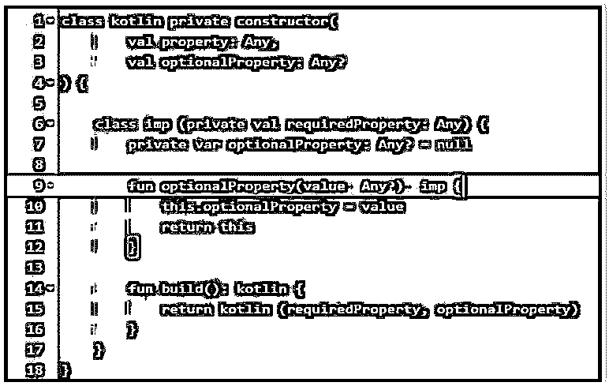
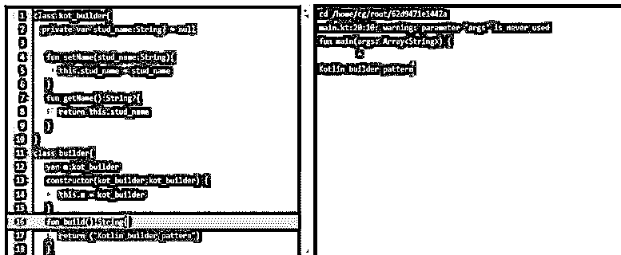
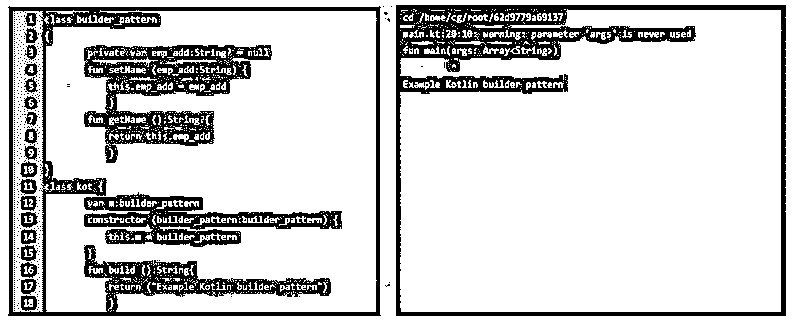
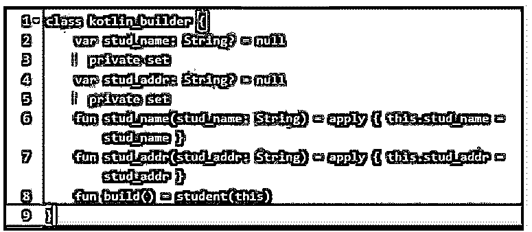

# 科特林生成器模式

> 原文：<https://www.educba.com/kotlin-builder-pattern/>


## Kotlin 构建器模式介绍

Kotlin builder 模式用于处理包含大量参数的对象构建，在创建可变对象时，我们正在构建它，这是经常使用的，但很少创建我们自己的对象。Kotlin 提供了一些有用的特性，比如默认和命名参数数据类，以及避免使用构建器模式的 apply。

通过在 kotlin 中将名副其实的函数作为构建器与接收类型安全和统计类型构建器的文字函数结合使用。kotlin 中的 builder 模式是一个著名的设计模式，我们用它来创建对象。kotlin 中的 builder 模式将允许我们创建一个不可变的对象，它以一步一步的方式变得复杂。该模式将提供机会，通过使用 fluent 方法的链接过程将不同的属性附加到对象上。这是非常有用和重要的。

<small>网页开发、编程语言、软件测试&其他</small>

### 关键要点

*   kotlin 的缺省参数让我们不必重载多个构造函数，但是构造函数仍然包含可选参数，这个参数非常多。
*   在构建器模式中，我们创建小对象来创建最终对象；我们正在构建一个提供 API 的对象。

### 如何创建 Kotlin 构建器模式？

为了首先在 kotlin 中创建构建器模式，我们需要小的构建器对象来创建主类的最终对象，并在主类中构建相同的对象。builder 类包含构造函数，它是公共的，将包含所有必需的参数。然后，我们将一个对象构建到价格中，但我们需要确保最终结果是相同的。我们需要创建 getter 和 setter，因为变量是私有的，所以任何人都不能从外部访问它。此外，我们通过使用 getter 和 setter 方法来提供访问。

构建器的设计模式提供了一个逐步构建对象的 API。在主类中，我们将函数实现为 build，我们可以将其命名为 get，也可以为该函数指定任何名称来创建目标对象。主类构造函数接受生成器对象作为参数。

在下面的例子中，我们正在创建一个小的 builder 对象，它是在 builder 类和 main 类中构建的，并且包含公共构造函数。此外，我们正在为同一个变量构造多个片段。构建器的设计模式提供了创建对象的 API。

**代码:**

```
class kotlin private constructor(
val property: Any,
val optionalProperty: Any?
) {
class imp (private val requiredProperty: Any) {
private var optionalProperty: Any? = null
fun optionalProperty(value: Any?): imp {
this.optionalProperty = value
return this
}
fun build(): kotlin {
return kotlin (requiredProperty, optionalProperty)
} }
}
```

**输出:**




### Kotlin 构建器模式-实现构建器

在面向对象的编程中，使用构造函数创建一个对象是非常容易的，同时对象定义也很简单。尽管如此，有时构造函数需要更多的函数和变量来初始化对象。在同一个场景中，我们使用一个构建器模式，它将创建一个不同的对象的小单元，并创建最终的对象。

kotlin 中的 Builder 模式提供了一个 API 来逐步构造对象。当我们需要动态创建对象时，构建器模式特别有用。但是不建议在 kotlin 中使用 builder 模式，因为我们通过使用 named 和 default 参数获得了相同的特性。

下面的步骤显示了我们如何实现构建器模式，如下所示:

*   创建小构建器对象。
*   构造对象也通过使用 getter 和 setter 方法设置变量。
*   创建用于构建所需对象的构建方法。
*   主类构造函数接受 builder 对象的参数。

下面的例子显示了我们如何在 kotlin 中实现 builder 模式，如下所示。我们将类名创建为 kot_builder。

**代码:**

```
class kot_builder
{
private var stud_name:String? = null
fun setName (stud_name:String) {
this.stud_name = stud_name
   }
fun getName ():String?{
return this.stud_name
   }
}
class builder{
var m:kot_builder
constructor (kot_builder:kot_builder) {
this.m = kot_builder
}
fun build():String{
return ("Kotlin builder pattern")
  }
}
fun main(args: Array<String>)
{
var kot_builder = kot_builder()
kot_builder.setName ("Kotlin Builder")
var obj = builder(kot_builder)
println (obj.build())
}
```

**输出:**




### 例子

下面是提到的例子:

#### 示例#1

在 kotlin 中，有些对象是简单的，它是通过使用构造函数创建的，构造函数是单一的。

**代码:**

```
class builder_pattern
{
private var emp_add:String? = null
fun setName (emp_add:String) {
this.emp_add = emp_add
  }
fun getName ():String?{
return this.emp_add
  }
}
class kot {
var m:builder_pattern
constructor (builder_pattern:builder_pattern) {
this.m = builder_pattern
}
fun build ():String{
return ("Example Kotlin builder pattern")
  }
}
fun main(args: Array<String>)
{
var builder_pattern = builder_pattern()
builder_pattern.setName ("Builder Pattern")
var obj = kot (builder_pattern)
println (obj.build())
}
```

**输出:**




#### 实施例 2

在下面的例子中，我们在嵌套的构建类中使用一个构造函数来访问这个类，如下所示。

**代码:**

```
class kotlin_builder {
var stud_name: String? = null
private set
var stud_addr: String? = null
private set
fun stud_name(stud_name: String) = apply { this.stud_name = stud_name }
fun stud_addr(stud_addr: String) = apply { this.stud_addr = stud_addr }
fun build() = student(this)
}
```

**输出:**




### 常见问题解答

下面是提到的常见问题:

#### Q1。我们如何申报？

**答案:**

下面的例子显示了如何在代码中声明构建器模式，如下所示。

**代码:**

```
val stud = stud.Builder ()
.firstName ("ABC")
.lastName ("PQR")
.build()
```

#### Q2。kotlin 中 builder 模式的用途是什么？

**答案:**

它用于创建对象。通过使用 builder 模式，我们可以在 kotlin 中创建不可变的对象。

#### Q3。它的目的是什么？

**答案:**

构建器模式的主要目的是创建一个复杂的对象。通过使用它，我们可以设置构建器对象属性。使用构建器模式，我们可以传递许多参数，因为每个构建器方法只有一个参数。

### 结论

kotlin 中的 builder 模式是我们用来创建对象的一个著名的设计模式。它用于处理包含大量参数的对象构建，在创建可变对象时，我们正在构建它。

### 推荐文章

这是 Kotlin 构建器模式的指南。在这里，我们讨论介绍以及如何创建它。实现生成器，示例。您也可以看看以下文章，了解更多信息–

1.  [Kotlin Web 框架](https://www.educba.com/kotlin-web-framework/)
2.  [科特林内部](https://www.educba.com/kotlin-internal/)
3.  [科特林印花](https://www.educba.com/kotlin-print/)
4.  科特林队列


