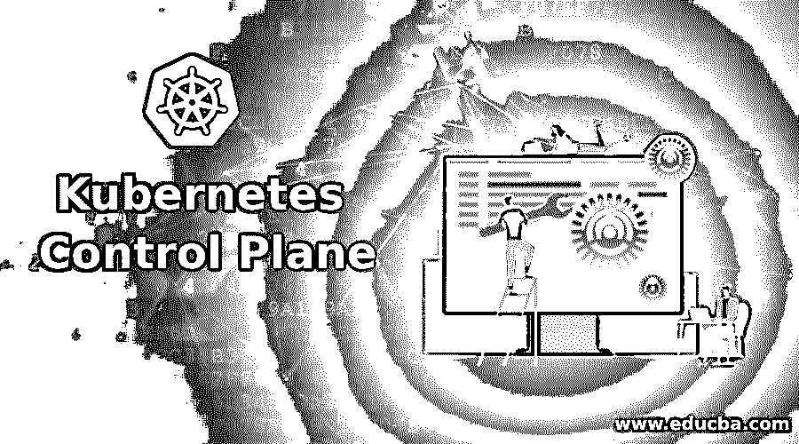
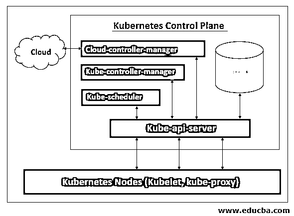

# Kubernetes 控制平面

> 原文：<https://www.educba.com/kubernetes-control-plane/>

## Kubernetes 控制平面简介

Kubernetes 控制平面负责维护集群中任何对象的期望状态。它还管理工作节点和单元。它由五个组件组成:Kube-api-server、Kube-scheduler、Kube-controller-manager 和 cloud-controller-manager。运行这些组件的节点称为“主节点”。这些组件可以在单个节点或多个节点上运行，但是建议在生产中的多个节点上运行，以提供高可用性和容错能力。每个控制平面的组件都有自己的职责，但是它们共同做出关于群集的全局决策，检测和响应由用户或任何集成的第三方应用程序生成的群集事件。

<small>网页开发、编程语言、软件测试&其他</small>

### Kubernetes 控制飞机是如何工作的？

下面我们通过一个例子来理解 Kubernetes 控制平面的工作原理

$**ku bectl get nodes:**ku bectl 是一个命令行工具，我们用它来与 Kubernetes 集群交互并管理它。在这里，当我们运行这个命令时，它通过 HTTPs 对集群进行 API 调用，并由“kube-apiserver”处理。“kube-apiserver”与“etcd”数据存储的其他控制平面组件通信，它获取数据并通过 HTTPs 发送回控制台，我们可以在终端上看到节点的详细信息。

### Kubernetes 控制平面的组件

让我们了解一下 Kubernetes 控制平面的不同组件。Kubernetes 控制平面有以下五个组件:

*   Kube-api-server
*   Kube-scheduler
*   kube-控制器-管理器
*   etcd
*   云控制器管理器

#### 1\. Kube-API-server

Kube-api-server 是控制平面的主要组件，因为所有流量都通过 api-server，如果控制平面的其他组件必须与“etcd”数据存储进行通信，它们也连接到 api-server，因为只有 Kube-api-server 可以与“etcd”进行通信。它服务于 REST 操作，并为 Kubernetes 控制平面提供一个前端，该前端公开了 Kubernetes API，其他组件可以通过该 API 与集群进行通信。可以水平部署多个 api-server 来使用负载平衡器平衡流量。

#### 2\. Kube-scheduler

Kube-scheduler 负责将新创建的 pod 调度到集群中运行的最佳可用节点。但是，可以在特定节点、特定区域或根据节点标签等安排一个或一组 pod。通过在部署 pod 或部署之前在 YAML 文件中指定关联性、反规范或约束。如果没有满足指定要求的可用节点，则不部署 pod，并且它保持未调度状态，直到 Kube-scheduler 没有找到可行的节点。可行节点是满足 pod 调度的所有要求的节点。

Kube-scheduler 使用两步流程为集群中的 pod 选择一个节点，进行过滤和评分。在过滤过程中，Kube-scheduler 通过运行检查找到一个可行的节点，如节点有足够的可用资源，这是为这个 pod 提到的。一旦它过滤掉所有可行节点，它就根据有效的分数规则给每个可行节点分配一个分数，并在具有最高分数的节点上运行 pod。如果多于一个节点具有相同的分数，那么它随机选择一个。

#### 3.kube-控制器-管理器

Kube-controller-manager 负责运行控制器进程。它实际上由四个进程组成，并作为一个进程运行，以降低复杂性。它确保当前状态与所需状态匹配，如果当前状态与所需状态不匹配，它会对集群进行适当的更改以达到所需状态。

它包括节点控制器、复制控制器、端点控制器以及服务帐户和令牌控制器。

*   **节点控制器:**–它管理节点，监视集群中的可用节点，并在任何节点出现故障时做出响应。
*   **复制控制器:**–它确保集群中的每个复制控制器对象运行正确数量的 pod。
*   **端点控制器:**–它创建端点对象，例如，为了对外公开 pod，我们需要将它加入到服务中。
*   **服务帐户和令牌控制器:**–负责创建默认帐户和 API 访问令牌。例如，每当我们创建一个新的名称空间时，我们需要一个服务帐户和访问令牌来访问它，因此这些控制器负责为新的名称空间创建默认帐户和 API 访问令牌。

#### 4.etcd

etcd 是 Kubernetes 的默认数据存储，存储所有集群数据。它是一致的、分布式的、高度可用的键值存储。etcd 只能由 Kube-api-server 访问。如果其他控制平面的组件必须访问 etcd，它必须通过 kube-api-server。etcd 不是 Kubernetes 的一部分。它是完全不同的开源产品，由云本地计算基金会提供支持。我们需要为 etcd 建立一个适当的备份计划，这样，如果集群发生问题，我们可以恢复备份并快速恢复业务。

#### 5.云控制器管理器

cloud-controller-manager 允许我们将内部 Kubernetes 集群连接到云托管的 Kubernetes 集群。它是一个单独的组件，只与云平台交互。云控制器管理器的控制器取决于我们运行工作负载的云提供商。如果我们有内部 Kubernetes 集群，或者我们出于学习目的在自己的 PC 上安装了 Kubernetes，则该功能不可用。云控制器管理器还在单个进程中包括三个控制器，它们是节点控制器、路由控制器和服务控制器。

*   **节点控制器:**–它不断检查云提供商托管的节点的状态。例如，如果任何节点没有响应，那么它检查该节点是否已经在云中被删除。
*   **路由控制器:**–它在底层云基础设施中控制和设置路由。
*   **服务控制器:**–它创建、更新和删除云提供商负载平衡器。

### 结论

Kubernete 的控制平面是 kubernete 星团的心脏。如果我们在一个集群中有多个主节点，那么 kube-scheduler 和 controller-manager 必须一次只作用于一个节点，在其他节点上，它们将处于备用模式。etcd 是 Kubernetes 的默认数据存储，但是如果需要，我们可以使用不同的键值数据存储。

### 推荐文章

这是一个 Kubernetes 控制平面的指南。在这里，我们讨论 Kubernetes 控制平面的介绍，它是如何工作的，以及前 5 个组件。您也可以浏览我们的其他相关文章，了解更多信息——

1.  [立方算子](https://www.educba.com/kubernetes-operators/)
2.  [立方命名空间](https://www.educba.com/kubernetes-namespace/)
3.  [Kubernetes 部署](https://www.educba.com/kubernetes-deployment/)
4.  [立方入口](https://www.educba.com/kubernetes-ingress/)