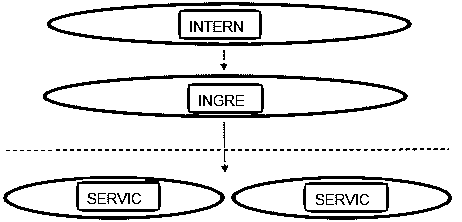
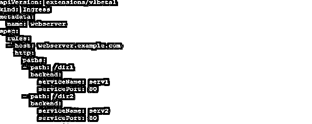
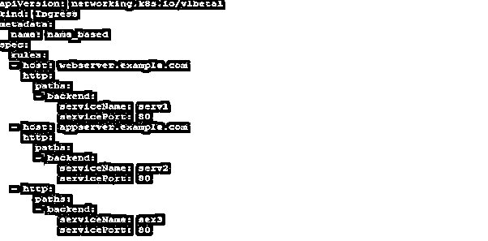
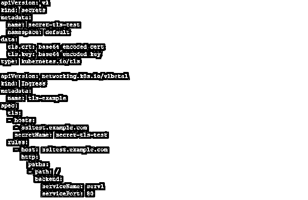
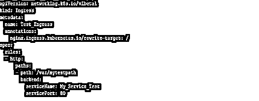

# 永恒的入口

> 原文：<https://www.educba.com/kubernetes-ingress/>

## Kubernetes Ingress 简介

Kubernetes 集群或集群中的豆荚在内部相互连接。但是如果你想使用像 HTTP 这样的服务来进行外部工作，你需要一个有效的工具。有 NodePorts、LoadBanalncers 可以实现同样的功能，但是 Kubernetes Ingress 是 Kubernetes 环境中的一个 API 对象，它可以控制从外部源到服务的 HTTP 和 https 入站流量。

这是通过入口资源实现的，入口资源定义了如何将请求路由到后台服务和入口控制器，入口控制器负责读取入口资源信息并相应地处理数据。

<small>网页开发、编程语言、软件测试&其他</small>

### 什么是 Kubernetes Ingress？

当您想要将运行在 Kubernetes 集群中的服务公开给外部网络时，可以使用 Kubernetes Ingress，外部网络可以是互联网或 Kubernetes 集群之外的任何东西。

这主要用于公开 HTTP 和 https 路由，提供外部可访问的 URL，在负载平衡器的帮助下平衡流量，终止 SSL 和 TLS 或提供基于名称的虚拟主机。入口具有资源或规则以及负责实现资源规则的控制器。外部用户通过使用 API 服务器(即入口控制器)的入口资源来请求入口。下图可能会帮助你更好地理解它:-

要部署入口，使用“kubectl create -f <filename>”命令和一个具有定义、路径、规则和其他强制字段的 YAML 文件。入口控制器将创建一个特定于实现的内部 LB(负载平衡器),它将伴随入口，直到相关服务存在。当您运行“kubectl get ing”命令时，可以在输出的最后一列看到负载平衡器的地址。</filename>

### Kubernetes 入口的类型

下面是提到的类型:

#### 1.单一服务入口

您可以通过在 Ingress_sample.yaml 文件的 spec 中指定一个没有规则的*默认后端*来创建入口，如下所示:

使用以下命令应用它:

入口控制器将为入口设置分配一个 IP。有时分配 IP 地址需要一些时间，在此之前，您会在以下命令的输出中看到地址待定:-

#### 2.简单扇出

Kubernetes 中的 Pods 具有仅在集群网络上可见的 IP，因此我们需要一个负载均衡器来接受入口流量并将其发送到指定的端点。但是 Ingress 允许您使用单个 LB(负载平衡器)。例如，像这样的设置:-

**代码:**

`webserver.example.com -> 10.10.10.101 -> /dir1  serv1:80
webserver.example.com -> 10.10.10.101 -> /dir2  serv2:80`

**输出:**

#### 3.基于名称的虚拟主机

基于名称的虚拟主机对同一个 IP 地址使用多个主机名，如下所示:–

**代码:**

`webserver.example.com -> 10.10.10.101 -> webserver.example.com serv1:80
appserver.example.com -> 10.10.10.101 -> appserver.example.com serv2:80`

以下入口告诉支持 LB(负载平衡器)根据主机报头路由请求

如果在您的资源文件中，您没有为服务定义主机字段，那么任何请求到您的入口控制器的 web 流量将被转发，而没有任何基于名称的虚拟主机标记到它。例如，在下面的示例中，webserver.example.com 的 web 流量将被转发到 serv1，appserver.example.com 的 Web 流量将被转发到 serv2，而发往未定义主机字段的 IP 地址的任何 Web 流量都将被发送到 ser3。

#### <u>4。坦克激光瞄准镜（Tank Laser-Sight 的缩写）</u>

 <u>可以通过添加以下内容来确保入口安全:–

*   包含 TLS 私有的秘密
*   证书

对于当前版本，Ingress 仅支持单个 TLS 端口 443，并考虑 TLS 端接。还要注意，TLS secret 应该有名为 tls.crt 和包含证书的 tls.key 的密钥。和要用于 TLS 的私钥

当使用这个秘密时，入口控制器使用 TLS 保护从客户端到 LB(负载平衡器)的通信。需要确保证书中的 TLS secret 包含主机的 CN 或 FQDN，如本例中的 ssltest.example.com。该资源将如下所示:-

#### <u>5。负载平衡</u>

 <u>控制器附有负载平衡策略，如负载平衡算法等。它适用于所有入口流量。高级负载平衡概念，如持续会话等。还不能从入口进入。但是如果你需要这些特性，你可以使用一个通用的负载平衡器。

### 更新入口

当您已经部署了一个入口，并且想要更新它以添加一个新的目标服务或主机目标时，您可以通过更新资源文件来完成，使用以下步骤:-

1.  检查当前入口详细信息:–

`#kubectl describe ingress <ingress_name>`

2.  使用命令编辑入口资源，这将在默认编辑器中打开 YAML 文件:–

`#kubectl edit ingress <ingress_name>`

3.  一旦保存了您的更改，kubectl 会将资源更新到 API 服务器，然后 API 服务器会更新入口控制器以更新 LB(负载平衡器)。使用以下命令验证这一点:

`#kubectl describe ingress <ingress_name>`

**NOTE:** You can get the same outcome by running below command on an Ingress resource YAML file.

`#kubectl replace -f <Filename>`

### 先决条件

要使用 Kubernetes Ingress，您应该有以下可用资源，否则您将根本无法使用它或无法充分利用它。

*   运行 Kubernetes 控制器，本地如 HAProxy Ingress、ingress-nginx 等。或者在类似云的 AWS ALB 入口控制器上，该控制器使用 AWS 应用程序负载平衡器实现入口。但是一个入口控制器应该符合你的需求规格，因为不同的入口控制器操作稍有不同
*   Kubernetes Resources 是指您必须根据自己的需求和节点端口或负载平衡器的可用性来定义的规则。下面是一个例子:

*   此外，Kubernetes Ingress 需要资源文件中的 apiVersion、kind 和元数据字段。所以这些你应该知道。除了这些字段之外，如果定义了主机，则规则将应用于该目标，如果没有定义主机，则规则将应用于所有入站 HTTP(或 HTTPS)流量。此外，字段 path(上例中的/var/mytestpath)有一个用服务名和服务端口定义的后端。在负载平衡器(如果有)将流量转发到相关服务之前，主机和路径字段都应该与 web 流量中的请求内容相匹配。
*   后端，它是 serviceName 和 servicePort 的组合。与规则的主机字段和路径字段匹配的对入口的 HTTP(或者 HTTPS)请求被发送到资源中提到的后端。默认后端通常配置在控制器中，用于处理与

### 结论

Ingress 允许您配置多个虚拟主机、粘性会话、路径重写和自定义配置，为 Kubernetes 提供了一个强大灵活的路由机制。当您选择了入口控制器并尊重入口资源时，请检查相应的入口文档，以了解其理解、功能并了解路由请求的不同方式。

### 推荐文章

这是一个 Kubernetes 入口指南。在这里，我们讨论什么是 Kubernetes 入口以及类型、更新入口和先决条件。您也可以浏览我们的其他相关文章，了解更多信息——

1.  [立方结构](https://www.educba.com/kubernetes-architecture/)
2.  [立方算子](https://www.educba.com/kubernetes-operators/)
3.  [什么是 Kubernetes？](https://www.educba.com/what-is-kubernetes/)
4.  [立方命名空间](https://www.educba.com/kubernetes-namespace/)

</u></u>