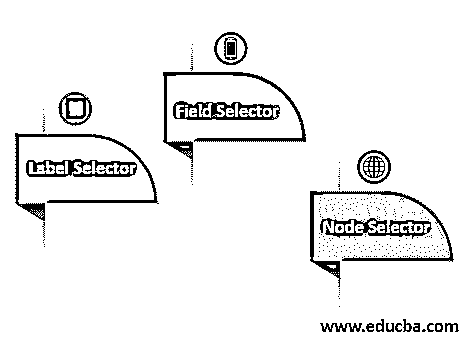
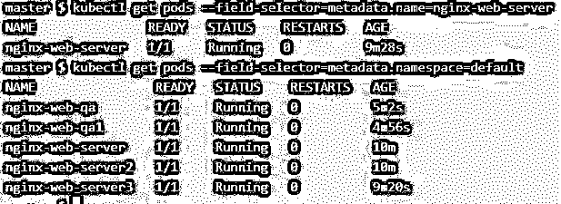

# 库伯内特选择器

> 原文：<https://www.educba.com/kubernetes-selector/>

## Kubernetes 选择器简介

Kubernetes 选择器允许我们根据分配给一组 pod 或节点的标签和资源字段的值来选择 Kubernetes 资源。当我们必须获取详细信息或在一组 Kubernetes 资源上执行任何操作时，或者当我们必须在一组特定的节点上部署一个或一组 pod 时，这是非常有用的。当我们想要获得任何有相似标签的 Kubernetes 对象的细节时，它就像一个过滤器。

### Kubernetes 中的选择器是如何工作的？

所有 Kubernetes 对象都有一些字段或元数据，如名称、名称空间、状态等。如果我们想要获得具有相同名称空间的对象的详细信息，我们可以通过指定选项'–field-selector '来实现。如果我们想使用 labelSelector 或 nodeSelector，我们需要将实际上是键/值对的标签应用于对象或节点。我们用键/值对指定“-l”选项，以获得匹配键/值对的对象列表。例如，如果我们想要列出所有分配了标签关键字等于“环境”且值等于“生产”的 pod，我们只需使用“-l”选项指定“环境=生产”。

<small>网页开发、编程语言、软件测试&其他</small>

### Kubernetes 选择器的类型

以下是 kubernetes 选择器的类型。

#### 1.标签选择器

我们对 Kubernetes 对象应用标签来组织或选择一组对象。标签可以在创建时附加，也可以随时添加和修改。标签区分大小写。我们可以通过选项“-l”使用标签选择器。让我们创建三个标签为“env: prod”和“app: nginx-web”的 pod 和两个标签为“env: QA”和“app: nginx-web”的 pod，如下所示:-

`apiVersion: v1
kind: Pod
metadata:
name: nginx-web-server1
labels:
env: prod
app: nginx-web
spec:
containers:
- name: nginx
image: nginx
ports:
- containerPort: 80`

`apiVersion: v1
kind: Pod
metadata:
name: nginx-web-server3
labels:
env: prod
app: nginx-web
spec:
containers:
- name: nginx
image: nginx
ports:
- containerPort: 80`

`apiVersion: v1
kind: Pod
metadata:
name: nginx-web-qa1
labels:
env: QA
app: nginx-web
………..`

`apiVersion: v1
kind: Pod
metadata:
name: nginx-web-qa
labels:
env: QA
app: nginx-web
………..`

`apiVersion: v1
kind: Pod
metadata:
name: nginx-web-server2
labels:
env: prod
app: nginx-web
spec:
containers:
- name: nginx
image: nginx
ports:
- containerPort: 80`

使用以下命令列出所有带有标签的窗格:

`$kubectl get pods --show-labels`

**说明:**在上面的快照中，我们总共有 5 个带有上述标签的 pod。现在，我们可以使用标签选择器列出所有贴有标签“env=QA”的窗格，如下所示:

`$kubectl get pods -l “env=QA” --show-labels`

**说明:**在上面的快照中，只显示了 QA pods。“–show-option”是可选的，用于确认输出。

下面的命令将显示所有没有标签“env”等于“QA”的 pod，这里将显示生产 pod:-

`$kubectl get pods –l “env!=QA” --show-labels`

我们还可以使用多个标签来缩小结果范围，如下所示:

`$kubectl get pods -l “env=QA, app=nginx-web” --show-labels
$kubectl get pods -l  “env=prod, app=nginx-web” --show-labels`

Kubernetes API 支持两种类型的选择器——基于等式的和基于集合的。上面提到的例子是基于等式的选择器。让我们看一些基于集合的选择器的例子。支持“in”、“notin”和“exists”运算符的。

`$kubectl get pods –l “app in (nginx-web)” --show-labels`

**解释:**第一个命令显示了所有标签为“env”且值为“prod”和“QA”的 pod，在第二个示例中，我们提到了“nginx-web”的“app”键作为基于等式的选择器，这意味着我们可以使用两种类型的选择器来缩小结果范围。

下面的命令演示了“notin”操作符的作用:

#### 2.字段选择符

字段选择器用于根据一个或多个资源字段的值查询 Kubernetes 对象，我们需要在创建对象时定义这些资源字段。我们使用'–字段选择器'选项来获取 Kubernetes 对象的详细信息，如下所示:

`$kubectl get pods --field-selector=metadata.name=nginx-web-server
$kubectl get pods --field-selector=metadata.namespace=default`

**解释:**在上面的例子中，我们使用了上面创建的 pod。我们在没有定义名称空间的情况下创建了这些 pod，因此 Kubernetes 已经指定了“默认”名称空间。在第一个示例中，我们基于“名称”字段进行了查询，只获得了一个输出，因为有一个 pod 使用了该名称；在第二个示例中，基于“名称空间”进行了查询，因此获得了所有 5 个 pod，因为它们都在默认名称空间中。

#### 3.节点选择器

当我们必须在通过了配置文件中定义的标准的特定节点组上部署一个或一组 pod 时，可以使用节点选择器。我们需要相应地标记节点。

在这里，我们将把标签“磁盘=ssd”附加到集群中的一个节点，如下所示:

`$kubectl label <object_type> <object_name> key=value
$kubectl label node node01 disk=ssd`

**说明:**在上面的例子中，用等于“disk”的键重命名节点“node01”，该键的值为“ssd”。如果该键已经被赋予了不同的值，并且想要改变它，则需要使用选项'–overwrite '，如下所示:–

`$kubectl lable node node01 disk=ssd --overwrite`

让我们使用下面的配置文件创建两个 pod，以了解“节点选择器”是如何工作的。这里，我们有一个节点选择器为“磁盘=ssd”的 pod，另一个节点选择器为“磁盘=ssd2”。

`apiVersion: v1
kind: Pod
metadata:
name: nginx-web-ssd
labels:
env: prod
app: nginx-web
spec:
containers:
- name: nginx
image: nginx
ports:
- containerPort: 80
nodeSelector:
disk: ssd`

`apiVersion: v1
kind: Pod
metadata:
name: nginx-web-hdd
labels:
env: prod
app: nginx-web
spec:
containers:
- name: nginx
image: nginx
ports:
- containerPort: 80
nodeSelector:
disk: hdd`

部署上述两个吊舱后，当我们检查吊舱的状态时，它看起来如下:

**说明:**在上面的快照中，节点选择器为“disk=ssd”的 pod 已成功部署，但是，节点选择器为“disk=hdd”的 pod 显示为“Pending”，因为没有标签为“disk=hdd”的可用节点。它将处于“挂起”状态，直到调度程序找到任何带有配置文件中提到的标签的节点。

### 结论

我们已经使用 Kubernetes 选择器来获取对象的详细信息，但是我们可以对其执行任务，例如删除一组带有特定标签的 pod，等等。nodeSelector 是一个非常基本的方法，可以将 pod 约束到节点，但是如果我们需要更多的控制来选择节点，那么我们可以使用节点相似性和反相似性特性。

### 推荐文章

这是一个指南 Kubernetes 选择器。在这里，我们还讨论了 kubernetes 中选择器的介绍和工作原理，以及不同的例子和代码实现。您也可以看看以下文章，了解更多信息–

1.  [立方〔t1〕](https://www.educba.com/kubernetes-kubectl/)
2.  [立方负载平衡器](https://www.educba.com/kubernetes-load-balancer/)
3.  [Kubernetes 部署](https://www.educba.com/kubernetes-deployment/)
4.  密密秘