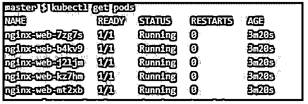
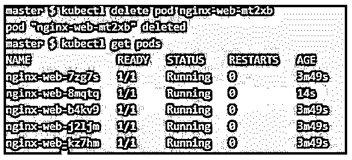
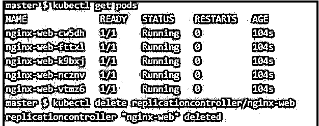
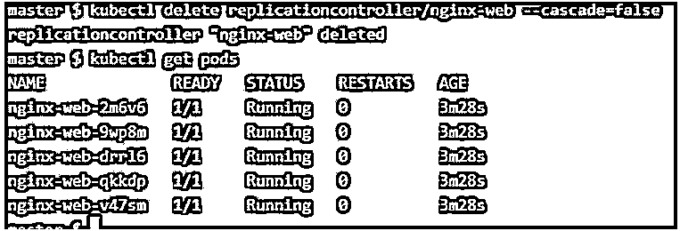

# Kubernetes 复制控制器

> 原文：<https://www.educba.com/kubernetes-replication-controller/>

## Kubernetes 复制控制器简介

Kubernetes 复制控制器确保在给定时间点，相同 pod 的所需副本与相同 pod 的当前副本相匹配，这意味着它确保当前状态始终与所需状态相匹配。Kubernetes 复制控制器保证一个 pod 或一组相同的 pod 永不停机。简而言之，我们称之为“rc ”,我们也在 kubectl 命令中使用这个快捷方式。Kubernetes 复制控制器几乎类似于一个流程监督者，但有一个区别是复制控制器监督多个节点上的多个 pod，而不是监督单个节点上的单个流程。

### 复制控制器如何在 Kubernetes 中工作？

Kubernetes 复制控制器不断将所需的单元数量与当前的单元数量进行匹配，如果运行的单元数量多于所需的单元数量，则终止多余的单元，或者如果单元数量少于所需的数量，则启动更多的单元。如果复制控制器维护的 pod 失败、被删除或被终止，它们将被自动替换。

<small>网页开发、编程语言、软件测试&其他</small>

例如，如果我们需要一个 web 服务器的 3 个副本，那么 Replication Controller 会确保一个 web 服务器的 3 个副本始终正常运行，如果任何一个 pod 由于任何中断性维护(如内核升级)而停止运行，它会自动启动一个新的 pod 来匹配所需的状态，而无需任何人工干预。即使应用程序只需要一个单元，也建议使用复制控制器。

### Kubernetes 复制控制器示例

以下是 Kubernetes 复制控制器的示例:

#### 示例#1

运行 nginx web 服务器的三个副本的复制控制器配置示例。

**代码:**

`apiVersion: v1
kind: ReplicationController
metadata:
name: nginx-web
spec:
replicas: 5
selector:
app: nginx-web
template:
metadata:
name: nginx-web
labels:
app: nginx-web
spec:
containers:
- name: nginx-web
image: nginx
ports:
- containerPort: 80`

将上述代码保存在 yaml 文件“rc_nginx.yml”中，并使用以下命令应用该文件:

**代码:**

`$kubectl apply -f rc_nginx.yml`

**Note:** In the above example, YAML file must be in the current working directory, if file location is different, specify the full path of the file.

**输出:**

**说明:**

在上面的例子中，当我们应用 yaml 文件时，已经创建了一个名为“nginx-web”的复制控制器。

#### 实施例 2

**代码:**

`$kubectl describe replicationcontroller/nginx-web`

**输出:**

**说明:**

在上面的例子中，它描述了与复制控制器‘nginx-web’相关的所有细节。我们在 yaml 文件中提到了 5 个副本，我们可以看到当前状态与所需状态相匹配，即 5 个副本。

让我们列出群集中所有正在运行的 pod，在下面的快照中，我们可以看到只有 5 个 pod 正在运行，pod 的名称以“nginx-web”开头，这是复制控制器的名称，然后是一些字符串以区分 pod。如果我们删除突出显示的窗格并再次列出所有正在运行的窗格，它将再次显示 5 个窗格，但已删除的窗格在列表中不再可用。我们看到一个新的 pod 刚刚创建，末尾有一个新的字符串。这意味着，当我们删除属于该复制控制器的一个单元时，当前状态变为 4，因此复制控制器创建了一个全新的单元。

### 删除复制控制器

下面给出了复制控制器的删除:

1.我们可以使用“kubectl delete”删除复制控制器及其所有单元。

**代码:**

`$kubectl delete replicationcontroller/nginx-web`

**输出:**

**说明:**

在上面的示例中，删除复制控制器后，pod 被终止。

2.我们可以通过将选项'–cascade = false '指定给“kubectl delete”命令来删除复制控制器，但不能删除在该控制器下运行的 pod。

**代码:**

`$kubectl delete replicationcontroller/nginx-web --cascade=false`

**输出:**

**说明:**

在上面的快照中，复制控制器已被删除，但 pod 仍在运行。

3.我们还可以通过更改 pod 的标签来从复制控制器中删除 pod，但是复制控制器将通过创建新的 pod 来替换该 pod。它主要用于将 pod 从服务中移除，以进行调试、数据恢复等。

### 复制控制器的角色

下面给出了复制控制器的角色:

#### 1.重新安排

复制控制器确保指定数量的 pod 始终运行，无论我们在任何情况下都必须运行单个 pod 还是 100 个 pod，即使节点出现故障或 pod 被手动终止或由任何不同的控制代理终止。

#### 2.缩放比例

我们可以使用复制控制器轻松地增减副本的数量。我们只需手动更新“副本”字段或自动缩放控制代理。

#### 3.滚动更新

我们还可以使用复制控制器来滚动更新服务。复制控制器在滚动更新中逐个替换 pod。我们需要创建一个新的复制控制器来实现滚动更新。我们创建一个包含 1 个副本的新复制控制器，然后将它向上扩展一个副本，将旧复制控制器向下扩展一个单元。我们继续这个过程，直到旧的复制控制器达到 0 个副本。一旦旧的复制控制器达到 0 个副本，我们就将其删除。

#### 4.多个发布轨道

“金丝雀”是我们在生产中经常做的测试。在这个测试中，我们只是向一些用户介绍了新版本的应用程序，并没有从产品中完全删除旧版本的应用程序。

例如，我们有一个针对所有 5 个 pod 的服务，现在我们想引入我们应用程序的新版本。我们设置了一个复制控制器，包含 4 个副本，标签为“env=prod”和“track=stable”，另一个复制控制器包含 1 个副本，标签为“env=prod”和“track=canary”。在这里，服务的目标是发行轨道“稳定”和“金丝雀”。我们可以根据测试结果扩展复制控制器的副本。

### 复制控制器的职责

复制控制器的职责如下:

1.复制控制器的主要职责是确保所需的副本数量与当前副本数量相匹配。

2.这里，复制控制器仅考虑从计数中排除的终止的 pod。

3.如果一个 pod 正在运行但不可访问，则复制控制器将替换该 pod，因为它不执行任何就绪或活性探测。

### 结论

如果我们想要连续运行一个 pod 或多个相同的 pod，Kubernetes 复制控制器非常有用，因为复制控制器中只允许“始终”重启策略。Kubernetes 复制控制器有多种替代方案，如“ReplicaSet”、“Deployment”、“Bare Pods”、“Job”和“DaemonSet”。选择什么完全取决于个人的需求。

### 推荐文章

这是 Kubernetes 复制控制器的指南。这里我们讨论一下简介，复制控制器在 kubernetes 中是如何工作的？示例、复制控制器的删除、角色和职责。您也可以看看以下文章，了解更多信息–

1.  [立方负载平衡器](https://www.educba.com/kubernetes-load-balancer/)
2.  [Kubernetes 部署](https://www.educba.com/kubernetes-deployment/)
3.  [立方入口](https://www.educba.com/kubernetes-ingress/)
4.  密密秘

