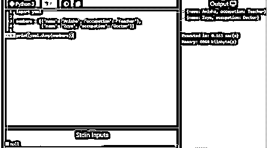

# 库伯内特 YAML

> 原文：<https://www.educba.com/kubernetes-yaml/>

## 

## Kubernetes YAML 的定义

Kubernetes YAML 被定义为,“YAML”是基于文本的信息，它可以被人类阅读，并允许我们借助于地图和名称-值对的联合以及项目的记录来简单地描述配置类型，我们可以通过询问 Kubernetes 以表达它们来获得关于流式对象的附加信息，因此，可以以指示性的方式生成 Kubernetes 的资源，然后利用这些文件， 通过使用 YAML 文件，创建了 Kubernetes 的资源，如 pod、服务和部署，它有四种类型的文件，如 apiVersion、kind、metadata 和 spec。

### 什么是库伯内特 YAML？

YAML 代表另一种标记语言，可用于数据序列化，它是一种基于文本的格式，如 JSON 和 XML，可以由人阅读以增加可读性，在数据序列化标准中，可以用于所有编程语言，它可以由人更新，因此它可以用于人类用例以及机器日志文件、配置文件、进程间消息传递，Kubernetes 中有不同类型的 YAML 文件，包括 apiVersion、kind、元数据、UID、命名空间和 spec。

### YAML 档案怎么写？

*   为了创建 YAML 文件，它有一个包含一个或多个键值对的散列映射，

`key: value`

<small>网页开发、编程语言、软件测试&其他</small>

可以通过设置另一个键-值对来编辑值，

`key:
another_key: “another value”`

*   如果我们想使用多行字符串，那么我们必须在任意数量的行后使用'>'字符，当我们有扩展命令时可以使用它，

`Jaiku :
Please remember me
If anyone write it
ohhh,  and welcome.`

*   要编写 YAML 文件，它有序列，通过使用键和值，我们可以标量为一个序列，

`scalar:
-has
-done
-he
-you`

我们也可以用键值对来编写这些项目，

*   我们可以在配置文件中使用锚和别名，锚由&识别，别名由*识别，

`song:
- &game A2
- he
- man
- fall
- you
- she
- *game`

当我们在 YAML 使用相同的文件时，

`song:
- A2
- he
- man
- fall
- you
- she
- A2`

*   我们也可以使用合并地图来创建 YAML 文件，

`default : &default
collage : jumbokid
sonu:
<< : * default
home : mumbai
dolly :
<< : * default
home : chennai`

我们可以合并多个地图，

`name : &sonu_name
first_name : sonu
last_name : dolly
address : &sonu_address
street : 5, villa
district : Little whising
country: England
sonu_date:
<<: [* sonu_name, *sonu_address]`

这样，我们可以编写 YAML 文件，

### YAML 基础知识

YAML 很方便，我们不需要在命令行中附加所有的变量，它维护得很好，YAML 文件可以附加到源代码控制中，这样在它的帮助下，我们可以跟踪交换，它也很灵活，因此通过使用 YAML 文件，我们可以创建一个更好的复合表单，这样我们就可以在命令行上运行。

它与 JSON 密切相关，这意味着任何有根据的 JSON 文件都是 YAML 文件，我们可以编写 JSON 文件，所以我们不必担心，因为该文件只需要在 YAML 编写，而如果我们试图在网上搜索相同的示例，那么我们会在 YAML 获得文件，而不是在 JSON 中。

它比传统的块格式有更多的基本组件，传统的块格式使用连字符+空格来开始列表中的一个项目，内联格式是用逗号和空格建立的，折叠格式可以将行尾改为空格并消除较大的空白。

### YAML 地图

YAML 映射构成了键-值对的无序集合，由于重复，所使用的键必须是唯一的，如果我们试图配置信息，那么为了理解这一点，让我们考虑这样的配置文件，

例 1)

`---
apiVersion: v1
kind : pod`

在上面的信息中，第一行是一个可选的分隔符，在一个文件中我们可以写多个结构，在上面的文件中，有两个值 v1 和 pod 映射到 apiVersion 和 kind。

例 2)

`{
“apiVersion” : “v1”
“kind” : “pod”
}`

在这种情况下，我们可以使用可选的引用，当我们搜索基于格式的字符串时，可以使用它来创建复杂的结构，我们可以创建一个映射另一个映射的键。

**立方 YAML 列表**:

Kubernetes YAML 中的列表是对象的顺序，我们可以在一个列表中使用许多项目，我们必须用破折号(-)定义项目，然后是父项目。我们也可以在地图上放置成员列表。

与 JSON 相比，YAML 的工作速度更快，我们可以使用许多结构，例如带有一组名称-值对的映射，单个项目也可以在列表中使用，映射的映射，列表的映射，列表的列表，映射的列表，等等。

**创造立方 YAML** :

让我们看一个创建 YAML 文件的例子，

**举例:**

`import yaml
members = [{'name': 'Anisha', 'occupation': 'Teacher'},
{'name': 'Zoya', 'occupation': 'Doctor'}] print(yaml.dump(members))`

**输出:**

在本例中，我们编写了 YAML 文件，并尝试用 python 对其进行转换，因为我们必须使用 dump()方法来序列化 python 对象，其中 yaml.dump()方法可以接受两个参数数据和流，这将给出生成的文档。

### 结论-立方结构 YAML

在本文中，我们得出的结论是，YAML 格式用于人类可读，这意味着它转换文件格式，所以我们也讨论了如何创建 Kubernetes YAML 列表，如何创建 Kubernetes YAML 文件，YAML 地图，我们还看到了 YAML 的基础知识。

### 推荐文章

这是一个库伯内特 YAML 指南。在这里，我们讨论如何创建库伯内特 YAML 列表，以及如何创建库伯内特 YAML 文件，YAML 地图。您也可以看看以下文章，了解更多信息–

1.  [Kubernetes 自动缩放](https://www.educba.com/kubernetes-autoscaling/)
2.  [立方注释](https://www.educba.com/kubernetes-annotations/)
3.  [Kubernetes 选择器](https://www.educba.com/kubernetes-selector/)
4.  [立方控制平面](https://www.educba.com/kubernetes-control-plane/)

