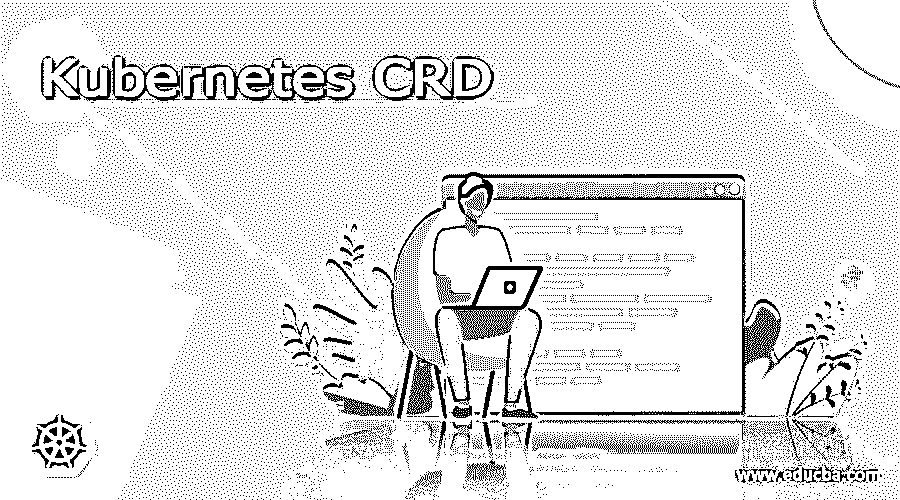

# 忽必烈的 CRD

> 原文：<https://www.educba.com/kubernetes-crd/>

## 什么是库伯内特 CRD？

Kubernetes 中的 CRD 代表自定义资源定义，它允许我们在 Kubernetes 中创建自定义对象。借助于此，我们可以很容易地在 Kubernetes 集群中创建定制的资源或对象，并且它可以像普通的或本地的 Kubernetes 对象一样使用。CRD 的这个概念是在 Kubernetes 1.7 中引入的，当我们想要在 Kubernetes 集群中添加我们自己创建的对象来完全填充或满足需求时，这是非常有用的。这允许我们使用 Kubernetes 中所有可用的特性和功能，在这篇文章中，我们将看到如何在 Kubernetes 中创建一个注册我们的自定义对象，并详细解释其内部工作原理，以便初学者更好地理解。

### 使用自定义资源

正如我们已经讨论过的，CRD 用于创建自定义资源，这为我们增加了如此多的用户，其中很少有人在下面提到:

<small>网页开发、编程语言、软件测试&其他</small>

1)为了运行 CRDs，我们不需要任何额外的服务器；它可以由 API 独立处理。

2)它也是用任何语言编写的，用户或我们不需要担心编程。

3)一旦创建了 CRD，就没有持续的支持。如果有大的出现，那么它将被选为 Kubernetes 主升级。

4)通过使用它，我们不需要为我们的 API 维护多个版本，它易于使用。

5)当我们在公司内部使用这种资源时，或者作为小型开源项目的一部分时，这是最合适的。综合考虑以上几点，我们可以决定什么时候去库伯内特斯的 CRD，所有这些都有助于我们很容易地找到答案。

### 添加库伯内特斯 CRD

在 Kubernetes 中，我们有两种创建定制资源的方法。为了更清楚起见，让我们详细讨论它们中的每一个(见下文);

1)使用 CRDs 的一种方式这可以在没有编程的情况下正常创建。

2)第二种方法是 API 聚合，但要使用它，需要编程，并让我们对 API 创建和行为、数据存储方式以及不同版本 API 之间的转换方式等有更多的控制。

CRD:自定义资源定义，这个 API 允许我们创建自定义资源。它将根据我们提供的模式和名称为我们创建新的定制资源。就由 Kubernetes 服务器管理和处理的存储而言。这是在 Kubernetes 集群中创建定制资源的方法之一，不需要太多编程。

### CRD 立方结构型态

如果我们谈论类型，没有特定 CRD 的这种类型，但是我们在 Kubernetes 中有自定义资源的类型。它为我们提供了两种在 Kubernetes 集群中轻松创建定制资源的方法，让我们仔细看看这两种方法的细节(见下文);

1) CRD，即自定义资源定义:这是在 Kubernetes 中创建自定义资源的一种形式，要创建它，我们不需要有编程知识。我们可以创建 CRD，删除它，等等。为了创建它，我们遵循。yaml 结构定义和少量命令。

2) API 聚合:这也是 Kubernetes 中自定义资源创建的形式之一，但这需要编程知识。有点难以管理等等。

这两点我们已经在文章的前一部分看到了，这里我们将更多地讨论 eh 自定义资源定义，API 聚合，我们将在下一篇文章中看到和讨论。

### 创建对象库伯内特 CRD 和库伯内特 CRD 的例子

为了创造库伯内特斯 CRD，我们必须遵循标准。yml 文件，这将有助于我们为我们创建 CRD，这是标准的，应该是相同的几个小的变化，让我们开始在 Kubernetes 创建 CRD 见下文；

**例如:**

`apiVersion: apiextensions.k8s.io/v1beta1
kind: CustomResourceDefinition
metadata:
name: appconfigs.stable.example.com
spec:
group: stable.example.com
versions:
- name: v1
served: true
storage: true
scope: Namespaced
names:
plural: your_name
singular: appconfig
kind: AppConfig
shortNames:
- ac`

现在，我们必须查看每一行来理解这一点。yml 文件详细定义；

a)在 yml 文件的前两行，我们试图告诉他们我们正在创建一个自定义资源定义；“元数据”是帮助我们定义 CRD 名称的关键。

b)我们在“名称”和“复数”下定义了名称。

c)现在我们可以为 CRD 定义组名，这里我们使用“Spec”属性来定义它。在“规范”下，我们使用“组”属性来定义它。

d)现在我们可以使用“版本”属性来定义自定义资源定义的版本。“版本”属于“规范”属性本身，并定义“v1”。还将“存储”键设为“真”,这意味着该版本将成为我们的存储版本。

e)之后，我们也设定了范围。

f)然后为我们的自定义资源定义定义了“复数”和“单数”名称。

g)它还为我们提供了定义 CRD 的“短名称”和“种类”名称，然后我们可以使用下面的命令来创建它。

**命令:**

`kubectl create -f crd.yaml`

f)在这之后，我们现在可以在下面的语法中找到我们的 CRD 的 API 端点，后面是根据您的 CRD 文件的名称和配置，为了更清楚起见，请参见下面:

**例如:**

`/group name / version/namespaced/*/crd_name`

现在要使用上面的 CRD，我们必须使用下面的来显示它。yml 文件定义；

**例如:**

`apiVersion: "we can give api version"
kind: ann=me of crd
name: this name
spec:
uri: "your uri"`

命令:“如果有命令”

`image: demo-image`

这样，我们可以在 Kubernetes 中创建和使用 CRD，遵循这两个。yml 文件开始。

### 结论

到目前为止，我们已经学习了自定义资源定义的创建，并将它们添加到 Kubernetes 集群中，并使用它们提供的所有功能。这一切都可以通过 vis 命令行界面或者 google 客户端来完成。它易于开发人员使用、操作和维护。o 为了更好地理解全文。

### 推荐文章

这是一个库伯内特 CRD 指南。这里我们讨论什么是 Kubernetes CRD，使用自定义资源，类型与命令。您也可以看看以下文章，了解更多信息–

1.  [Kubernetes 主机路径](https://www.educba.com/kubernetes-hostpath/)
2.  [Kubernetes 环境变量](https://www.educba.com/kubernetes-environment-variables/)
3.  [Kubernetes 复制控制器](https://www.educba.com/kubernetes-replication-controller/)
4.  [Kubernetes 自动缩放](https://www.educba.com/kubernetes-autoscaling/)

