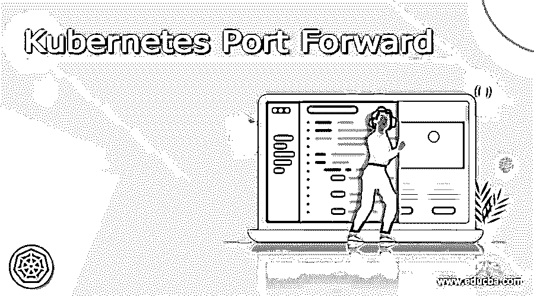

# Kubernetes 港口前进

> 原文：<https://www.educba.com/kubernetes-port-forward/>

## Kubernetes 港口前沿介绍

Kubernetes 端口转发的定义是，端口转发是 Kubernetes 中的命令，它可以从定义的 pod 中避开拥塞，它允许我们从本地主机获得 Kubernetes 操作的内部集群并与之互连，以便我们可以利用该方法来探索问题并在本地平衡我们的服务，而不需要提前发现它们。kubectl 端口转发非常通用，因为它可以转发 TCP 流量，另一方面，kubectl 代理可以转发 HTTP 流量，这对于本地测试或调试非常有用。

### Kubernetes 港口远期概述:

端口转发也称为端口映射，它是计算机网络中的一个应用程序，允许通过请求地址或端口号来转换通信，它还控制来自与本地 TCP/IP 网络相关联的外部服务器的流量，kubectl 端口转发可以将连接转发到本地端口或 pod 上的端口。Kubernetes 有一个内置的 kubectl，它显示可用于为应用程序生成服务的命令，它还分配 IP 地址以从互联网访问应用程序，kubectl 可以选择和分配本地端口，并通过管理本地主机争议找到端口号，port-forward 命令一直用于连接特定的 pod，以便发现问题。 我们可以说，端口转发过程一直用于测试或调试应用程序，以找出运行时的问题，因为用户可以利用应用程序的好处，这是 Kubernetes 端口转发的概述。

<small>网页开发、编程语言、软件测试&其他</small>

### 如何使用 Kubernetes 端口 forward？

port-forward 命令已用于连接我们的 Kubernetes 集群中的任何 pod，如果任何 pod 启动失败，那么我们必须准备好访问服务，并纠正这个问题，因为我们需要有端口转发，这在后端服务中是有用的，而不是专门用于远程目的。Kubernetes 是一个自动化系统，具有端口转发流程，可以访问用户的直接和重复输入，如果与 pod 的连接失败，则可以通过手动运行命令，由新的转发流程重新生成。

kubectl 具有内置的端口转发功能，

*   用户可以与 Kubernetes 互连，因为 Kubernetes 中的 kubectl 在其本地机器上有一个内置的命令行。
*   port-forward 命令可用于描述集群的资产名称，也可用于定义端口号。
*   API 服务器可以在本地主机和集群上运行的资产中建立一个 HTTP 连接。
*   由于这些功能，用户可以很容易地连接到特定的 pod 来纠正问题，或者我们可以说用户能够在调试中找到问题。
*   端口转发是允许访问内部资源的过程。

### 基本 Kubernetes 端口转发命令

它在 Kubernetes 中有一些基本的转发命令，让我们看看其中的一些，

*   “port-forward”是可用于连接命令提示符的命令，用于设置 pod 中的应用程序，它是从目标 pod 到本地主机的过程或机器,“Netsh”命令已用于开始端口转发过程，该命令允许我们替换资产的类型或名称，它们还定义本地和远程端口号。

让我们看看命令，

`‘kubectl port-forward TYPE/NAME [options] LOCAL_PORT: REMOTE_PORT’`

*   如果一些 pod 等同于标准类型或名称，那么它可以以不规则的方式选择 pod，因此为了避免这种不可预测性，我们必须定义一个精确的 pod，我们可以物理地找到精确的 pod 名称，并且我们可以通过键入来获得名称空间下的名称列表。

让我们看看命令，

`‘kubectl –n yournamespace get pods’`

*   如果我们希望授权的连接接近或访问我们的组或集群中的 MongoDB 部署，那么 pod 的名称将是 mongo-db-r3pl1ka3，端口号是 5762，命令如下:

`‘kubectl port-forward pod/mongo-db-r3pl1ka3 8080:5762’`

在此命令中，API 将在本地端口 8080 上可用，它可以将数据转发到 pod 上的端口 5762。

*   对于数据的随机访问，pod 需要与本地 IP 连接，然后它有一个 port-forward 命令，该命令用于将数据随机访问转发到本地端口，它还转发指定 pod 中的端口 5762，让我们看看该命令。

`‘kubectl port-forward pod/mongo-db-r3pl1ka3 8080 5762’`

*   在端口转发中，port-forward 命令用于连接本地主机，它允许通过使用特定 pod 内的端口 8080 和 5762 来转发数据，这对应于本地和远程端口，下面给出了该命令。

`‘kubectl port-forward pod/mongo-db-r3pl1ka3 8080 5762’`

*   该部署已经在端口转发命令中使用，以在相同的 pod 内转发数据，并且还可以在本地定义 pod，

`‘kubectl port-forward deployment/mydeployment 8080 5762’`

*   为了在 pod 上定义端口转发命令，有一个命令可以在同一个 pod 内使用，以检查使用了哪个服务，

`‘kubectl port-forward service/myservice 8080 5762’`

### 结论

在本文中，我们得出结论，port-forward 命令已被用于与 Kubernetes 集群中的任何 pod 链接，然后我们还讨论了几个可以与之连接的命令，我们也看到了如何使用这些命令，本文将有助于详细理解这一概念。

### 推荐文章

这是一个库伯内特港口前进指南。这里我们讨论简介、概述和命令。您也可以看看以下文章，了解更多信息–

1.  [Kubernetes 主机路径](https://www.educba.com/kubernetes-hostpath/)
2.  [Kubernetes 环境变量](https://www.educba.com/kubernetes-environment-variables/)
3.  [Kubernetes 复制控制器](https://www.educba.com/kubernetes-replication-controller/)
4.  [Kubernetes 自动缩放](https://www.educba.com/kubernetes-autoscaling/)

