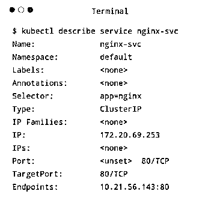
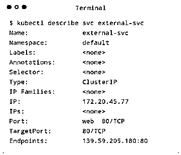

# 立方端点

> 原文：<https://www.educba.com/kubernetes-endpoints/>

## Kubernetes 端点简介

Kubernetes 端点被定义为 Kubernetes 将自动创建端点的位置，这些端点被称为端点，它是一个与服务具有相似名称的对象，并被存储。一般来说，我们可以定义 Kubernetes 端点，这些端点获取或存储一个或多个动态分配给它的 pod IP 地址以及端口。因此，可以使用 kubcetl 软件查看 Kubernetes 端点，代理将被定向到这些 IP 地址和 pods 的端口，每当服务收到请求时，这些 IP 地址和端口就会被分配。

### 什么是 Kubernetes 端点？

Kubernetes 中的端点是一种资源，用于跟踪动态分配给它的对象或 pod 的 IP 地址，它充当服务选择器，通过将 IP 地址添加到端点来匹配 pod 标签，这些点可以使用软件 kubectl get endpoints 来查看。

<small>网页开发、编程语言、软件测试&其他</small>

因此，我们通常可以说这些端点充当资源，这些资源是可以链接到服务的抽象，它将定义实现服务的端点列表。每当我们想要使用端点资源时，我们需要使用必须唯一定义的名称空间和名称来导入这些资源。任何具有端点对象的服务，这些端点对象包含 pod 的 IP 地址，每当这些 pod 被添加或删除时，这些端点对象就会被更新，再次通过整个网络发送，并且还会消耗每个节点，这可能会进一步导致网络中的大量流量，这需要每个节点付出艰苦的劳动。

### Kubernetes 端点示例

在这里，我们将看到使用 Kubernetes 端点示例的两种不同方式，一种是导入 kuberetes_endpoints 资源，另一种是在 kubectl 终端上执行，两种方式都给出类似的输出。

让我们看看 kubernetes_endpoints 资源的用法，示例代码如下所示:

`resource "kubernetes_endpoints" "example" {
metadata {
name = "example"
}
subset {
address {
ip = "10.0.3.4"
}
address {
ip = "10.0.3.5"
}
port {
name = "http"
port = 80
protocol = "TCP"
}
port {
name = "https"
port = 443
protocol = "TCP"
}
}
subset {
address {
ip = "10.0.2.4"
}
address {
ip = "10.0.2.5"
}
port {
name = "http"
port = 80
protocol = "TCP"
}
port {
name = "https"
port = 733
protocol = "TCP"
}
}
}
resource "kubernetes_service" "example" {
metadata {
name = "${kubernetes_endpoints.example.metadata.0.name}"
}
spec {
port {
port = 8080
target_port = 80
}
port {
port = 8443
target_port = 443
}
}
}`

以上是我们使用 Kubernetes 端点资源的示例代码，我们可以看到使用上述端点的示例代码，这些端点使用参数和属性来跟踪用于实现服务的端口的 IP 地址。上面的代码使用了诸如注释、标签、名称、命名空间等参数，以及诸如代、IP、端口、协议、节点名等属性。上述示例用法可以使用其名称和命名空间导入，例如我们可以在上面的代码中看到如下所示:

`$ terraform import kubernetes_endpoints.example default/ terraform-example-name`

现在我们将看到一个示例，Kubernetes 服务使用与上面的示例代码相同的属性和参数，因为在下面的示例代码中，我们将看到，只要 pod 出现，标签匹配开始，流量就开始，因此将通过添加 pod 的 IP 地址来获得此服务的端点列表，因此可以类似于下面的代码所示来创建该示例。
`---
apiVersion: v1
kind: Pod
metadata:
name: nginx-pod
labels:
app: nginx
spec:
containers:
- name: nginx-container
image: nginx
ports:
- name: web
containerPort: 80
protocol: TCP
--- apiVersion: v1
kind: Service
metadata:
name: nginx-svc
spec:
selector:
app: nginx
ports:
- protocol: TCP
port: 80
targetPort: 80`

在这里，我们可以看到我们已经使用默认类型的集群 IP 创建了一个 pod 和服务，因此对于 Kubernetes 端点，当我们在 kubetcl 终端中导入并运行 below 命令时，我们将获得以下属性及其结果。

在这里，在 terminal 上面，我们可以看到一些属性，如 name:提供端点资源的名称，namespace:定义所提供的端点资源的名称内的空间，labels:它包含对端点资源进行组织和分类的键和值，annotations:它也包含与端点资源一起存储的键值，用于存储任意元数据、选择器、IP、端口、端点、targetPort、元数据等。

### Kubernetes 自定义端点

这通常是 Kubernetes API 的扩展，在 Kubernetes 默认情况下不会安装，这代表任何特定 Kubernetes 端点安装的定制，这些用于构建 Kubernetes 功能，使 Kubernetes 更加模块化。因此，自定义端点可以创建将指向任何被指向的资源的端点。让我们看看下面的例子:

`kind: Service
apiVersion: av1
metadata:
name: extrn-svc
spec:
ports:
- name: ex
protocol: TCP
port: 80
targetPort: 80
Then without specifying the selector attribute we escribe the endpoints object as shown below:
kind: Endpoints
apiVersion: av1
metadata:
name: extrn-svc
subsets:
- addresses:
- ip: 139.59.205.180
ports:
- port: 80
name: ex`

在上面的代码中，我们可以看到服务和端点的名称必须始终相同，这里的地址指的是发送流量。因此，要创建它们并检查服务及其端点，如下面的终端所示，我们再次获得与上一个示例相同的属性，但在这个示例中，我们还获得了另一个名为 endpoints 的额外属性，它提供了 IP 地址。

Kubernetes 端点中有许多其他不同的命令来检查工作服务，在 pod 中安装 curl，使用其名称检查可用的服务，等等。此外，我们可以在上面的终端中看到有一个属性 Endpoints，它提供了服务资源的 IP 地址。

### 结论

在本文中，我们得出结论，Kubernetes 端点被用作 Kubernetes 服务中的资源，以跟踪 pod 或端口的 IP 地址。在本文中，我们已经看到了如何获得端点的例子，其中 kubectl 软件描述了端点的创建，它创建了实现实际服务的端点集合。

### 推荐文章

这是 Kubernetes 端点指南。这里我们讨论一下入门，什么是 Kubernetes 端点？代码实现示例。您也可以看看以下文章，了解更多信息–

1.  [Kubernetes 主机路径](https://www.educba.com/kubernetes-hostpath/)
2.  [Kubernetes 环境变量](https://www.educba.com/kubernetes-environment-variables/)
3.  [Kubernetes 复制控制器](https://www.educba.com/kubernetes-replication-controller/)
4.  [Kubernetes 自动缩放](https://www.educba.com/kubernetes-autoscaling/)

