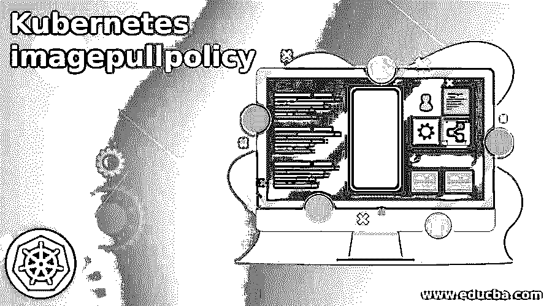

# 库伯斯坦 imagepullpolicy

> 原文:# t0]https://www . educba . com/kubrines-imagepullpolicy/

## kuble image pullpolicy 简介

Kubernetes imagepullpolicy 被定义为 imagepullpolicy，它为其容器设置了值，以控制可以拉开始容器和标签的图像。当 kubelet 试图拉或下载一个特定的图像时，它就工作了。当查询列出容器图像以解决图像的名称时，kubelet 可以定期浮动容器。Kubernetes imagepullpolicy 在 kubelet 需要收集图像的现代化版本时运行，并且 pull 策略在新 pod 建立时生效，然后 kubelet 可以采取 pod 策略指定的适当步骤。

### 什么是不可思议的 imagepullpolicy？

*   Kubernetes 的 imagepullpolicy 可以在收集新的图像版本时执行命令，它是容器的字段，并且可以在启动新的 pod 时使用；因此，kubelet 可以保存由 pod 的策略提供的特定活动，在 Kubernetes 中，我们不需要定义图像拉取策略，如果 pod 没有该策略，那么 Kubernetes 可以根据图像标签来结束我们的设计，例如， 如果我们有一个名为 my-image 的图像，那么 Kubernetes 可以将其转换为 my-release，需要记住的一点是，只有当标签不存在时，这些图像才会被拖动，它们已经在 kubelet 的节点上，因此这个策略被称为 IfNotPresent 策略，Kubernetes 不能根据另一个作品的效果来更改它的 imagepullpolicy。
*   在图像拉取策略的识别中，Kubernetes 可以在更新时指定图像，并且 Kubernetes 将允许根据图像的标签来设置策略，如果被标记为“最新”，那么 Kubernetes 将认为策略的值将是“总是”，并且如果图像没有被认为是“最新”的标签，则策略值将被置为“总是”，否则 orchestrator 将取消并且“图像拉取策略”被置为“如果不存在”

### Kubernetes imagepullpolicy 需要两步。

要将图像从容器拉至注册表，需要两个步骤:

<small>网页开发、编程语言、软件测试&其他</small>

*   该机密具有登录信息，并且是为访问注册表而创建的；具有该秘密的 pod 可以通过从定义的列表中拉出图像来指定。为了首先生成秘密，需要生成可以以 JSON 格式下载的凭证，并且 JSON 格式的密钥可以用于在拖动图像时接近容器。
*   要在 pod 的规范或 YAML 文件中描述图像名称和位置，可以从云列表中拖动图像。

### Kubernetes 的三个图像策略拉动选项

Kubernetes 中的图像拉取策略有三个值:

*   **Always:**image pull policy 描述了如何获取一张图片来通过一个容器，image pull policy 的 Always 值可以一直拉图片，也就是说每次容器启动时都会尝试拖动一个新的类型，通过设置 imagepull policy Always 可以避免图片出现问题。Fairwinds Insights 软件可用于自发检查图像拉取策略；该软件能够识别标签何时未被识别，并且它还通知是否 imagepullpolicy 未被设置为 Always，当 kubelet 具有带有命令摘要的容器图像时，如果 kubelet 利用其缓存图像，但是在本地，否则，kubelet 拖动带有设置摘要的图像，并且可以用于开始容器，我们可以说，如果 imagepullpolicy 的值被设置为“Always ”,那么 Kubernetes 可以一直从存储库中拖动图像。
*   **IfNotPresent:** 这是 imagepullpolicy 的另一个值，其中被称为默认 imagepullpolicy，仅当图像不存在于本地时才用于拖动或拉取图像；它会告诉 kubelet，如果图像已经存在，那么就不需要拉这个图像，另一方面，如果我们想强行拉这个图像，那么我们需要在我们的。yaml 文件。策略的“IfNotPresent”值只能拖动节点上不存在的图像。
*   **Never:** 这也是 imagepullpolicy 的值，其中从不拉取 ku delet 不显示图像的值，如果图像已经在本地存在，那么 ku delet 尝试开始容器；否则，它会失败，容器的编译时可以观察到图像的层已经存在于节点上，因此它们不需要再次拉取。

### 久世 imagepullpolicy 的例子

下面是提到的例子:

#### 示例#1

例如，kubelet 要始终尝试拉，我们必须将 pod 上的“imagePullPolicy”中的“Always”值设置为 imagePullPolicy: Always。

**代码:**

`spec:
containers:
-name: my-assets
image: our-img : our-release
imagepullpolicy: Always`

在上面的例子中，如果我们有一个名为 our-name 的图像，那么 kubelet 可以将它转换成我们的 release，并且 imagepullpolicy 已经被设置为“Always”，因为它获得了已经通过案例的图像。

#### 实施例 2

在 pod 规格文件中指定密码的示例。

**代码:**

`apiVersion: v2
kind: Pod
metadata:
name: nilson
spec:
containers:
-name: application-container1
image: img-best-nature-picture/application-container1
imagePullPolicy: Always
imagePullSecret:
-name: nilson-secret`

在上面的例子中，我们使用一个 pod 的秘密来指定 pod 中的秘密。

### 结论

在本文中，我们得出结论，Kubernetes 中的图像是通过各种 imagepullpolicy 的不同应用程序来管理和提取的，因此我们也看到了 imagepull policy 的三个主要值的一些要点。

### 推荐文章

这是 Kubernetes imagepullpolicy 的指南。在这里，我们讨论了简介、Kubernetes 的三个图像策略拉选项以及示例。您也可以看看以下文章，了解更多信息–

1.  [Kubernetes 主机路径](https://www.educba.com/kubernetes-hostpath/)
2.  [Kubernetes 环境变量](https://www.educba.com/kubernetes-environment-variables/)
3.  [Kubernetes 复制控制器](https://www.educba.com/kubernetes-replication-controller/)
4.  [Kubernetes 选择器](https://www.educba.com/kubernetes-selector/)

