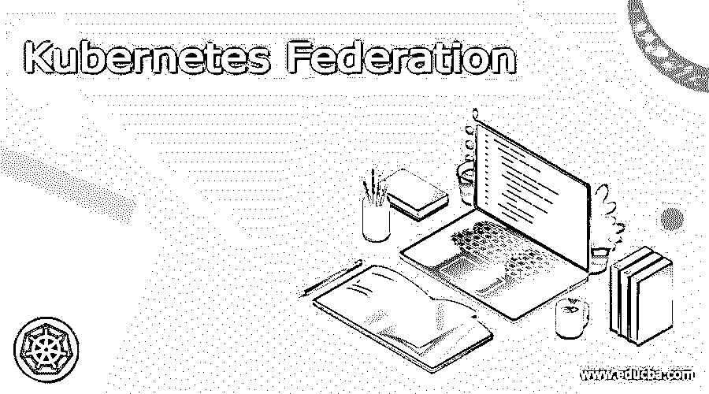

# 忽必烈联合会

> 原文：<https://www.educba.com/kubernetes-federation/>

## Kubernetes 联合会简介

Kubernetes federation 的定义是，它是一个工具，用于在 Kubernetes 中同步各种集群的配置，Kubernetes 称为 KubeFed，它支持一个新标准，该标准具有 Kubernetes 中常用的组件，我们可以控制所有来自托管集群中的 API 集的集群，这样，哪个集群将进行控制，我们还可以控制配置的外观， 它还提供了低级别的工具，因此可以作为在各种集群上逐步复合 Kubernetes 及其用例的基础。

### 什么是 Kubernetes 联合会？

Kubernetes federation 或 KubeFed 是一个工具，用于同步各种集群的配置，Kubefed 可以管理我们是否需要定义哪个集群，还可以管理配置的外观，它允许一个低级机制，可用于增加 Kubernetes 的产量， 联合还可以用于校准，这意味着它可以校准所有各种数据中心的应用程序，在这些数据中心中，应用程序可以支持集群中每个成员的本地变量，我们可以从不同于环境的域名和网络策略中添加特殊内容，Kubefed 可以使用两种类型的配置，即类型配置， 其中它定义了可由 KubeFed 处理的 API 的类型，另一个是集群配置，其中它定义了可由 KubeFed 选择的集群。

<small>网页开发、编程语言、软件测试&其他</small>

### 如何建立 Kubernetes 联盟？

要建立 Kubernetes 联盟，我们需要遵循一些步骤，

**步骤 1:在主机集群上安装 Kube 联盟-**

在开始使用多个集群之前，我们必须通过执行下面给出的命令在主机集群控制平面上安装 Kube 联邦工具，

" helm–namespace kube-Federation-system upgrade-I kube fed kube fed-charts/kube fed–create-namespace–kube-context cluster 1 "

**步骤 2:将集群加入联盟-**

为了加入集群，我们需要有上下文，为此我们必须运行下面的命令，

" kubectl 配置获取上下文"

我们可以通过使用两个集群(如 Admin@cluster1 和 Admin@cluster2)来生成联合集群，其中集群 1 将是主机，kubefedctl 工具已经用于联合集群，

" kubefedctl join cluster 1–cluster-context Admin @ cluster 1–host-cluster-context Admin @ cluster 1 "
" kubefedctl join cluster 2–cluster-context Admin @ cluster 2–host-cluster-context Admin @ cluster 1 "

**步骤 3:测试集群是否已经成功加入-**

我们可以检查在联合中管理的两个群集

" kubectl-n Kube-Federation-system get kubefedclusters "

**步骤 4:创建联邦名称空间-**

在主机集群上生成联合名称空间是非常重要的，因为我们可以将 kubernetes 资产放置到这个名称空间中。为了使它可用于各种集群，我们可以使用 YAML 配置来生成联合名称空间。

**步骤 5:为联盟中的所有集群开发应用程序-**

应用程序的部署将类似于服务对象，我们需要部署具有联合名称空间的 YAML 配置，以便为联合中的两个集群自动开发。

### Kubernetes 联合会建筑

主机集群是支持 Kubernetes 联盟的基本抽象，主机集群承载将生成集群成员的任何配置，它是一个也可以运行实际工作负载的成员，但一般来说，为了清晰起见，任何组织都将主机集群作为独立的集群。

一个 API 可以管理整个群集中的整个配置，其中配置可以决定应该应用哪个群集以及它们将做什么，它有一组策略、模板，并且它可以将特定的群集留给可以控制联合配置的单个群集，并且联合配置还可以控制所有多群集服务的 DNS 条目， 它规定创建配置以访问任何可以应用或删除的集群，这些集群在开发中通常有自己的名称空间，并且在集群上保持兼容。

### 如何创建 Kubernetes 联邦？

Kubernetes 联盟可以在具有集群成员的主机集群上创建，主机集群可以是其中的一员，它也运行实际的工作负载，但通常主机集群是提供清晰性的独立集群。

联合控制平面的开发非常类似于长期建立的开发，其中它提供了类似的功能，以便在联合控制平面中创建它们，从而确保在所有注册的集群上存在一定数量的副本。

我们可以通过向联合 apiserver 发送请求来创建一个联合部署，我们可以为它运行如下命令，

" ku bectl–context = Federation-cluster create-f my development . YAML "，

其中'–context = Federation-cluster '将用于向联邦 API 服务器提交请求，而不是发送到 kubernetes 集群。
创建联合部署后，控制平面将在所有 kubernetes 集群中生成部署，我们可以通过执行下面的命令来检查集群，
“ku bectl–context = fdh-bdup-west1a get deployment mydep”，因此我们可以说已经创建了名为“fdh-bdup-west1a”的集群。

### Kubernetes 联合会示例

在本例中，我们看到了配置是如何在所有集群中传播的，

`apiVersion: types.kubefed.io/v1beta1
kind: FederatedDevelopment
metadata:
name: myinx-test
namespace: myinx-test
spec:
guide:
metadata:
labels:
app: myinx
spec:
replicas: 4
selector:
matchLabels:
app: myinx
guide:
metadata:
labels:
app: myinx
spec:
containers:
- image: myinx
name: myinx
placement:
clusters:
- name: cluster1
- name: cluster3`

### 结论

在本文中，我们得出结论，kubernetes 联合工具可用于 kubernetes 集群中的同步，因此我们也看到了设置、架构以及如何创建 Kubernetes 联合，因此如果有人想了解联合的概念，本文将会有所帮助。

### 推荐文章

这是一个 Kubernetes 联合会的指南。这里我们讨论一下简介，什么是 Kubernetes 联盟，如何建立 Kubernetes 联盟？代码实现示例。您也可以看看以下文章，了解更多信息–

1.  [Kubernetes Daemonset](https://www.educba.com/kubernetes-daemonset/)
2.  [Kubernetes 自动缩放](https://www.educba.com/kubernetes-autoscaling/)
3.  [立方控制平面](https://www.educba.com/kubernetes-control-plane/)
4.  [Kubernetes 选择器](https://www.educba.com/kubernetes-selector/)

