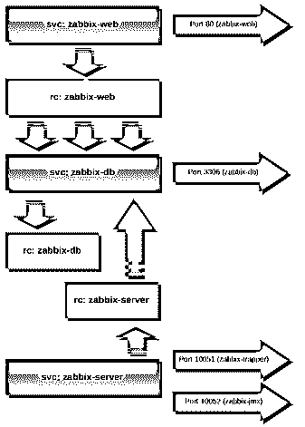

# Kubernetes Zabbix

> 原文：<https://www.educba.com/kubernetes-zabbix/>

## Kubernetes Zabbix 的定义

Zabbix 是一款开源软件，用作各种 IT 组件的监控工具，包括服务器、虚拟机、网络服务器等。Zabbix 帮助我们提供不同类型的指标，比如监控指标、磁盘空间消耗和 CPU 负载。为此，我们需要适当的配置，这可以通过 XML 模板来完成，在这个 XML 中，我们可以定义我们想要进行监控的组件。这是一个基于网络的软件，有一个集中的数据库，它还为我们提供了数据的可视化，可以通过地图、图表、屏幕和概览等看到这些数据。在本教程的下一部分，我们将详细了解它的内部工作和实现，以便对它的工作有更好的了解，更加清晰和理解。

### Kubernetes Zabbix 概述

正如我们所见，Zabbix 是一个用于监控目的的开源软件；在这个的帮助下，我们能够测试它的各种组件。这是一个分布式监控解决方案，它帮助我们跟踪或监控各种 It 组件的不同参数，其中包括网络参数、虚拟机、数据库、应用程序、云、网站以及其他许多可以轻松监控的组件。此外，它还帮助我们为任何类型的事件生成警报，这对开发人员都有帮助。让我们列出关于 Zabbix 的关键点，这些关键点实际上是可用的，并使我们的应用程序更容易监控，如下所示；

<small>网页开发、编程语言、软件测试&其他</small>

1)它有助于数据可视化。2)监控各种 It 组件。
3)提供出色的报告
4)非常快速地发现问题。
5)根据事件帮助通知。

### 如何使用 kubernetes Zabbix？

在本节中，我们将讨论帮助我们在 Kubernetes 中使用 Zabbix 的一步一步的过程。这是一个漫长的过程，我们必须确定文件结构和需要执行的命令集，以便使用 Zabbix 并正确设置它来监控我们的应用程序。所以让我们从零开始更好地理解它；

1)已使用的库版本:v1.18.0

2)应遵循的步骤:

a)在第一步中，尝试使用以下命令创建名称空间；

`kubectl apply -f namespace.yaml`

b)创建后，现在我们将创建配置映射，为此执行以下命令；

`kubectl apply -f configmaps.yaml`

c)第三步是创建 secrtetes。yaml 文件，使用下面的命令；

`kubectl apply -f secretes.yaml`

d)一旦。创建了 ymal 文件，现在是创建数据库的时候了，可以使用下面的命令创建数据库；

`kubectl apply -f database-mysql. yaml`

e)在这些步骤中，我们将在数据库创建之后创建一个 Zabbix 代理。为此，请使用以下命令；

`kubectl apply -f zabbix-agent.yaml`

f)现在将需要 Zabbix 服务器来运行以下命令；

`kubectl apply -f zabbix-server.yaml`

g)这将是创建文件结构的最后一步，在这一步中，我们必须创建前端。yaml 文件，使用下面的命令；

`kubectl apply -f zabbix-frontend.yaml`

至此，我们已经创建了所有需要的文件。现在我们将看到每个文件的意义，详见下文；

1) zabbix-frontend.yaml:该文件用于前端配置。
2) zabbix-server.yaml:该文件用于 zabbix 服务器配置。
3) database-mysql.yaml:该文件用于 Zabbix 数据库配置。
4) zabbix-agent.yaml:该文件用于配置 zabbix 代理。
5) nampespace.yaml:该文件用于命名空间配置。
6) confimaps.yaml:这个文件是一个通用变量，将在各种配置文件中使用。
7)cluster role-monitoring . YAML:该文件包含角色。
8) cadvisor.yaml:该文件帮助我们根据现有数据获取和导出监控指标。
所有这些步骤都可以按照这里写的顺序执行。

### 库比厄斯札比克斯服务公司

这里的服务是指 Zabbix 为我们提供了服务监控功能，这有助于我们获得高水平的监控。有时，开发人员要求他们真正了解服务的高层细节，包括 it 部门提供的所有服务，并不真正关心磁盘空间、处理器负载等。此外，这种高级别的监控有助于我们了解 It 基础架构的薄弱环节、现有 IT 的结构、各种 IT 服务 SLA 以及其他高级别的信息。因此，通过使用 Zabbix 服务，我们可以轻松地跟踪和监控所需的高级信息。对于服务，我们有一个基本结构，如下所示:

1)服务:包括工作站、服务器等。由下面的结构表示；
服务
-工作站
-工作站 1
-工作站 2
-服务器

**复制控制器模式**

在本节中，我们将通过一个图表详细讨论复制控制器模式，以便理解其流程，因此让我们通过图表开始概述(参见下面的流程图以便更好地理解);

正如我们在上图中看到的，它由各种类型的组件组成。它有助于我们监控 It 组件的高可用性。这里，复制机制通过使用二进制和异步来工作。如果我们有多个节点，则按照节点的概念工作，中间的节点将在第一个节点上工作时被禁用，依此类推。它不关心被禁用的节点，它将继续与其他节点一起工作。

### 结论

我们已经看到了 Zabbix 的使用，它帮助我们毫不费力地监控各种 IT 组件。建议通读整篇文章，以便更好地清晰和理解它。它有使用它的所有步骤，并使用命令集正确地配置它。

### 推荐文章

这是一个 Kubernetes 扎比克斯指南。这里我们讨论一下入门，如何使用 kubernetes zabbix 和 Kubernetes Zabbix 跑步？代码实现示例。您也可以看看以下文章，了解更多信息–

1.  [Kubernetes Daemonset](https://www.educba.com/kubernetes-daemonset/)
2.  [Kubernetes 培训](https://www.educba.com/course/kubernetes-training/)
3.  [Kubernetes 主机路径](https://www.educba.com/kubernetes-hostpath/)
4.  [Kubernetes 环境变量](https://www.educba.com/kubernetes-environment-variables/)

