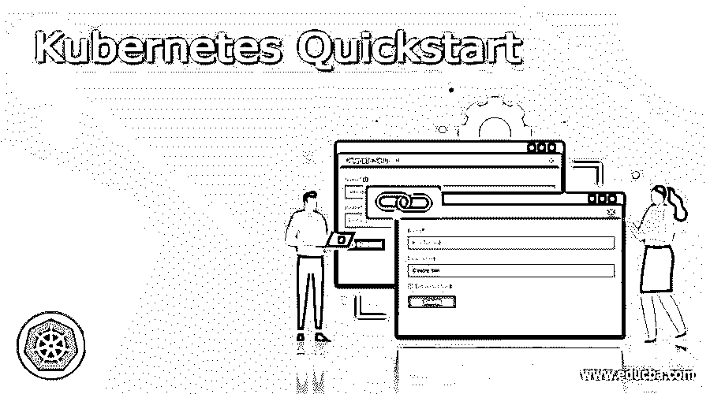
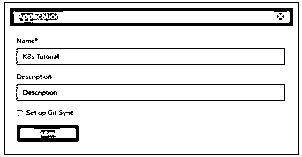
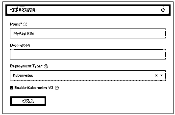
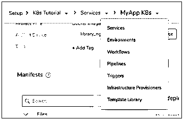
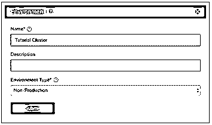

# 忽必烈快速启动

> 原文：<https://www.educba.com/kubernetes-quickstart/>

## Kubernetes 快速入门的定义

在本教程中，我们将更多地讨论使用 Kubernetes 的快速入门指南，因为我们可能需要一些先决条件来开始设置 Kubernetes。但在我们深入了解 Kubernetes 的设置之前，让我们先了解一下 Kubernetes 是什么，它是一个开源平台，可以帮助我们管理和包含服务，这是一个工作负载，可以为我们实现声明性和自动化配置。它也是可扩展和可移植的。此外，我们对它的工具和服务有很好的支持，因为它很容易获得。此外，Kubernetes 拥有发展最快的生态系统，在本教程的下一节中，我们将更详细地讨论 Kubernetes 的工作、实现和快速入门，所有这些都是为了更好地理解和清楚起见而需要从细节入手的先决条件。

### Kubernetes 快速入门概述

在上一节我们已经看到了 Kubernetes 的概述，但是在开始之前，首先要理解下面的内容；

<small>网页开发、编程语言、软件测试&其他</small>

1)为了从 Kubernetes 开始，我们必须具备一些先决条件，让我们来看看快速入门所需的要点和步骤。

2)我们需要一台运行 macOS 或 Linux 的机器。

3)在开始之前，我们还需要一些工具，如下所示:

1) git

2) golang

3) python

4)制作

5)码头工人

6)皮尤姆

7) gcc 编译器

8) pip

因此，在我们开始使用 Kubernetes 之前，我们需要上述工具，这是一个概述，我们将在教程的下一部分详细了解整个设置，以便更好地使用和轻松地在机器上设置 Kubernetes。

### 配置 SPIRE 服务器

我们需要执行以下几组命令，如下所示:

1)使用下面的命令创建命名空间；

`kubectl apply -f spire-namespace.yaml`

2)通过执行以下命令来验证命名空间；

`kubectl get namespaces`

3)如下配置 SPIRE

**例如:**

`kubectl apply \
-f server-account.yaml \
-f spire-bundle-configmap.yaml \
-f server-cluster-role.yaml`

### Kubernetes 快速入门配置文件格式

现在，在本节中，我们将更详细地讨论我们必须遵循的格式。一旦我们在机器上开始设置 Kubernetes，我们必须维护一个配置文件，它应该遵循以下几点，让我们仔细看看它；

1)首先，当我们试图定义配置文件时，我们必须指定所需的 API 的稳定版本。

2)之后，我们应该将配置文件存储在版本控制中，然后再尝试将其推送到集群。这将使我们能够并帮助我们轻松快速地恢复我们想要的更改。这也有助于我们帮助集群恢复和重新创建。

3)我们可以使用 JSON 或 YAML 等任何格式来编写配置文件，但我们始终建议使用 YAML 而不是 JSON，因为 YAML 格式可读性更强，用户友好性也更好。但是 JSON 和 YAML 这两种格式可以互换使用。

4)我们应该总是试图将单个文件内的相关对象分组，以逆可读性，因为我们可以很容易地维护一个文件，而不是寻找几个文件。

5)还要寻找 kubectl 命令，这些命令可以直接从目录中调用。

6)尽量避免用缺省值初始化变量，因为这会不必要的引起错误，文件应该用最小的配置，这将使它不容易出错。

7)也使用注释给出对象描述，这将允许并使我们能够更好地自省。

我们已经查看了示例配置文件，它可以帮助您建立自己的配置文件，见下文；

**例如:**

`apiVersion: veriosn here
kind: type
metadata:
name: your name
labels:
app: your name
tier: your name
role: yourname
spec:
ports:
- port: your port 6379
targetPort: your port 6379
selector:
app: same as above
tier: same as above
role: same as above`

### 下载安装委托

在本节中，我们将看到 Delegate 的安装，并尝试将其启动到集群。为此，我们必须遵循几个步骤让我们仔细看看它，

1)第一步是登录线束。

2)我们将拥有 Harness manager，单击 Setup，在这里我们将配置我们的微服务、部署、管道、构建块、资源等。为了管道。

3)现在点击线束代理。

4)点击委托下载，之后点击 Kubernetes YAML 文件，在这里你会看到委托设置。

5)您可以给出与–k8s-delegate 完全相同的名称。

6)我们将选择主要配置文件。

7)现在下载它，你可以看到 Kubernetes 的 Delegate，它的 YAML 文件，所有的自述文件你现在都可以在你的电脑上看到这个存档。打开命令提示符，试着在你的机器上找到代理路径。

9)现在提取我们已经下载的文件夹，然后导航到我们刚才提取的 harness-delegate-kubernetes 文件夹。

### 创建线束应用程序和服务

按照以下步骤创建应用程序和服务；

1)首先点击线束配置中的创建应用程序，将出现下图的弹出框。2)输入您想要的应用程序名称并提交。
3)应用程序将被创建。

对于服务:

1)点击服务，在弹出的菜单中添加服务。2)填写所有细节，如名称、描述和类型等。
3)点击提交创建您的服务。
4)它会为你创造服务。

### 您的目标 Kubernetes 集群

通过使用它，我们可以表示我们的基础设施，如开发、生产、QA、Stage 等。使用以下步骤进行配置；

1) Breadcrumb 将引导您进入环境。

2)在这里，我们可以添加环境，填写详细信息，如名称、描述类型等。

3)单击提交添加环境。

4)现在转到基础架构设置，并提供详细信息，如名称、描述、类型、版本名称等。

5)提交。

### 结论-kubrines quick start

正如我们已经看到的所有步骤和文件格式，在我们的机器上设置我们的 Kubernetes 遵循整篇文章和步骤，以获得更好的理解和清晰，而且如果我们尝试按照提到的步骤设置，这是很容易的。

### 推荐文章

这是 Kubernetes 快速入门指南。这里我们讨论定义、概述、配置文件格式示例以及代码实现。您也可以看看以下文章，了解更多信息–

1.  [Kubernetes 自动缩放](https://www.educba.com/kubernetes-autoscaling/)
2.  [立方控制平面](https://www.educba.com/kubernetes-control-plane/)
3.  [Kubernetes 选择器](https://www.educba.com/kubernetes-selector/)
4.  [立方注释](https://www.educba.com/kubernetes-annotations/)

