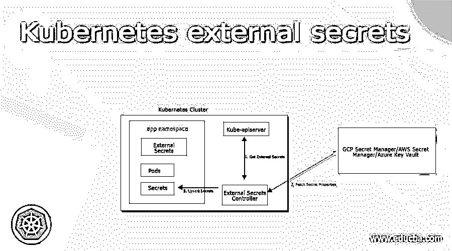

# 永恒的外部秘密

> 原文：<https://www.educba.com/kubernetes-external-secrets/>

## Kubernetes 外部秘密简介

Kubernetes 外部机密的定义是，外部机密是 Kubernetes 中的一个操作符，它结合了外部机密管理系统，我们可以说它是 API 定制资源的集合，为外部 API 提供了用户友好的处理，它可以用来读取来自外部 API 的信息，并且它可以自发地管理作为 Kubernetes 机密的值。 它允许我们利用外部机密管理系统安全地将机密放入 Kubernetes，并且它还能够读取关于 Kubernetes 外部系统的设计和模拟的进一步信息。

### Kubernetes 有哪些对外的秘密？

外部秘密允许我们利用外部管理系统，并将秘密安全地附加在库本内特网上；它还可以读取与 Kubernetes 的设计和灵感相关的额外信息，外部秘密中的秘密是一个携带少量微妙数据(如密码)的实体， 令牌或密钥，其中的信息类型可以存储在 pod 的标识中，因此，当我们尝试使用 kubectl 生成机密时，我们不需要在我们的应用程序代码中包含私有数据，然后它可以生成'-f secret.yaml '以将其存储在' etcd '中，否则，我们必须定义加密提供程序，如果我们尝试在存储机密之前定义提供程序，然后可以在 API 中生成值，kubectl 可以用于获取机密。

<small>网页开发、编程语言、软件测试&其他</small>

库伯内特人可以有支撑秘密的内置物，也可以称为秘密；它提供了一个指示性的 API，使得应用程序可以简单地访问秘密数据，并且不需要任何特殊的代码，秘密对象不管理外部秘密管理系统的存储。

### 使用外部秘密

*   通过使用下面的命令，我们可以将外部机密添加到我们的集群中，

`“kubectl apply -f https://raw.githubusercontent.com/godaddy/kubernetes-external-secrets/master/external-secrets.yml”`

*   下面是通过使用外部机密来处理它们的对象类型，

`“kubectl -n deers-and-bears get es”`

假设我们想要将秘密对象转换成外部秘密。在这种情况下，它使用 Kubernetes secrets CLI 以便转换变得更容易。这可以通过使用 kubectl 命令来完成，该命令可以用来秘密地加载数据，以便生成外部秘密对象。

### Kubernetes 外部秘密示例

下面提到了不同的例子:

#### 示例#1

`apiVersion: v1
kind: Secret
metadata:
name: rat-and-rabbit
type: Opaque
data:
password: b38uXfp=`

在这个例子中，secret 对象被用来存储数据库的密码。

#### 实施例 2

`apiVersion: 'v1'
kind: ExtrenalSecret
metadata:
name: deers-and-bears
secretDescriptor:
backendType: secretsManager
data:
- key: deers-and-bears/mysql-password
name: password`

在这个例子中，ExternalSecret 可以用来标识秘密管理系统，数据可以在一个数组中携带。

### Kubernetes 外部秘密设计

在自定义资源定义的帮助下，外部秘密的对象已经由外部秘密添加，并且为了添加需要写入 node.js 的外部秘密控制器，可以设计对象本身的方位。

外部秘密控制器可以跟随遵循该模式的库对象，这些对象可以是用户可以定义外部秘密对象的状态的发展，控制器可以生成支持对象以突出该状态，控制器可以支持外部秘密对象的对象，并且它还可以从特定的外部秘密管理系统带来秘密信息，并且它可以机械地生成用于携带数据的本地秘密对象。

简单地说，外部秘密的设计，

*   外部机密可以添加到集群中。
*   控制器可以借助 Kubernetes API 给出外部秘密。
*   控制器可以使用外部秘密来获取私有数据。

### 外部秘密管理系统

Kubernetes secret 可以保留私有对象，如密码、令牌和密钥，以在我们的集群中提供安全性，这些秘密可以在 pod 的生命周期中提供更大的灵活性，并且它支持可以在其中使用的敏感数据，从而可以克服向未授权用户泄露数据的风险。

*   秘密是名称空间的对象。
*   秘密可以作为环境变量被缩放，该环境变量可以被 pod 中可用的容器所利用。
*   秘密数据被存放在节点的 tmpfs 中。
*   API 服务器可以像 etcd 中的纯文本一样对数据保密。
*   一个秘密的大小可能是 1 MB。
*   创造一个秘密:

username.txt 和 password.txt 是使用下面的命令创建的，

`“echo -n 'root' > ./username.txt”`

`“echo -n 'Npgs' > ./password.txt”`

*   列表机密:

使用下面的命令创建了机密列表，

`“kubectl get secret/db-serds”`

输出将以表格的形式给出。

*   查看机密:

已经使用下面的命令查看了这些秘密，

`“kubectl describe secret/db-serds”.`

输出会像这样，

`Name:         db-serds
Namespace:    default
Labels:
Annotations:
Type:  Opaque
Data
====
password.txt:  12 bytes
username.txt:  5 bytes`

*   使用 yaml 文件:

可以通过以两种不同的方式使用工作负载来使用该秘密，即通过识别对象，

`“echo -n 'root' | base64”`

*   可以通过识别对象，以两种不同的方式使用工作负载来使用这个秘密。

### 结论

这篇文章的结论是，外部秘密将允许我们管理外部秘密管理系统，该系统可以从外部 API 读取信息。我们也看到了有例子的设计，所以这篇文章将帮助我们理解外部秘密的概念。

### 推荐文章

这是一个 Kubernetes 外部秘密的指南。这里我们讨论 Kubernetes 外部秘密，它将允许我们管理外部秘密管理系统。您也可以看看以下文章，了解更多信息–

1.  [Kubernetes 主机路径](https://www.educba.com/kubernetes-hostpath/)
2.  [Kubernetes 环境变量](https://www.educba.com/kubernetes-environment-variables/)
3.  [Kubernetes 自动缩放](https://www.educba.com/kubernetes-autoscaling/)
4.  [Kubernetes 部署](https://www.educba.com/kubernetes-deployment/)

