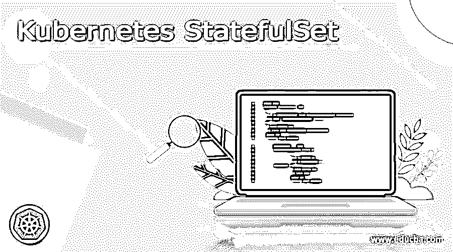

# 忽必烈 StatefulSet

> 原文：<https://www.educba.com/kubernetes-statefulset/>

## Kubernetes StatefulSet 简介

Kubernetes statefulset 的定义是，statefulset 是一种帮助我们安装和管理 Kubernetes pods 组的设备。我们可以说，statefulset 是由 Kubernetes 提供的功能，它具有运行容器的安装选项，并提供关于 pod 的排序和唯一性的保证，如部署。它控制基于类似容器规范的 pod，Kubernetes 中的 pod 以连续顺序安装，并以相反的顺序终止，如果 statefulset 具有 web，则它的 pod 被命名为 web0、web1 和 web2。

### 什么是 Kubernetes Statefulset？

Kubernetes 中的状态集是一种可以用来控制的设备，它可以携带一个或多个 pod，使用状态集应用程序，它不关心哪个网络正在使用，也不需要激光存储，因为状态集应用程序可能需要 web 服务器，我们还需要知道状态集中的每个 pod 都有序数值和稳定的网络 ID，可用于分配， 如果一个 pod 已经由 statefulset 实现，那么它以从 0(零)开始直到最后一个 pod 的订单形式出现，因此 pod 将稳定运行，并且它们在新的 pod 被创建之前做好准备。

<small>网页开发、编程语言、软件测试&其他</small>

### 使用 Kubernetes Statefulset

概述的用于实现有状态应用程序的有状态集和有状态集应用程序对于应用程序是有用的，

*   稳定的并且具有唯一的网络标识符，其中我们可以说有状态的应用对于这种类型的应用是有用的。
*   当我们订购的应用程序具有优雅的实现和伸缩性时，statefulset 非常有用。
*   statefulset 在订购自动滚动更新的应用程序时也很有用。

### 如何创建 statefulset？

我们可以通过使用 kubectl apply 来创建或生成 statefulset，其中 statefulset 可以自发地取代 pod，并自发地连接到具有存储资产的新 pod，这些资产是请求和限制，可以通过使用清单文件来安排 statefulset。

让我们看一个 statefulset 的例子，在这个例子中，它可以首先生成无头服务“mgynx”来打印 pod 的 IP 地址。

《出埃及记》

`apiVersion: v2
kind: Service
metadata:
name: mgynx
label:
appli: mgynx
spec:
ports:
- port: 70
name: web
clusterIP: None
selector:
appli: mgynx
---
apiVersion: apps/v2
kind: StatefulSet
metadata:
name: web
spec:
serviceName: "mgynx"
replicas: 2
selector:
matchLabels:
appli: mgynx
template:
metadata:
labels:
appli: mgynx
spec:
containers:
- name: mgynx
pic: k7m.gcr.io/mginx-slem:0.7
ports:
- containerPort: 70
name: brow
volumeMounts:
- name: www
mountPath: /user/share/mgynx/html
volumeClaimTemplates:
- metadata:
name: www
spec:
accessMode: [ "ReadOnlyMany" ] resource:
requests:
storage: 2Gi`

在上面的例子中，我们有两个终端。首先，我们创建了一个无头服务，并使用“kubectl get”在 statefulset 中创建 pod，如下所示。

`‘kubectl get pods -w -l appli= mgynx’`

在第二个终端中，我们使用了“kubectl apply”来创建 headless 服务和定义 web 上的 statefulset。YAML，

`‘kubectl apply -f web. yaml’`

通过使用这个命令，我们可以生成两个在服务器上运行的 pod。

当我们运行命令“kubectl get service mgynx”时，它会给出与服务器 mgynx 相关的服务；当我们运行命令“kubectl get statefulset web”时，它会显示成功创建的 statefulset。

### 状态设置中的豆荚

状态集合中的 pod 具有一个特殊的顺序索引和一个稳定的网络身份，

*   序数索引:

我们可以通过使用下面的命令将 pod 设置为 statefulset，

`‘kubectl get pods -l appli=mgynx’`

正如我们在 statefulset 中看到的，pod 可以具有与特殊序数相关的粘性和特殊身份，我们可以将它们分配给 statefulset 中的每个 pod，如果 statefulset 有两个副本，则它会生成两个 web，即 web-0 和 web-1。

*   网络身份:

每个 pod 都有一个稳定的主机名，该主机名可以基于它们的序号索引号。已经使用了“kubectl exec”命令来执行主机名

*   0 1 中的 forido ku bectl exec " we b-$ I "-sh-c ' hostname '；' done '，此命令将同时提供 web-0 和 web-1。
*   “kubectl run”命令已用于执行容器。
*   我们可以使用“kubectl delete”命令删除 statefulset 中的 pod。

### Kubernetes 陈述了一系列限制

它对 Kubernetes 中的 statefulset 有一些限制，如果

*   Kubernetes 中给定 pod 的存储库应配备永久卷设备，这取决于管理员的查找存储类别。
*   如果我们移除或向下提升状态集，那么将不能移除与状态集相关的卷，这可以解决数据的安全性，这比自动移除所有状态集资产更有帮助。
*   现在，statefulset 有一个负责 pod 网络身份的无头服务。
*   如果 pod 已被移除，则 statefulset 不给出 pod 关闭的保证，如果 statefulset 被删除，则为了实现 pod 的有序和优美的结论，我们可以将 statefulset 缩小到 0 以进行移除。

o 当我们在 pod 管理策略的帮助下使用滚动更新时，可以获得可以手动修复的崩溃状态。

### 结论

在本文中，我们得出结论，Kubernetes 中的 statefulset 已被用于控制 statefulset 应用程序，其中它提供了排序和唯一性的保证，我们讨论了如何使用 statefulset，如何创建它，限制以及如何在 Kubernetes 中创建 statefulset。

### 推荐文章

这是 Kubernetes StatefulSet 的指南。这里我们讨论一下简介，什么是 Kubernetes Statefulset，如何创建，以及例子。您也可以看看以下文章，了解更多信息–

1.  [Kubernetes Daemonset](https://www.educba.com/kubernetes-daemonset/)
2.  [Kubernetes 主机路径](https://www.educba.com/kubernetes-hostpath/)
3.  [Kubernetes 环境变量](https://www.educba.com/kubernetes-environment-variables/)
4.  [Kubernetes 自动缩放](https://www.educba.com/kubernetes-autoscaling/)

