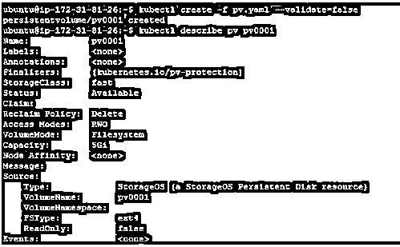
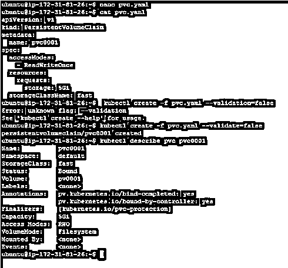

# 立方体积

> 原文：<https://www.educba.com/kubernetes-volume/>

## Kubernetes 卷介绍

Kubernetes 卷是一个目录或容器的文件系统，它有一个可定制的信息存储。这是一个单点功能，kubernetes 可以通过它在整个网络分布中分配资源和服务。这种可定制的信息存储还允许管理员从一个点管理其对象及其属性。Kubernetes 的生命周期取决于容器是否存活。在容器终止并重启之前，该文件系统是可用的。根据 pod 的存在，Kubernetes 卷对于存储临时数据非常有用。如果需要，信息存储可以不同地分布在许多 pod 中。由于 kubernetes 卷是一个充当管理员的文件系统，它可以很容易地从整个网络中的各种 pod 中搜索信息。

### 立方体积类型

**1。本地节点目录存储器**:本地节点存储器连接到 pod，它存储在 RAM 或永久存储器中。由于它们的 pod 依赖性，当 pod 运行时，它们的内容是可用的。如果停机，数据就会丢失。

<small>网页开发、编程语言、软件测试&其他</small>

**例如，**empty dir 和 hostPath 附加到 pod，存储在存储器或 RAM 中。

**2。Cloudstorage volumes** :这种类型的卷位于独立于应用程序的 pod 之外。它用于保存数据。它的缺点多于优点。请查看以下列表:-

1.  这是很难处理的，因为他们的沟通
2.  在连接到 Pod 之前，用户必须对存储有足够的了解。

例如:–gcepersistindisk，awsElasticBlockStore。

**3。文件共享卷**:在这种卷类型中，NFS 通过 YAML 文件与卷连接。最初，卷的内容被卸载以供使用，但它是可用的。不像 NFS 的空空如也，即使没有吊舱，体积仍然存在。

**4。分布式文件系统**:这种类型的卷必须安装到您的 pod 中。该卷可以预先填充数据，并且该数据可以被传递到相应的 pod。例如:glusterfs

请在下面找到用于 glusterfs 的 yaml

`apiVersion: v1
kind: Pod
metadata:
name: glusterfs
spec:
containers:
- name: glusterfs
image: nginx
volumeMounts:
- mountPath: "/mnt/glusterfs"
name: glusterfsvol
volumes:
- name: glusterfsvol
glusterfs:
endpoints: glusterfs-cluster
path: kube_vol
readOnly: true`

请查看下面的输出:-

**5。特殊卷类型**:持久卷和持久卷 Claim 是一种特殊的卷，主要用于 kubernetes 集群。

持久卷(PV)是在主机中物理存在的存储块，用于存储持久数据。PV 的主要特点是它有一个独立的生命周期，当访问它的 pod 关闭时，它还会继续存在。每个 PV 都包含一个规范和状态，即卷的规范和状态。请查看下面的示例:-

`apiVersion: v1
kind: PersistentVolume
metadata:
name: cba
spec:
capacity:
storage: 5Gi
accessModes:
- ReadWriteOnce
persistentVolumeReclaimPolicy: Recycle
nfs:
path: /temp
server: 127.0.0.1`

请查看下面的输出:-

PV 将具有特定的存储容量。这是使用 PV 的容量属性设置的。

### 永久卷(PV)访问模式

每个卷都由 PV 提供的特定访问模式支持。请在下面找到访问模式详情:-

不同的可用访问模式有:

**read write once–**如果只有一个节点，卷可以由唯一的节点以读写方式装载

**readonly many–**如果有许多节点，卷可以由许多其他节点以只读方式装载

**read write many–**如果有任何节点，卷可以被许多其他节点以读写方式装载。

### 卷的阶段

**可用—**如果卷的空闲资源未准备好申请，则卷的这种状态处于可用状态。

**Bound—**当 PersistentVolumeClaim 将卷绑定到声明时。这种体积状态被认为是束缚态。

**Released—**当卷资源在集群中不可用时，尽管现有的声明已被删除。在这种情况下，该卷被视为处于释放状态。

**失败–**如果卷未能通过其自动进程申请，则该卷被视为处于失败状态。

持久卷声明是一种请求平台在应用程序中创建持久卷的请求。永久卷(PV)和永久卷声明(PVC)之间的通信通常是通过它们的生命周期过程进行的。Kubernetes 寻找 PVC 中定义的条件，如果有，它将与 PV 的声明相匹配。这叫做绑定。我们可以通过两种方式提供永久卷(PV)

**Static–**集群管理用来在 yaml 文件中创建静态分配的卷。管理包含有关可供集群用户使用的存储的信息。

**动态–**一旦管理员创建了与用户的 PersistentVolumeClaim 相匹配的卷，集群就会尝试动态配置该卷。pod 可以通过申请卷来访问存储。pod 的命名空间及其声明用于由群集查找，以便持久卷可以轻松声明。然后，主机和 pod 都可以使用该卷。

请查找永久卷声明(PVC)的配置

`kind: PersistentVolumeClaim
apiVersion: v1
metadata:
name: claimVol
spec:
accessModes:
- ReadWriteOnce
resources:
requests:
storage: 8Gis`

找到下面的输出:-

每个 PVC 都有一个规格和索赔状态。每当 PVC 请求具有特定访问模式的存储时，索赔使用与卷相同的约定。

### 卷和索赔的生命周期

**供应:**一个集群管理员将创建几个 PV。它们载有可供使用的存储细节。

**绑定:**用户创建一个 PersistentVolumeClaim，使用其任何访问模式请求特定的存储量。

**使用:**豆荚通常会声称自己的体积。集群检查声明以找到绑定卷，并为 pod 安装相同的卷。

**释放:**当用户使用完他们的卷时，他们可以从 API 中删除 PVC 对象，这允许回收资源。

**回收:**持久卷的回收策略告诉集群在卷被释放后如何处理该卷。

### 推荐文章

这是一个库伯内特卷指南。在这里，我们讨论了 Kubernetes 卷的类型以及卷和索赔的生命周期。您也可以阅读以下文章，了解更多信息——

1.  密密秘
2.  [Kubernetes 部署](https://www.educba.com/kubernetes-deployment/)
3.  [如何安装 Kubernetes？](https://www.educba.com/install-kubernetes/)
4.  [立方算子](https://www.educba.com/kubernetes-operators/)

