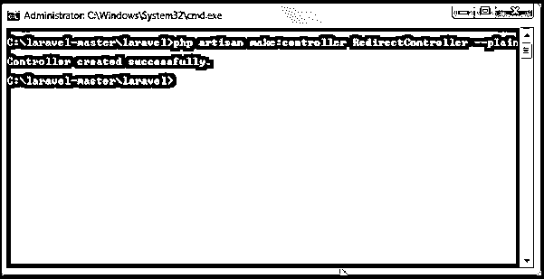

# Laravel 重定向到 URL

> 原文：<https://www.educba.com/laravel-redirect-to-url/>

## Laravel 重定向到 URL 简介

Laravel 重定向是那些将用户从一个页面转移到另一个页面的重定向。该页面可以是完全不同的网页，也可以在同一网站内。重定向帮助用户访问页面的其他部分或获取同一主题的相关信息，而不必自己去寻找。这导致节省了大量的时间。

重定向还增加了用户体验的满意度，这是任何开发人员的最终目标。

<small>网页开发、编程语言、软件测试&其他</small>

### 为什么我们使用 Laravel 重定向到 URL？

使用 Laravel 框架是用户体验创新高的原因之一。该框架足够健壮和灵活，开发人员可以快速创建功能。Laravel 框架也是一个高度可扩展的框架，可以面对大多数挑战。这就是为什么电子商务所有者和开发者喜欢在他们的电子商务设置中使用这个框架来创建功能的原因。

Laravel 框架还有一个连接到一个巨大库的表达性查询命令行系统。这允许开发者从多个选项中进行选择来创建单一功能。这提高了质量，缩短了周转时间。laravel 框架本身是开源的，它允许第三方程序集成到它们的命令行中。这也是开发人员更喜欢使用 laravel 框架来创建庞大系统的原因。

### 实现 Laravel 重定向到 URL 的示例

让我们看几个例子来理解 laravel 重定向到 URL 是如何工作的:

#### 示例#1

**代码:**

`Route::get('user/profile', ['as' => 'profile', function () {
//
}]);
<html>
<body>
<h1>Example of Redirecting to Named Routes</h1>
</body>
</html>
Route::get('/test', ['as'=>'testing',function() {
return view('test2');
}]);
Route::get('redirect',function() {
return redirect()->route('testing');
});
http://localhost:8000/redirect`

**输出:**

上面的例子是重定向到命名路由

#### 实施例 2

返回 redirect()-> action(' NameOfController @ method name '，[parameters])；

`php artisan make:controllerRedirectController –plain`

**代码:**

`<?php
namespace App\Http\Controllers;
use Illuminate\Http\Request;
use App\Http\Requests;
use App\Http\Controllers\Controller;
class RedirectController extends Controller {
public function index() {
echo "Redirecting to controller's action.";
}
}
Route::get('rr','RedirectController@index');
Route::get('/redirectcontroller',function() {
return redirect()->action('RedirectController@index');
});
http://localhost:8000/redirectcontroller`

**输出:**

这个例子举例说明了重定向到控制器动作。

### 重定向代码

下面是重定向代码的几个简单例子。

在下列情况下可能会发生重定向:

*   重定向到 Laravel 中的 URL。
*   重定向回 Laravel 中的上一页。
*   重定向到 Laravel 内的指定路由。
*   重定向到 Laravel 框架中参数内的命名路由。
*   在 Laravel 框架中重定向到控制器动作。
*   使用 Laravel 框架中的给定参数重定向到控制器动作。
*   Laravel 框架中使用 Flashed 会话数据的重定向。

**1。重定向到 Laravel 中的 URL。**

`return redirect('user/dashboard');`

**2。重定向回 Laravel 中的上一页。**

`return redirect()->back();`

运筹学

`return redirect()->back()->withInput();`

**3。重定向到 Laravel 内的指定路由。**

`return redirect()->route('home');`

**4。重定向到 Laravel 框架中参数内的命名路由。**

`return redirect()->route('users', [1]);`

**5。在 Laravel 框架中重定向到控制器动作。**

`return redirect()->action('App\Http\Controllers\UserController@index');`

**6。使用 Laravel 框架中的给定参数重定向到控制器动作。**

`return redirect()->action('App\Http\Controllers\UserController@index', ['id' => 1]);`

**7。Laravel 框架中使用 Flashed 会话数据的重定向。**

`return redirect('home')->with('messgae', 'Welcome to ExpertPHP Tutorials!');`

### 查看和重定向的区别

理解视图和重定向之间的区别很重要:

*   当我们点击一个链接时，作为回报，我们会看到一个页面，这意味着我们主要是在响应一个 URL。例如，如果有人点击某个页面的职业链接并访问该页面，这里所做的只是查看该页面。这意味着 URL 通过以视图的形式向用户提供输出来做出响应，在本例中是/career 页面，它的链接最初是被点击的。
*   重定向完全是另一回事。重定向正在转换 URL，这意味着用户正在调用不同的控制器方法。
*   同样的一个经典例子是登录错误过程。这种情况已经发生在我们身上很多次了。我们转到登录页面，插入我们的登录 ID 和密码。如果凭据正确，我们将进入下一页。但是，如果它不正确，则会显示一条错误消息，说明“登录凭证不正确”或类似内容，并再次重定向到登录页面。

有相当多的例子展示了重定向。

1.  有时，当高级用户访问 VIP 页面时，我们会被要求首先以用户身份登录。这是重定向的另一个经典例子。要进入网站的特定页面或利用特定的付费服务，必须先通过认证。认证可以有不同的形式。然而，在大多数情况下，登录是必要的，因为客人不能利用上述服务。因此，会闪现一条消息，说明需要登录。然后用户被重定向到登录页面。
2.  这些是开发人员最常用来帮助用户的重定向。它们还增强了用户体验，这通常会提高用户参与度。
3.  正如上面的许多例子所说明的，有无数种方式可以发生重定向。在这种情况下，使用 URL。
4.  另一种重定向形式是让用户返回到上一个视图。这也是重定向，不应该与视图混淆。前面已经提到了视图的例子。

### 结论

Laravel 框架以其灵活性而闻名，上面的例子就是证明。该框架还可以与 Java 平台集成以提供相同的功能。重定向是开发行话不可或缺的一部分。它允许用户访问网页的所有相关部分以及其他来源。用户理解重定向之间的区别也是非常必要的。如前所述，它可以有多种类型。本文主要关注基于 URL 的重定向以及实现重定向的多种方式。有了 Laravel 框架，开发翻开了新的一页。它不仅使它更快，而且更好。

### 推荐文章

这是一个指南 Laravel 重定向到网址。这里我们讨论 Laravel 重定向到 URL 的介绍，以及它的不同例子和代码实现。您也可以浏览我们推荐的其他文章，了解更多信息——

1.  [Laravel 车型有哪些？](https://www.educba.com/laravel-models/)
2.  [Codeigniter vs Laravel–主要差异](https://www.educba.com/laravel-vs-codeigniter/)
3.  [Laravel 控制器简介](https://www.educba.com/laravel-controllers/)
4.  [DOM pdf Laravel 指南](https://www.educba.com/dompdf-laravel/)

