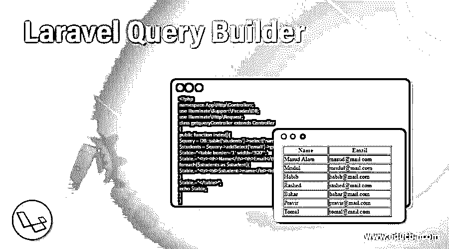
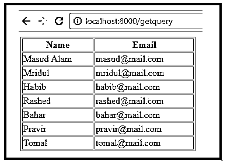
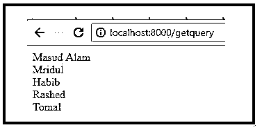
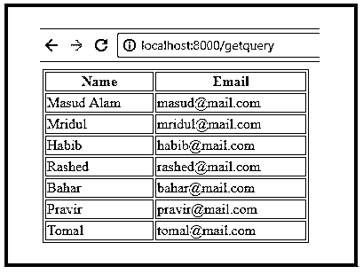
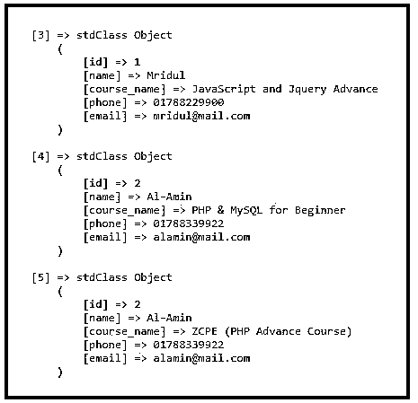
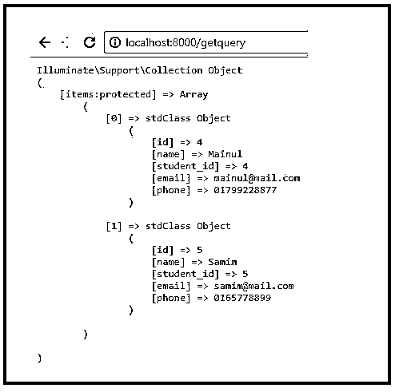
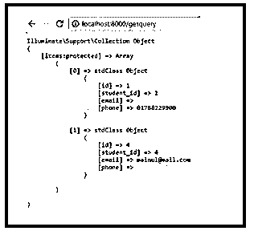
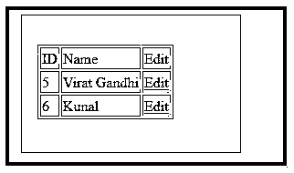

# Laravel 查询生成器

> 原文：<https://www.educba.com/laravel-query-builder/>

## Laravel 查询生成器简介

Laravel 框架最重要的功能之一是查询构建器。Laravel 框架的数据库查询生成器为创建和操作数据库查询提供了一个方便流畅的界面。它可以用来完成应用程序中的大多数数据库操作，并在所有支持 Laravel 框架的数据库系统上执行。它基于 PDO 参数绑定来保护应用程序免受任何 SQL 注入攻击。gets 的优点是不需要清理作为绑定传递的字符串。

**查询的几个例子:**

<small>网页开发、编程语言、软件测试&其他</small>

1.从所述表中获取用户。

**代码:**

`$users = DB::table('users')->get();`

2.从所述表中获取一行。

**代码:**

`$user = DB::table('users')->where('name', 'John')->first();`

3.去拿约翰和他的身份证。

`$user_id = DB::table('users')->where('name', 'John')->pluck('id');`

4.去取几列。

**代码:**

`$users = DB::table('users')->select('name', 'email')->get();`

5.获取小于 10 的用户 id。

**代码:**

`$users = DB::table('users')->where(id, '<', 10)->get();`

6.获取编号在 10 到 20 之间的 id。

**代码:**

`$users = DB::table('users')->whereBetween('id', array(10, 20))->get()`

在讨论 Laravel 查询构建器时，还需要了解 ORM。ORM 或对象关系映射器是一种连接到对象的方法，无需考虑对象与其源的关系。拉勒维尔的 ORM 被称为雄辩者。雄辩允许开发者用一个简单易用的语法把数据库对象和关系联系起来。雄辩的 ORM 提供了主动记录执行，这意味着我们在 MVC 结构中创建的每个模型都与数据库中的一个表相关。

### Laravel 查询生成器的示例

下面是一些例子:

#### 示例#1

显示不同列中的所有行。

**代码:**

`<?php
namespace App\Http\Controllers;
use Illuminate\Support\Facades\DB;
use Illuminate\Http\Request;
class getqueryController extends Controller
{
public function index(){
$students = DB::table('students')->select('name', 'email as student_email')->get();
$table="<table border='1' width='300'";
$table.="<tr><th>Name</th><th>Email</th></tr>";
foreach($students as $student){
$table.="<tr><td>$student->name</td><td>$student->student_email</td></tr>";
}
$table.="</table>";
echo $table;
}
}`

**输出:**

#### 实施例 2

只选择唯一的值，将重复的值放在一边”。

**代码:**

`<?php
namespace App\Http\Controllers;
use Illuminate\Support\Facades\DB;
use Illuminate\Http\Request;
class getqueryController extends Controller
{
public function index(){
$students = DB::table('students')->distinct()->get(["name"]);
foreach($students as $student){
echo $student->name," ";
}
}
}`

**输出:**

#### 实施例 3

添加新列。

**代码:**

`<?php
namespace App\Http\Controllers;
use Illuminate\Support\Facades\DB;
use Illuminate\Http\Request;
class getqueryController extends Controller
{
public function index(){
$query = DB::table('students')->select('name');
$students = $query->addSelect('email')->get();
$table="<table border='1' width='300'";
$table.="<tr><th>Name</th><th>Email</th></tr>";
foreach($students as $student){
$table.="<tr><td>$student->name</td><td>$student->email</td></tr>";
}
$table.="</table>";
echo $table;
}
}`

**输出:**

#### 实施例 4

执行 Inner Join()查询函数。

**代码:**

`<?php
namespace App\Http\Controllers;
use Illuminate\Support\Facades\DB;
use Illuminate\Http\Request;
class getqueryController extends Controller
{
public function index(){
$students = DB::table('students')
->join('contacts', 'students.id', '=', 'contacts.student_id')
->join('course_choice', 'students.id', '=', 'course_choice.student_id')
->join('courses', 'students.id', '=', 'course_choice.student_id')
->select('students.id','students.name','courses.course_name','contacts.phone','contacts.email')
->get();
echo "<pre>";
print_r($students);
echo "</pre>";
}
}`

**输出:**

#### 实施例 5

执行高级联接子句。

**代码:**

`<?php
namespace App\Http\Controllers;
use Illuminate\Support\Facades\DB;
use Illuminate\Http\Request;
class getqueryController extends Controller
{
public function index(){
$students=DB::table('students')
->join('contacts', function ($join) {
$join->on('students.id', '=', 'contacts.student_id')
->where('contacts.student_id', '>', 3);
})
->get();
echo "<pre>";
print_r($students);
echo "</pre>";
}
}`

**输出:**

#### 实施例 6

使用 Laravel 查询构建器，您可以执行联合查询。

**代码:**

`<?php
namespace App\Http\Controllers;
use Illuminate\Support\Facades\DB;
use Illuminate\Http\Request;
class getqueryController extends Controller
{
public function index(){
$first = DB::table('contacts')
->whereNull('phone');
$students = DB::table('contacts')
->whereNull('email')
->union($first)
->get();
echo "<pre>";
print_r($students);
echo "</pre>";
}
}`

**输出:**

#### 实施例 7

执行 update()方法。

laravel > PHP artisan make:controllerStudUpdateController–plain

**代码:**

`<?php
namespace App\Http\Controllers;
use Illuminate\Http\Request;
use DB;
use App\Http\Requests;
use App\Http\Controllers\Controller;
class StudUpdateController extends Controller
{
public function index()
{
$users = DB::select(‘select * from student’);
return view(‘stud_edit_view’,[‘users’=>$users]);
}
public function show($id)
{
$users = DB::select(‘select * from student where id = ?’,[$id]);
return view(‘stud_update’,[‘users’=>$users]);
}
public function edit(Request $request,$id)
{
$name = $request->input(‘stud_name’);
DB::update(‘update student set name = ? where id = ?’,[$name,$id]);
echo “Record updated successfully. ”;
echo ‘<a href = “/edit-records”>Click Here</a> to go back.’;
}
}
<html>
<head>
<title>View Student Records</title>
</head>
<body>
<table border = “1”>
<tr>
<td> ID </td>
<td> Name </td>
<td> Edit </td>
</tr>
@foreach ($users as $user)
<tr>
<td>{{ $user->id }} </td>
<td>{{ $user->name }} </td>
<td><a href = ‘edit/{{ $user->id }}’>Edit</a></td>
</tr>
@endforeach
</table>
</body>
</html>
<html>
<head>
<title>Student Management | Edit</title>
</head>
<body>
<form action = “/edit/<?php echo $users[0]->id; ?>” method = “post”>
<input type = “hidden” name = “_token” value = “<?php echo csrf_token(); ?>”>
<table>
<tr>
<td> Name </td>
<td>
<input type = ‘text’ name = ‘stud_name’
value = ‘<?phpecho$users[0]->name; ?>’/></td>
</tr>
<tr>
<td colspan = ‘2’>
<input type = ‘submit’ value = “Update student” /></td>
</tr>
</table>
</form>
</body>
</html>
Route::get(‘edit-records’,’StudUpdateController@index’);
Route::get(‘edit/{id}’,’StudUpdateController@show’);
Route::post(‘edit/{id}’,’StudUpdateController@edit’);`

**输出:**

**点击编辑选项后:**

**操作成功后:**

使用 Laravel 查询构建器的优点是它简化了相关步骤，并以更快的速度执行任务。这有助于开发人员以更快的速度实现它。这是 Laravel 大部分功能构建的前提。

### 结论

Laravel 框架是最受欢迎的框架之一，因为它为客户提供了大量的选择。使用 Laravel Query Builder，用户可以执行所有相关的基本查询，以获得所需的输出或项目所需的内容。

### 推荐文章

这是一个指南，以 Laravel 查询生成器。这里我们讨论 laravel 查询构建器的介绍，并通过例子来更好地理解。您也可以看看以下文章，了解更多信息–

1.  [Laravel 表单](https://www.educba.com/laravel-forms/)
2.  [Laravel Distinct](https://www.educba.com/laravel-distinct/)
3.  [Laravel 创建表格](https://www.educba.com/laravel-create-table/)
4.  [拉韦勒刀片](https://www.educba.com/laravel-blade/)

