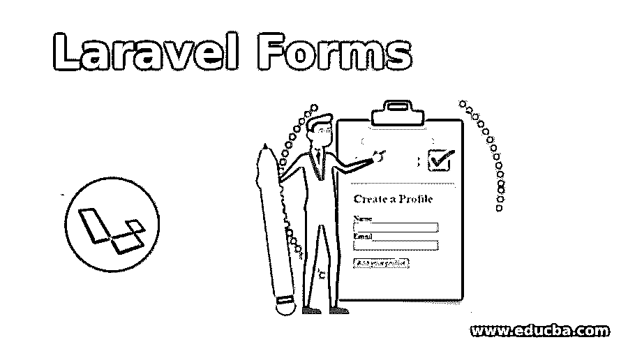
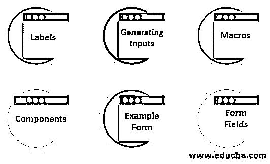
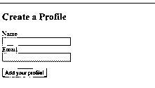

# 拉腊维尔形式

> 原文：<https://www.educba.com/laravel-forms/>

## Laravel 表单介绍

在 Laravel 中，在处理对象时，您需要非常频繁地更新或创建这些对象。因此，创建表单变得非常常见，以便在数据库中更新或创建这些资源。

所以首先让我们从打开表单开始。

<small>网页开发、编程语言、软件测试&其他</small>

`{!! Form::open(array('url' => 'xxx/yyy')) !!}
//
{!! Form::close() !!}`

按照惯例，方法“Post”是自动假定的；但是，也可以指定另一种方法。

**例如:**

`echo Form::open(array('url' => 'xxx/yyy', 'method' => 'put'))`

您还可以创建指向控制器方法或命名路由的表单。

**例如:**

`echo Form::open(array('action' => 'Controller@<method-name>'))echo Form::open(array('route' => 'route.<route-name>'))`

参数也可以传递给这些表单。

**例如:**

`echo Form::open(array('action' => array('Controller@<method-name>', $user->id)))echo Form::open(array('route' => array('route.<route-name>', $user->id)))`

还可以使用“文件”选项将文件上传到表单。

**例如:**

`echo Form::open(array('url' => 'xxx/yyy', 'files' => true))`

**Note:** In order to keep your application protected from forgery requests, Laravel automatically adds CSRF token. It protects your application by placing a random token in the session.

### 使用模型绑定创建表单

曾经希望您的表单根据模型内容填充吗？这里是破解，试试 Form::model 如下图:

`echo Form::model($user, array('route' => array('user.update', $user->id)))`

这样，当生成一个表单元素时，比方说一些输入文本，字段值将采用与字段名称匹配的模型值。让我们用一个例子来理解这句话。因此，如果输入文本被命名为“link”，那么模型的属性“link”将被视为值。但是有一些旧的输入。如果与输入名称匹配，它们将接受新值。

**Note**: Don’t forget to use Form::close while using Form::model.

#### 1.标签

现在让我们跳到标签，看看标签元素是如何生成的。所以是这样的:

`echo Form::label('email', '<email-address>');`

谁不喜欢在蛋糕上多加点樱桃呢？让我们指定一些额外的属性如下:

`echo Form::label('email', ‘<email-address>’, array('class' => 'awesome'));`

#### 2.生成输入

**文本输入:**

`echo Form::text('FirstName');`

**默认输入:**

`echo Form::text('email', 'xxyy@gmail.com');`

**文本区输入:**

`echo Form::textarea('address');`

**密码输入:**

`echo Form::password('passkey');`

**数字输入:**

`echo Form::number('contact', 'some-value');`

**文件输入:**

`echo Form::file('picture');`

要使文件输入工作，“文件”选项应为“真”。

`[echo Form::open(array('url' => 'xxx/yyy', 'files' => true))]`

**单选按钮输入:**

`echo Form::radio('name', 'some-value');`

有时我们需要已经选中的单选按钮，语法如下:

`echo Form::radio('name', 'some-value', true);`

**复选框输入:**

`echo Form::checkbox('name', 'some-value');`

有时我们需要已经选中的复选框，语法是这样的:

`echo Form::checkbox('name', 'some-value', true);`

**下拉列表:**

`echo Form::select('married', array('Y' => 'Yes', 'N' => 'No'));`

有时我们需要已经选择了默认值的下拉列表，语法如下:

`echo Form::select('married', array('Y' => 'Yes', 'N' => 'No'), 'N');`

**分组列表:**

语法是这样的:

`echo Form::select('colour', array(    'Primary' => array('red' => 'Red'),    'Secondary' => array('purple' => 'Purple'),));`

**按钮:**

`echo Form::button('click');`

**提交按钮:**

`echo Form::submit('confirm');`

#### 3.宏指令

你知道我们可以在表单类中定义自己的助手吗？是的，我们可以！这些被称为“宏”。它们很容易被定义。现在，我们来看看如何定义其中一个。你必须给你的宏起一个名字和一个闭包。现在像这样简单地注册它:

`Form::macro('myMacroField', function(){    return '<input type="awesome">';});`

Tadaa，你的宏已经定义好了。

是时候看看你将如何调用你的宏了。所以，可以用名字来称呼。语法是这样的:

`echo Form::myMacroField();`

#### 4.成分

我们可以像自定义宏一样定义自己的自定义组件。组件和宏的唯一区别是组件使用刀片模板生成 HTML，而宏使用闭包。闭包被证明对前端非常有用，前端需要一些特殊的表单标记。

让我们来看看定制组件是如何构建的。同样的语法是这样的:

`Form::component('someText', 'components.form.text', ['name', 'someValue', 'parmeters']);`

**传递默认值:**

在为组件编写方法签名时，可以传递默认值。你只需要给数组列表赋值。这是如何做到的:

`Form::component('someText', 'components.form.text', ['name', 'someValue' => null, 'parmeters' => []]);`

**调用组件:**

如果我们想调用上面创建的组件(我们传递了一些默认值)，可以这样做:

`{{ Form::someText('last_name')}};`

它的输出将是这样的:

`

<label for=”last_name”>Last Name</label>
<input type=”text” name=”last_name” value=”” class=”form-control”>

`

#### 5.示例表单

以我们的 web 应用程序中的“Profile”模型和“ProfileController”资源控制器为例。我们现在将创建一个显示表单的个人资料页面。此表单将用于创建“个人资料”对象。我们的控制器创建配置文件的功能如下所示:

`public function create()
{
$profile = new Profile;
return view('profile.create', ['profile' => $profile]);
}`

现在需要创建一个对象，并应该传递它。然后，这个新创建的对象将用于在我们的视图“create”中创建一个表单。

内容如下:

`{!! Form::model($profile, ['action' => 'ProfileController@store']) !!}
{!! Form::close() !!}`

#### 6.表单字段

让我们以“简档”模型中来自用户的两个输入为例。假设我们以“姓名”和“电子邮件”为例。这只是两个文本字段。添加这些字段后，我们的表单将类似于:

`{!! Form::model($profile, ['action' => 'ProfileController@store']) !!}

{!! Form::label('name', 'Name') !!}
{!! Form::text('name', '', ['class' => 'form-control']) !!}

{!! Form::label('email', 'Email') !!}
{!! Form::text('email', '', ['class' => 'form-control']) !!}

<button class="btn btn-success" type="submit">Add your Profile!</button>
{!! Form::close() !!}`

这将向用户显示一个配置文件创建表单，您可以通过它从用户那里获取数据，并将其存储在您的数据库中，如下所示:

让您熟悉表单的另一个简单示例:

`{!! Form::model($car, ['action' => 'CarController@store']) !!}

{!! Form::label('make', 'Make') !!}
{!! Form::text('make', '', ['class' => 'form-control']) !!}

{!! Form::label('model', 'Model') !!}
{!! Form::text('model', '', ['class' => 'form-control']) !!}

<button class="btn btn-success" type="submit">Add the Car!</button>
{!! Form::close() !!}`

现在，如果你点击网址，你会看到这样一个表格:

让我们看另一个例子，它也包含一个下拉菜单和单选按钮。

`@extends('layout.layout')
@section('content')
<h1>Add New Product</h1>

<form action="/products" method="post">
{{ csrf_field() }}

<label for="title">Product Name</label>
<input type="text" class="form-control" id="productName" name="name">

<label for="description">Product Company</label>
<select class="form-control" name="company">
<option>Apple</option>
<option>Google</option>
<option>Mi</option>
<option>Samsung</option>
</select>

<label for="description">Product Amount</label>
<input type="text" class="form-control" id="productAmount" name="amount"/>

<label for="description">Product Available</label> 
<label class="radio-inline"><input type="radio" name="available" value="1"> Yes</label>
<label class="radio-inline"><input type="radio" name="available" value="0"> No</label>

<label for="description">Product Description</label>
<textarea type="text" class="form-control" id="productDescription" name="description"></textarea>

@if ($errors->any())

<ul>
@foreach ($errors->all() as $error)
<li>{{ $error }}</li>
@endforeach
</ul>

@endif
<button type="submit" class="btn btn-primary">Submit</button>
</form>
@endsection`

现在，如果你点击网址，你会看到这样一个表格:

### 结论——Laravel 表格

希望这篇文章能够让您轻松理解 Laravel 表单的概念。到目前为止，我们已经介绍了足够多的 Laravel 表单概念，它将使您能够创建具有良好表单的 web 应用程序，这将帮助您从用户那里获取数据并将其存储在您的数据库中。你还在等什么？准备，就位，开始。快乐发展！

### 推荐文章

这是一本拉腊维尔表格指南。在这里，我们还讨论了引入和创建一个带有模型绑定的表单，以及不同的例子。您也可以看看以下文章，了解更多信息–

1.  [拉勒维尔集体](https://www.educba.com/laravel-collective/)
2.  [幼虫工匠](https://www.educba.com/laravel-artisan/)
3.  [Laravel 迁移](https://www.educba.com/laravel-migration/)
4.  [Laravel Orderby](https://www.educba.com/laravel-orderby/)

