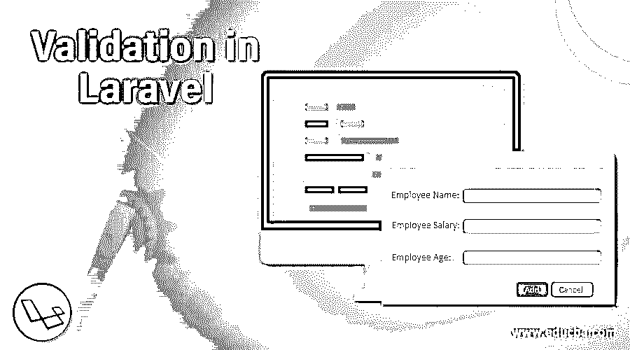

# Laravel 中的验证

> 原文：<https://www.educba.com/validation-in-laravel/>




## Laravel 中的验证简介

验证数据与 [web 应用开发](https://www.educba.com/what-is-web-application/)齐头并进。您可以自由地使用 Laravel 中可用的多种数据验证方法中的一种。“ValidatesRequests”为您提供了许多非常强大的验证规则，以便验证来自 HTTP 请求的数据。

**定义路线**

<small>网页开发、编程语言、软件测试&其他</small>

首先，我们将在文件“routes/web.php”中定义两条路由。Get 和 Post 是两条表示路线。该表单将在 Get 的帮助下显示给用户，数据将使用 Post 存储在数据库中。

因此，路由定义如下:

```
Route::get('ExampleForm'/create, 'MyController@create');
```

```
Route::post('ExampleForm', 'MyController@store');
```

### 创建控制器

现在让我们创建一个控制器，我们将在其中创建一个从用户那里获取数据并存储这些数据的函数。如果你不熟悉创建一个控制器，那么浏览下面创建控制器的要点，否则直接进入验证逻辑。

*   使用下面的 artisan 命令创建控制器。

```
Php artisan make:Controller MyController
```

*   使用上述命令，将创建 MyController.php 文件，其默认代码如下:

```
<?php
namespace App\Http\Controllers;
use Illuminate\Http\Request;
use App\Http\Controllers\Controller;
class MyController extends Controller
{
/**
* Form shown to user
* @return Response
*/
public function create()
{
return view('ExampleForm.create');
}
/**
* Function to Store data.
*
* @param Request $request
* @return Response
*/
public function store(Request $request)
{
// Validating and storing data
}
}
```

### 验证逻辑

为了验证数据，我们将在 store()方法中插入验证逻辑。将从对象“Illuminate\Http\Request”中使用“Validate”方法进行数据验证。

现在，您可以插入您的验证规则存储方法，如下所示:

```
/**
* Store data.
*
* @param Request $request
* @return Response
*/
public function store(Request $request)
{
$validation = $request->validate([
'name' => 'required|unique:ExampleForm|max:255',
'email' => 'required',
]);
// Data is valid.
}
```

在这里，我们可以在方法“validate”中指定我们自己的自定义验证规则。控制器将一直运行，直到您指定的验证规则失败。验证规则失败后，将会引发错误响应，并且用户会看到一条错误消息。

**Note:** You can use ‘bail’ if you want to ignore all further rules after a validation rule has been failed.

**举例:**

```
$request->validate([
'name' => 'bail|required|unique:ExampleForm’|max:255,
'email' => 'required',
]);
```

在这里，如果“最大”规则验证失败，那么“唯一”规则将被忽略。这表明验证是按照定义中的规则顺序进行的。

### **D** 显示错误

如果在执行控制器时，任何验证规则失败，那么用户将被自动重定向到验证失败之前用户所在的位置。因此，如果我们谈论我们之前所举的例子，用户应该被自动重定向以创建一个方法。反过来，这将允许显示输出错误响应。

```
<!-- /resources/views/profile/create.blade.php -->
<h2>Create Profile</h2>
@if ($errors->any())
<div class="alert alert-danger">
<ol>
@foreach ($errors->all() as $error)
<li>{{ $error }}</li>
@endforeach
</ol>
</div>
@endif
<!-- Create Profile -->
```

### Laravel 中的验证规则

一些最广泛使用的验证规则列表:

**1。已接受:**只能是 1、on、true 或 yes。它可以用于接受与网站相关的某些术语。

**2。alpha:** 要验证的文本只能包含字母。

**3。alpha_num:** 要验证的文本只能包含字母和数字。

**4。alpha_dash:** 要验证的文本只能包含字母、数字、下划线和破折号。

**5。array:** 要验证的文本应该是一个数组。

**6。布尔:**唯一接受的值是 0，1，“0”，“1”，真和假。

**7。date:** 要验证的文本只能是符合 PHP 函数的日期格式。

**8。distinct:** 适用于数组。要验证的数组不应包含重复值。

**9。email:** 要验证的文本应该是邮件。

10。ends_with: < value1 >，< value2 >，..:要验证的文本应该以指定的值结束。

**11。image:** 输入文件应该是扩展名为 png、jpeg、gif、bmp、webp 或 svg 的图像。

**12。integer:** 要验证的文本应该是一个整数。

13。必需:指定的字段应该包含某个值，并且不能留空。

**14。string:** 要验证的文本应该是一个字符串。

### 使用表单请求进行验证

当你必须处理复杂的验证场景时，“表单请求”就开始起作用了。表单请求只是一个类，您将在其中插入验证规则。为了使用表单请求进行验证，首先我们需要创建表单请求。

让我们看看如何创建表单请求。

```
php artisan make:request StoreProfile
```

您已经成功地生成了类 StoreProfile，它被放在目录“app/Http/Requests”中。通常，这个目录已经存在，但是如果它不存在，不要担心，因为它会在您运行上面的命令时被创建。

让我们看看如何插入验证规则，如下所示:

```
/**
* Getting validation rules.
*
* @return array
*/
public function rules()
{
return [
'name' => 'required|unique:ExampleForm|max:255',
'email' => 'required',
];
}
```

现在让我们看看这些验证规则是如何执行的。你只需要输入你的请求，就可以了，传入的请求将被验证。

```
**
* Storing user’s profile.
*
* @param StoreProfile $request
* @return Response
*/
public function store(StoreProfile $request)
{
// Request is valid
// Retrieve validated data
$validated = $request->validated();
}
```

如果在执行控制器时，任何验证规则失败，那么用户将被自动重定向到验证失败之前用户所在的位置。

**表格请求授权**

“授权”方法可用于在用户对任何资源执行任何动作/操作之前对用户进行身份验证。

### 错误消息的定制

您还可以通过重写方法“messages”来自定义应该向用户发送什么样的错误响应。

```
public function messages()
{
return [
'name.required' => 'Your name is required',
'email.required' => ‘An email is required',
];
}
```

### 结论——在 Laravel 的验证

希望到目前为止，我们已经在 Laravel 中学习了足够多的验证概念，这将使您能够创建包含验证规则的 web 应用程序，同时它将是健壮和安全的。

### 推荐文章

这是 Laravel 中的验证指南。这里我们讨论 laravel 中的介绍、创建控制器、验证逻辑和验证规则。您也可以看看以下文章，了解更多信息–

1.  [Laravel 控制器](https://www.educba.com/laravel-controllers/)
2.  [拉勒维尔集体](https://www.educba.com/laravel-collective/)
3.  [在 PHP 中验证](https://www.educba.com/validation-in-php/)
4.  [Laravel 积垢发生器](https://www.educba.com/laravel-crud-generator/)


