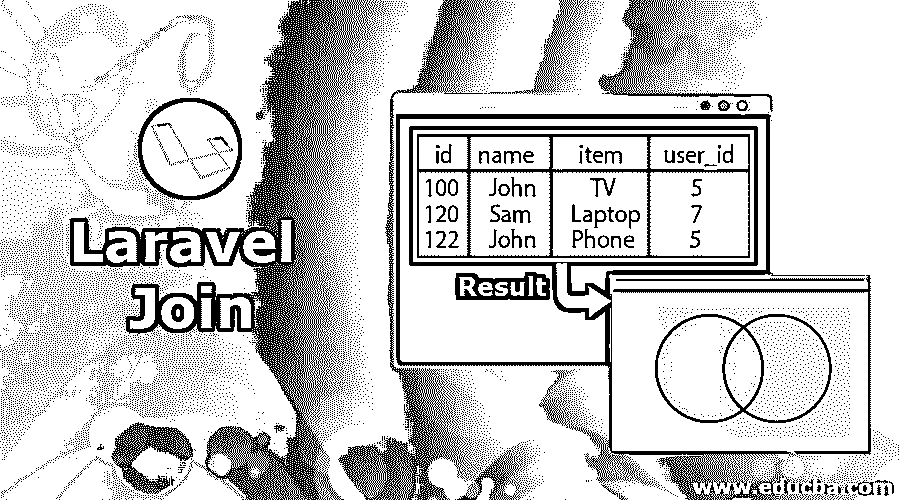
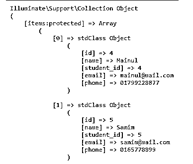
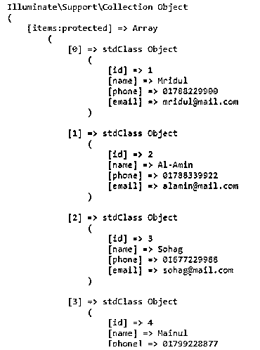
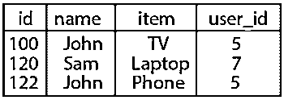
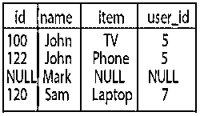

# 拉勒维尔连接

> 原文：<https://www.educba.com/laravel-join/>

## Laravel Join 简介

Laravel 框架是目前科技界最受欢迎的框架之一。原因是它的易用性和可扩展性。一段时间以来，它获取函数的健壮而简单的方法已经赢得了人们的喜爱。因为这个原因，Laravel 框架已经成为创建电子商务网站的首选。客户端有各种各样的功能可供选择。Laravel framework 是一个受欢迎的平台的另一个原因是因为它能够促进第三方集成。它无缝地工作来创建整个系统。在本文中，我们将快速了解 Laravel Join，看看它对从多个数据点创建报告有多大帮助。

### 什么是 Laravel 加入？

借助 Laravel 中的连接查询，可以添加两个或更多的表。它有助于将大量不同的表集成到一个单一的参考点。

<small>网页开发、编程语言、软件测试&其他</small>

它被分成不同的部分:

**Laravel Inner Join:** 只有当给定列的选定值与两个表都匹配时，该子句才会选择记录。

我们必须非常谨慎地选择。

*   **Laravel Left Join 子句:**Laravel Left Join 子句将返回左表中出现的所有值，即使右表中没有匹配项。因此，右边的表将返回空值。
*   **Laravel Right Join 子句:**Laravel Right Join 子句将返回右侧表中出现的所有值，即使左侧表中没有匹配项。因此，左边的表将返回空值。
*   **Laravel Cross Join 子句:**Laravel Cross Join 子句允许表 1 中的每一行与表 2 中的每一行连接。
*   **Laravel Advanced Join 子句:**在该子句中，其他功能可以包含在命令集中。像“where”和“orwhere”这样的查询可以用来比较列和值。
*   **Laravel 子查询联接:**它是高级联接子句的延续，其中插入了一个子查询来扩展主查询的功能。

所有这些连接使得 Join 子句成为最常用的查询之一。

### 实现 Laravel 连接的示例

让我们看一个例子来充分说明这一点。

#### 示例#1

高级连接子句:

**代码:**

`<?php
namespace App\Http\Controllers;
use Illuminate\Support\Facades\DB;
use Illuminate\Http\Request;
class getqueryController extends Controller
{
public function index(){
$students=DB::table('students')
->join('contacts', function ($join) {
$join->on('students.id', '=', 'contacts.student_id')
->where('contacts.student_id', '>', 3);
})
->get();
echo "<pre>";
print_r($students);
echo "</pre>";
}
}`

**输出:**

#### 实施例 2

左连接子句

**代码:**

`<?php
namespace App\Http\Controllers;
use Illuminate\Support\Facades\DB;
use Illuminate\Http\Request;
class getqueryController extends Controller
{
public function index(){
$students = DB::table('students')
->leftJoin('contacts', 'students.id', '=', 'contacts.student_id')
->select('students.id','students.name','contacts.phone','contacts.email')
->get();
echo "<pre>";
print_r($students);
echo "</pre>";
}
}`

**输出:**

现在，这个例子是关于集成不同的表集并将其集成。Join table 返回两个表中都存在的所有记录或行。

#### 实施例 3

让我们来看看语法:

`Join(‘order’, ‘users.id’,’=’,’orders.user_id’)`

*   **‘顺序’:**第二个表的标识符
*   **‘用户，id’:**第一个表的键
*   **'=':** 运算符
*   第二个表的**‘orders . user _ id’:**键

**这是内部连接子句的语法分解:**

**代码:**

`// Use table “users” as first table
$usersOrders  = DB::table('users')
// Perform a Join with the “orders” table, checking for the presence of matching
// “user_id” column in “orders” table and “id” column of the “user” table.
->join('orders', 'users.id', '=', 'orders.user_id')
// Retrieve users from the table as an array of objects containing users and
// products that each user has purchased
->get();
1 select * from `users` inner join `orders` on `users`.`id` = `orders`.`user_id``

**输出:**

让我们看看左连接子句的语法:

`leftJoin(‘order’, ‘users.id’,’=’,’orders.user_id’)`

*   **‘顺序’:**第二个表的标识符
*   **‘用户，id’:**第一个表的键
*   **'=':** 运算符
*   第二个表的**‘orders . user _ id’:**键

这是左连接子句的分解，现在让我们看一个表示相同含义的例子:

**代码:**

`// Use table “users” as first table
$usersOrders  = DB::table('users')
// Perform a Left Join with the “orders” table, checking for the presence of
// matching “user_id” column in “orders” table and “id” column of the “user” table.
->leftJoin('orders', 'users.id', '=', 'orders.user_id')
// Retrieve an array of objects containing records of “users” table that have
// a corresponding record in the “orders” table and also all records in “users”
// table that don’t have a match in the “orders” table
->get();
1 select * from `users` left join `orders` on `users`.`id` = `orders`.`user_id``

**输出:**

左连接尤其适用于这样的情况:即使第二个表中没有匹配的记录，您也希望获得第一个表中的所有记录。Join 子句可用于多种功能。

同样的逻辑也适用于 SQL。事实上，SQL 是 PHP 和 Laravel 框架的前身，这个想法是相似的。连接功能将吸收所有不同的表，并将它们组合在一起以获得相关的输出。这可以:

**左连接:**

`SELECT Orders.OrderID, Customers.CustomerName, Orders.OrderDate
FROM Orders LEFT JOIN Customers
ON Orders.CustomID=Customers.CustomerID;`

| **订单 ID** | **客户名称** | **订购日期** |
| Three hundred and eight | 安娜普什科娃 | 1990 年T3】 |
| Three hundred and thirty-four | 空 | One thousand eight hundred and ten |
| Four hundred and nine | 空 | Two thousand and one |

**右连接:**

**代码:**

`SELECT Orders.OrderID, Customers.CustomerName, Orders.OrderDate
FROM Orders RIGHT JOIN Customers
ON Orders.CustomID=Customers.CustomerID;`

| **订单 ID** | **客户名称** | **订购日期** |
| 空 | 约翰·钱伯斯 | 空 |
| Three hundred and eight | 安娜普什科娃 | One thousand nine hundred and ninety |
| 空 | 安东尼娅朱塞佩 | 空 |

### 结论

从上面的例子中可以明显看出 Laravel 连接子句的有效性。这是一个有用的子句，它使开发人员能够从表的不同来源获取值，并创建所需的结果。这也是 Laravel 框架灵活性的另一个例子。

### 推荐文章

这是一个拉勒维尔加入指南。在这里，我们讨论介绍及其不同的例子以及代码实现。您也可以浏览我们推荐的其他文章，了解更多信息——

1.  [Laravel 车型有哪些？](https://www.educba.com/laravel-models/)
2.  [前 10 个 Laravel 命令](https://www.educba.com/laravel-commands/)
3.  [Codeigniter vs Laravel–主要差异](https://www.educba.com/codeigniter-vs-laravel/)
4.  [Laravel 控制器简介](https://www.educba.com/laravel-controllers/)

