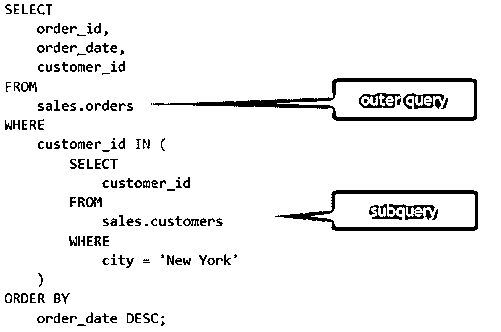
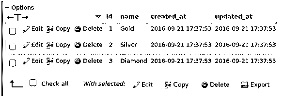
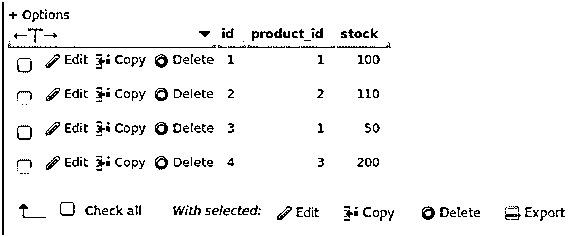
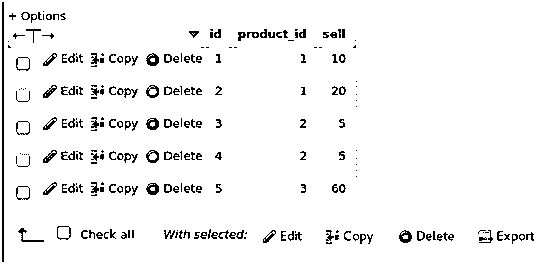

# Laravel 子查询

> 原文：<https://www.educba.com/laravel-subquery/>

## Laravel 子查询简介

Laravel 框架可能是 PHP 技术中最受欢迎的框架，它遵循 MVC 架构。因此，Laravel 子查询只是嵌套在另一个数据库查询中的查询。当似乎很难通过关系检索辅助模型数据时，在 Laravel 数据库中使用子查询是一种有效的方法，不需要额外的数据库查询。

### 什么是 Laravel 子查询？

它包含不止一个查询，是从多个表中获取数据的强大工具。因此，从各种来源生成单个结果，使编码器更容易将获取的数据累积为单个结果。

<small>网页开发、编程语言、软件测试&其他</small>

当我们讨论子查询时，让我再告诉你一件事。包含查询的语句称为外部查询，而报告中的问题称为子查询。

### 雄辩子查询

一个有说服力的查询不过是查询中的一个队列，通过它我们可以只使用一个查询从多个相关的表中获取信息。因为只有一个查询可以完成您的任务，所以雄辩的查询在限制查询数量方面很有帮助。因此，避免了数据库负载。

通过我们与各种 web 开发人员和互联网的交流，我们了解到人们(尤其是初级开发人员)经常发现熟悉 Laravel 子查询很有挑战性。在许多情况下，他们确实掌握了一些关于各种关系数据库的知识，并且熟悉它们的命令和查询。但是当谈到在 Laravel 中使用子查询时，他们经常会陷入困境和困惑。它们缺乏功能，并且经常无法将子查询加入到 Laravel 雄辩查询生成器中。然而，我们认为这些问题的出现是由于缺乏对主题的深刻理解。

要成为一名优秀的开发人员，您始终需要记住两件基本的事情:

1.  使用最少的数据库查询。
2.  使用最少的数据存储。

虽然大多数开发人员不太会被第一个目标困扰，但并不是所有人都很擅长保持第二个目标。因此，我们将为 Laravel 5 用户设置一个示例，说明如何使用 Laravel 查询构建器在 SELECT 语句中使用子查询。

这里，我们在 SELECT 语句中使用 DB:: raw()函数，它可以将我们的子查询加入到“雄辩的查询生成器”中。

在这种情况下，我们使用下面列出的三种不同类型的表:

*   项目
*   项目 _ 库存
*   物品 _ 出售

我们打算从上面的图表中得到项目、库存的总数和每笔销售的记录。

#### 1.项目表数据

#### 2.物料 _ 库存表数据

#### 3.物品表数据 _ 出售

因此，对于大多数开发人员来说，使用 MySQL 查询似乎相对容易。然而，这里从头开始的一切都是对上表的 MySQL 查询:

**查询:**

`SELECT
items.*,
(SELECT SUM(items_stock.stock) FROM items_stock
WHERE items_stock.product_id = items.id
GROUP BY items_stock.product_id) as item_stock,
(SELECT SUM(items_sell.sell) FROM items_sell
WHERE items_sell.product_id = items.id
GROUP BY items_sell.product_id) as item_sell
FROM `items``

上面，你可以看到 MySQL 查询。现在，我们正在谈论的事实是，大多数程序员不会发现运行 MySQL 查询很难，但当涉及到将这些查询绑定到 Laravel 雄辩的查询生成器时，他们会感到困扰。因此，在 Laravel 5 版本中，上面的查询将如下所示:

`$data = DB::table("items")
->select("items.*",
DB::raw("(SELECT SUM(items_stock.stock) FROM items_stock
WHERE items_stock.product_id = items.id
GROUP BY items_stock.product_id) as item_stock"),
DB::raw("(SELECT SUM(items_sell.sell) FROM items_sell
WHERE items_sell.product_id = items.id
GROUP BY items_sell.product_id) as item_sell"))
->get();`

### 结论

为了生成和执行准确的查询，Laravel 的数据库查询生成器充当了一个强大而方便的界面。Laravel 的查询构建器适用于大多数其他关系数据库，这使得开发人员可以用 Laravel 查询构建器合并其他数据库的查询。除了它拥有的所有其他优势，它还包含一个额外的工具来保护您的应用程序免受网络攻击。它包括 PDO 参数绑定，以保护您的 web 应用程序免受 SQL 注入攻击。

### 推荐文章

这是一个 Laravel 子查询指南。在这里，我们讨论 Laravel 子查询的介绍及其不同的示例和代码实现。您也可以浏览我们推荐的其他文章，了解更多信息——

1.  [Laravel 型号](https://www.educba.com/laravel-models/)
2.  [Codeigniter vs Laravel](https://www.educba.com/laravel-vs-codeigniter/)
3.  [Laravel 控制器](https://www.educba.com/laravel-controllers/)
4.  [Dompdf Laravel](https://www.educba.com/dompdf-laravel/)

