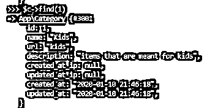

# 拉勒维尔发现

> 原文：<https://www.educba.com/laravel-find/>

## Laravel Find 简介

Laravel Find 不是一个查询生成器。它使用主键，但有助于从数据库中检索单个记录。使用主键，它根据用户的需要过滤记录以获得结果。它总是返回单个行，不像 where 使用 get 方法，通过该方法用户可能最终获得多个结果。Laravel Find 返回任何模型的对象实例。如果没有返回任何行，Find 将返回 null，没有任何结果，因为数据可能不可用。

### 拉弗尔找到了什么？

借助 Laravel 中的主键，它有助于从数据库中检索单个数据记录，该记录可用于要处理的应用程序的功能。查找选项不使用数组中的键。它也不是一个列名。用户需要明白雄辩不是捷径，但寻找才是。

<small>网页开发、编程语言、软件测试&其他</small>

当需要借助主键检索任何记录时，请使用以下代码:

`$user = User::find (1);
var_dump ($user->name);`

find()方法通过$primaryKey 属性查找模型。如果你没有设置，它将假设 id。如果设置了 protected $primaryKey = foo_id，find()函数将通过 foo_id 而不是 id。Laravel 也期望 id 是整数；如果您使用的不是整数(比如字符串)，那么您需要将模型的 incrementing 属性设置为 false。

$c->find (1)通过对用户的实例变量调用“find”方法来工作，该变量是$c，它有助于为用户返回单个记录。“Find”方法利用主键 id，主键 id 通常通过过滤简单 id 值为 1 的任何特定记录来工作。等效的 SQL 语句是 SELECT FROM categories，其中 WHEREid = 1 限制 1。借助“find”方法获得的结果总是限于可用的记录，对象以结果的形式返回。

### Laravel 怎么找工作？

Laravel find 能够在用户需要从更大的数据库中获取一组相关数据时，为用户从数据库中检索数据。由于数据量太大，手动搜索一组特定的记录变得困难甚至耗时。Laravel 中的大多数数据都是自动生成的，它们是自我编码的，因为 Laravel PHP 有助于通过大量自动化属性更快地准备好应用程序和网站。Laravel Find 用于在 Laravel 中可用的主键的帮助下检索数据。任何用户都必须注意的一点是，Laravel find 并不像它看起来那样是一个查询构建器。这个误解需要优先澄清。

Laravel 中可用的查询构建器提供了很多便利。它还提供了一个创建和运行数据库查询的接口。大多数数据库操作可以在定制和准备的应用程序中执行。它也适用于所有支持的数据库系统。

上面的例子将有助于我们更好地理解 Laravel Find 的工作。

在上面的图像中，id 为“1 ”,具有要检索的“儿童”部分的数据记录，描述为“适合儿童的项目”,其他时间详细信息表示为“null ”,这意味着在 Laravel Find 的帮助下，它们在数据库中不可用。

与帮助您获取任何有效数据库字段的“Where”不同，find 只使用默认情况下在系统中注册的主键来从数据库中检索单个数据。“Where”使用“get”方法，在该方法中，您将获得不止一个结果，因为它会进行深度搜索，并以许多类似的数据作为响应。

在“find”方法的帮助下(如上图所示),当用户检索信息时，如果记录确实存在于数据库中，用户必定会得到一个对象。将被接收的对象将是“模型”的实例，并且所有可用的数据库字段将作为类的属性而可用。如果在数据库中找不到任何数据，则直接返回“null”值。

上图描述了使用“where”模型从数据库中检索数据。用户在使用“where”子句时可以建立一个限制，即借助实例变量上的“first”方法将结果限制为一行，如下所示:

`$c->WHEREid (1) ->first ()`

第一种方法的响应类似于“find”方法，以便从数据库中检索数据。Laravel find 此后将从数据库中搜索与用户通过使用给定选项给出的过滤标准相匹配的记录，但是它将只返回与用户的搜索标准相匹配的第一个和主要记录。

### 实现 Laravel 查找的示例

正如我们所知道的，Laravel 中的 find()方法可以由任何用户与一组主键一起使用，它将从数据库中返回一组匹配的记录。举个例子，

`$student = Students::all ();`

*   借助于上述数据，我们可以得到所有学生的详细情况。

`$student = Students::find (1);`

*   上面的代码将帮助我们检索由' id '识别的一个学生的数据。

`$Calmy Dens = Students::where ('name', '=', ‘Calmy Dens’)->first();`

*   正如我们所看到的，通过特定的属性，我们可以找到特定学生的详细信息。

### 结论

正如我们逐渐理解的，Laravel Find 是用来从数据中得到单个数据的。Laravel find 将在主键的帮助下查找特定的数据。与“Where”不同，“find”查找特定的数据，通过“Where”也可以为用户检索数据库中的类似数据。如果数据不可用，它将显示“null”值。

### 推荐文章

这是一个拉腊维尔发现指南。在这里，我们讨论一个介绍，解释，如何在 Laravel 查找工作，实施的例子。您也可以浏览我们的其他相关文章，了解更多信息——

1.  [Laravel 密钥生成](https://www.educba.com/laravel-key-generate/)
2.  [Laravel 创建表格](https://www.educba.com/laravel-create-table/)
3.  [在 Laravel 中验证](https://www.educba.com/validation-in-laravel/)
4.  [Laravel 迁移](https://www.educba.com/laravel-migration/)

