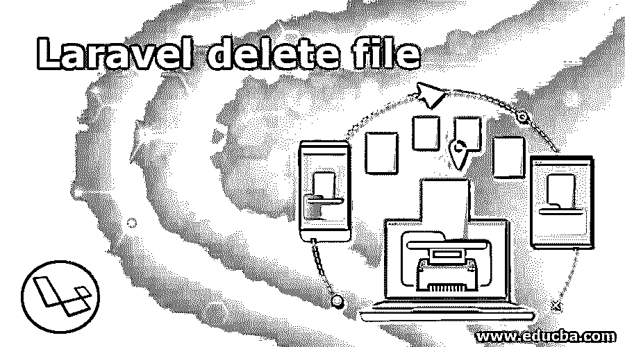

# 删除文件

> 原文：<https://www.educba.com/laravel-delete-file/>

## Laravel 删除文件简介

Laravel 是最突出和最有效的 PHP 开发框架之一，它一直统治着 web 开发市场，超过了同时代的 CakePHP、Codeigniter 和 Yii 框架。PHP 或超文本预处理是目前使用最广泛的服务器端脚本语言。因为它的简洁和容易的编码语法，它在 web 开发者中变得更受欢迎。因此，它成为后端开发最流行的语言之一。Laravel 是它的主要框架之一，非常适合开发安全和可伸缩的 web 应用程序。由于其出色的特性，如 MVC 支持、安全的身份验证系统、快速的开发时间、定制设施，最重要的是，邮件集成服务被广泛的 IT 专业人员所采用。

**基础:** Taylor Otwell 开发了 Laravel，致力于创建受 MVC(模型视图控制器)架构启发的 web 应用程序。Symfony 的原则也创造了它。它于 2011 年首次发布，旨在成为 Codeigniter 的强大替代品。过去的每一年都真正成为了以前的 PHP 框架的替代品，具有以前的框架所缺乏的某些功能，并成为了一个可靠的 MVC 框架。

<small>网页开发、编程语言、软件测试&其他</small>

今天，在这篇文章中，我们将详细讨论如何从 Laravel 文件夹中删除文件。

**现在就开始:**因此，如果你处于学习 Laravel 的初级水平，或者可能是初级开发人员，却在如何从 Laravel 文件夹中删除文件的问题上犹豫不决，那么这篇文章可能会帮助你。Laravel 框架可用于构建强大的动态网站，尤其是电子商务平台。因此，为了运行和维护我们的网站，我们经常需要在我们的 Laravel 文件夹中上传各种文件或图像。在我们的工作完成后，我们也需要删除它们。在这一点上，我们已经看到许多初级程序员努力删除代码。在某些情况下，可以看到他们成功地从数据库中删除了文件，但却试图从 Laravel 文件夹中删除它们。因此，确保无用的文件和图像占用内存。所以，当你从数据库中删除文件时，确保你也成功地从你的 Laravel 文件夹中删除了它们。

### 如何在 Laravel 中删除公共文件夹中的文件？

在本文中，我们将向您展示如何首先检查一个文件是否存在，然后从文件夹中删除该文件。所以，如果你是 Laravel 7.x 或者 6.x 的用户，这里是你的解决方案。这里，我有两种删除文件的方法-

*   使用 Laravel 文件系统。
*   使用核心 php 函数，如 file exists()和 unlink()。

你可以选择任何适合你的方式。

#### 1.使用文件系统

**代码:**

`public function removeImage()
{
if(\File::exists(public_path('upload/bio.png'))){
\File::delete(public_path('upload/bio.png'));
}else{
dd('File does not exists.');
}
}`

#### 2.利用核心 PHP 函数

**代码:**

`public function removeImage()
{
if(file_exists(public_path('upload/bio.png'))){
unlink(public_path('upload/bio.png'));
}else{
dd('File does not exists.');
}
}`

使用 Laravel 7 框架，上述解决方案非常方便。他们将帮助你从你的目录中清除不必要的，而对于 Laravel 6 用户，我们有另一个解决方案来解决你的问题。

对于 Laravel 6，我们使用 delete Directory()和 file 对象来删除目录。在这种情况下，我们可以获取删除的文件夹路径，之后，我们可以使用函数中的获取文件夹路径。如果成功，它将返回 true，如果失败，它将返回 false。

但是，我们建议在执行程序之前创建一个名为 test 或 demo 的文件夹。

### Laravel 删除文件的实现示例

以下是 Laravel 删除文件的示例:

#### 示例#1

**代码:**

`public function index()
{
$folderPath=public_path('test');
$dd =File::deleteDirectory($folderPath);
dd($dd);
}`

在这里，如果它返回 true，那么这个方法就是成功的，但是如果它返回 false，那么它就失败了。

至于 Laravel 7，我们已经给出了同时使用 Laravel 和 PHP 的例子；同样，我们也将为 Laravel 6 用户给出一个使用 PHP 函数的例子。在这里，

#### 实施例 2

**代码:**

`public function index()
{
$folderPath=public_path('test');
$dd =rmdir($folderPath);
dd($dd);
}`
同理，上面那个，如果返回 true，则成功，如果返回 false，则方法失败。

此外，我们遇到一些人说，当试图使用 file:: delete 从公共路径中删除文件时，他们经常得到消息“在该路径中找不到文件”对于他们，我们有自己的答案:

#### laravel 的解决方案:

**代码:**

`/**
* Show the application dashboard.
*
* @return \Illuminate\Contracts\Support\Renderable
*/
public function index(Request $request)
{
$file =public_path('img/slider.jpeg');
$img=File::delete($file);
dd($img);
}`

如果返回 true，则该方法成功，否则失败。

#### 核心 PHP 解决方案:

**代码:**

`/**
* Show the application dashboard.
*
* @return \Illuminate\Contracts\Support\Renderable
*/
public function index(Request $request)
{
$file =public_path('img/slider.jpeg');
$img= unlink($file);
dd($img);
}`

和上面的一样，如果输出为真，程序成功，如果返回为假，则程序失败。

在 Laravel 中，delete 方法接受单个文件名或一组要从磁盘中删除的文件。假设一个文本文件保存在我的公共文件夹 Laravel 中，这不再是一个要求。我们想从我保存的控制器中删除它。我们还想用一个特定的链接来根除文件:link('public/test.txt ')。为了避免错误，你必须使用 PHP 的 unlink 函数。此外，请记住不要忘记创建您各自文件的完整路径，如果它不是从一开始就存储的话。

### 结论

如前所述，Laravel 是 PHP 著名的框架之一，因为它有一些令人难以置信的特性。与当代的 code igniter 框架不同，它带有内置的身份验证类特性和单元测试工具。这是它与众不同的地方。此外，与 CakePHP 不同的是，它的开源工具方便了用户免费获得好处。在数据备份的情况下，Laravel 也会采取比其他人更实际的方法。综合所有这些，我们可以看到有足够的理由选择 Laravel 而不是其他 PHP 框架。

### 推荐文章

这是一个删除文件的指南。在这里，我们讨论 Laravel 删除文件的介绍及其不同的例子和代码实现。您也可以浏览我们推荐的其他文章，了解更多信息——

1.  [Laravel 型号](https://www.educba.com/laravel-models/)
2.  [Codeigniter vs Laravel](https://www.educba.com/laravel-vs-codeigniter/)
3.  [Laravel 控制器](https://www.educba.com/laravel-controllers/)
4.  [Dompdf Laravel](https://www.educba.com/dompdf-laravel/)

