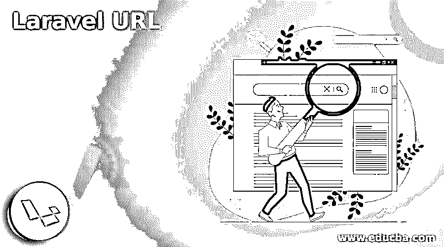

# Laravel URL

> 原文：<https://www.educba.com/laravel-url/>

## Laravel URL 简介

Laravel URL 帮助器用于在 Laravel 中生成 URL，laravel 有一些帮助器，用于帮助生成 laravel URL。当我们在模板和响应 API 中构建链接时，这些助手很有帮助，在为项目或应用程序的另一部分生成重定向响应时也会用到它们。laravel URL helper 可能用于在我们的应用程序中生成任意 URL，laravel 生成的 URL 将自动使用类似 http 或 https 的方案。它还将处理来自我们应用程序的当前请求。

### 什么是 Laravel URL？

*   Laravel 允许我们简单地从命名的路由创建签名的 URL。
*   基本上，已签名的 URL 用于可公开访问的路径，并且需要保护图层免受 URL 的操纵。
*   我们可以创建签名的 URL 来实现 public 调用的取消订阅链接。
*   我们需要使用 signRoute 方法为 laravel 中的名称的路由创建签名的 URL。在 laravel 中，签名的 URL 非常重要。

下面是在 laravel 中创建 URL 的语法如下:

<small>网页开发、编程语言、软件测试&其他</small>

`Return url:: (method of URL facade ex. signedRoute ) (‘Unsubscribe’, [ ‘user’ => 1 ]);`

*   在上面的语法中，我们可以看到 URL 是从返回类型开始的。此外，我们需要在创建时使用该方法。
*   我们还将使用路由关键字生成 URL。在不常用的模型中，我们可以使用 route 键来生成 URL。
*   如果我们想使用雄辩的模型生成它，同时我们需要传递参数值。
*   laravel 路由助手用于自动提取路由关键字。
*   我们也可以在 laravel 中创建 laravel 临时签名 URL，该 URL 将在特定时间后过期，我们在创建时已经在 URL 中提到过。
*   从公共文件夹中访问图像非常重要。我们可以通过使用它来访问公共文件夹中的任何资产。

### Laravel URL 的基本类型

下面给出了提到的基本类型:

#### 1.基本路由

*   第一种类型是接受 URL 和闭包的基本路由，它提供了一种非常简单的方法来定义路由。
*   我们在位于我们的路由目录中的路由目录中定义了 laravel 路由。
*   laravel 路由文件是在加载 laravel 应用程序时自动调用的。

#### 2.签名的 URL

*   第二种类型是签名 URL，这种 URL 用于命名路由。此 URL 包含字符串 URL 哈希附加字符串。
*   我们还可以验证已签名的 URL 的传入请求，我们可以使用 hasValidSignature 方法来验证传入请求。
*   在访问签名的 URL 时，如果该 URL 已经过期，我们将收到错误代码，即 403。

#### 3.命名路由的 URL

*   基本上，路由助手用于在命名例程中生成 URL。命名例程 URL 允许我们创建或生成 URL，而无需使用由 route 定义的实际 URL。
*   如果假设我们已经改变了 route 的 URL，那么在我们调用 route 函数时就没有必要改变了。
*   要使用这种方法生成 URL，我们需要使用 route helper。路由助手用于在 laravel 中生成 URL。

#### 4.雄辩的模特

*   我们也可以通过雄辩的模型来产生它。要使用雄辩模型生成 URL，我们需要将雄辩模型作为参数值传递。

### 控制器操作的 URL

*   在 laravel 中，action 函数将用来生成控制器操作的 URL。

以下是 URL 控制器操作的语法:

**语法:**

`Use (path of controller);
$ URL = action ([controller name :: class , ‘index of controller’]);`

*   如果我们的控制器方法接受路由的参数，那么我们需要为路由参数传递关联数组。
*   我们也可以传递第二个带有控制器动作的参数。下面的语法显示了第二个带有控制器动作的参数。
*   我们使用第二个参数，因为具有控制器操作的用户如下。

`$ URL = action ([controller name :: class , ‘profile of controller’], [‘user_id’ => 1]);`

*   在上面的语法中，我们可以看到我们对控制器使用了两个参数，即控制器的配置文件和 user_id。
*   在一些应用程序中，我们为 URL 的参数定义了请求类型值。
*   我们还可以将许多参数定义为控制器动作中的地区参数。

### 先决条件

*   我们需要使用 URL 助手在 laravel 中生成 URL。此外，我们需要使用 http 或 https 的方案并为当前请求提供主机。
*   我们需要在 laravel 中提供访问 URL 的路径。如果不提供路径，我们就无法访问 URL。
*   要访问它，我们首先需要在我们的系统中安装 laravel。使用 composer，我们正在我们的系统中安装 laravel。
*   要访问它，我们需要配置 laravel 应用程序的基本配置。
*   要访问它，我们需要使用不同的方法，如果我们想要访问签名的 URL，那么我们需要使用 signedRoute 方法。
*   我们需要验证签名的路由请求。

### 访问资产 URL

*   我们可以通过使用助手来访问资产 URL。我们可以对所有链接使用相同的链接。在本地工作时，http 是好的，但是在生产工作时，我们需要使用 https 而不是 http。

我们可以使用资产 URL 访问图像，如下所示:

``

*   我们需要在从资产 URL 访问图像时定义图像的来源和名称。
*   要使用资产 URL 访问图像，我们需要将所有资产或图像放在应用程序公共文件夹中。

### 结论

Laravel 允许我们简单地从命名的路由创建一个签名的 URL。我们也可以在 laravel 中创建 laravel 临时签名 URL，这个 URL 将在我们在 URL 中提到的特定时间后过期。

### 推荐文章

这是一个 Laravel 网址指南。这里我们讨论简介、基本类型、控制器动作的 URL、先决条件和访问资产 URL。您也可以看看以下文章，了解更多信息–

1.  [拉勒韦尔加入](https://www.educba.com/laravel-join/)
2.  [Laravel Tinker](https://www.educba.com/laravel-tinker/)
3.  [Laravel 验证数组](https://www.educba.com/laravel-validate-array/)
4.  [不在拉腊维尔的地方](https://www.educba.com/where-not-in-laravel/)

