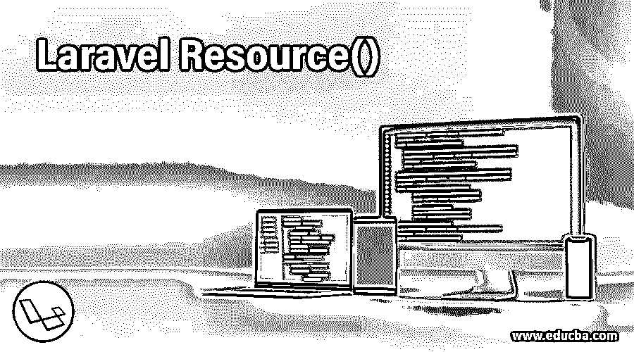
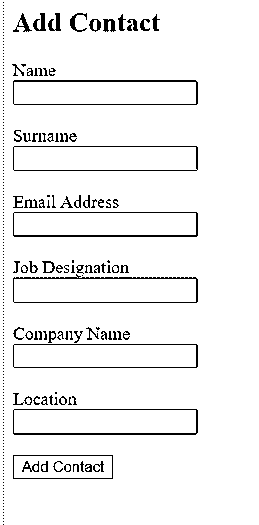
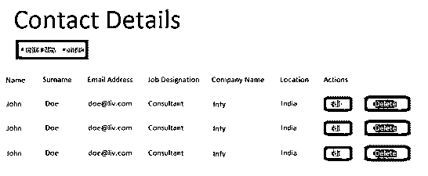

# Laravel 资源()

> 原文：<https://www.educba.com/laravel-resource/>

## Laravel 资源介绍()

任何管理后端的主要任务之一是操纵数据或资源。一个资源，将在一段时间内被创建，那些资源将被读取，在一段时间内被更新，最后，当需求结束时，可能被删除。这整个过程似乎是一项艰巨的任务。对于开发人员来说，创建能够以多种方式操作数据的系统并不总是容易的。为了简化这项任务，创建了资源控制器。这些控制器忽略了创建、读取、更新和删除资源的整个过程。按照 Laravel 的说法，它们被称为 CRUD 控制器，这也是 LARAVEL 框架如此受欢迎的原因之一。在本主题中，我们将了解 Laravel Resource()。

它帮助开发人员在最短的时间内创建最健壮的功能。其富有表现力的查询命令行是用户友好的。Laravel 框架也是高度可伸缩的。这就是为什么电子商务开发商期待着在这方面的工作。其多样化的库使得 Laravel 框架成为一个健壮的框架。

<small>网页开发、编程语言、软件测试&其他</small>

Laravel 框架是开源的，允许第三方平台和软件与其框架集成。这种灵活性导致了大量独立功能的产生。

CRUD 格式是创建资源控制器最简单的方法，因为它是用户更新和操作数据或资源的一站式商店。它是一种用户表单。在 laravel 框架中，富于表现力的命令行结构确保了控制器的创建是流畅的。此外，resource()查询允许开发人员快速获取需要提取的内容。

### Laravel 中的 Resource()控制器是如何创建的？

现在让我们快速看一下资源控制器是如何创建的:

在本例中，我们将创建一个表单，用户可以通过该表单添加或创建资源。

这是要使用的路线:

`use App\Contact;
public function store(Request $request)
{
$request->validate([
'name'=>'required',
'surname'=>'required',
'email_address'=>'required'
]);
$contact = new Contact([
'name' => $request->get('name'),
'surname' => $request->get('surname'),
'email_address' => $request->get('email_address'),
'job_designation’ => $request->get('job_designation’),
'company_name' => $request->get(‘company_name'),
'location' => $request->get('location')
]);
$contact->save();
return redirect('/contacts')->with('success', 'Contact added!');
}
public function create()
{
return view('contacts.create');
}
$ cd resources/views
$ touch base.blade.php`

下面这组代码是关于 HTML 代码的设计。HTML 或超文本标记语言普遍用于创建设计。

`<!DOCTYPE html>
<html lang="en">
<head>
<meta name="viewport" content="width=device-width, initial-scale=1.0">
<link href="{{ asset('css/app.css') }}" rel="stylesheet" type="text/css" />
</head>
<body>

@yield('main')

</body>
</html>
$ mkdir contacts
$ cd contacts
$ touch create.blade.php
@extends('base')
@section('main')

<h1 class="display-3">Add Contact</h1>

@if ($errors->any())

<ul>
@foreach ($errors->all() as $error)
<li>{{ $error }}</li>
@endforeach
</ul>

 
@endif
<form method="post" action="{{ route('contacts.store') }}">
@csrf

<label for="name">Name</label>
<input type="text" class="form-control" name="name"/>

<label for="surname">Surname</label>
<input type="text" class="form-control" name="surname"/>

<label for="email_address">Email Address</label>
<input type="text" class="form-control" name="email_address"/>

<label for="job_designation">Job Designation</label>
<input type="text" class="form-control" name="job_designation"/>

<label for="company_name">Company Name</label>
<input type="text" class="form-control" name="company_name"/>

<label for="location">Location</label>
<input type="text" class="form-control" name="location"/>

<button type="submit" class="btnbtn-primary-outline">Add contact</button>
</form>

@endsection`

**输出:**

### Laravel Resources()的另一个例子

以下代码涉及资源的创建:

`Open: app/Http/Controllers/ContactController.php
Update the underneath code in index():
public function index()
{
$contact_details = Contact::all();
return view('contact_details.index', compact('contact_details'));
}`

这组代码将有助于创建读取方法

`Create: resources/views/contact_details.index.blade.php file
$ touch index.blade.php
Locate: resources/views/contact_details/index.blade.php and update the below code:
@extends('base')
@section('main')

<h1 class="display-3">Contact Details</h1>
<table class="table table-striped">
<thead>
<tr>
<td>Name</td>
<td>Surname</td>
<td>Email Address</td>
<td>Job Designation</td>
<td>Company Name</td>
<td>Location</td>
<td colspan = 2>Actions</td>
</tr>
</thead>
<tbody>
@foreach($contact_details as $contact)
<tr>
<td>{{$contact->name}}</td>
<td>{{$contact->name}} {{$contact->surname}}</td>
<td>{{$contact->email_address}}</td>
<td>{{$contact->job_designation}}</td>
<td>{{$contact->company_name}}</td>
<td>{{$contact->location}}</td>
<td>
<a href="{{ route('contact_details.edit',$contact->name)}}" class="btnbtn-primary">Edit</a>
</td>
<td>
<form action="{{ route('contact_details.destroy', $contact->name)}}" method="post">
@csrf
@method('DELETE')
<button class="btnbtn-danger" type="submit">Delete</button>
</form>
</td>
</tr>
@endforeach
</tbody>
</table>

@endsection
public function edit($id)
{
$contact = Contact::find($id);
return view('contact_deatils.edit', compact('contact'));
}`

正如我们在上面的例子中看到的，编辑功能使用户能够更新表单，数据库也随之更新。公共函数是一个全局函数。它不受限制地工作。它只是让其他类可以访问全部内容。因此，对于任何需要在尽可能短的时间内召回的功能来说，这变得势在必行；使用了公共函数。

上述代码集将需要添加到

`app/Http/Controllers/ContactController.php
public function edit($id)
{
$contact = Contact::find($id);
return view('contact_details.edit', compact('contact'));
}`

下面的代码是 update 方法的实现:

`public function update(Request $request, $id)
{
$request->validate([
'name'=>'required',
'surname'=>'required',
'email_address'=>'required'
]);
$contact = Contact::find($id);
$contact->name =  $request->get('name');
$contact->surname = $request->get('surname');
$contact->email_address = $request->get('email_address');
$contact->job_designation = $request->get('job_designation');
$contact->company_name = $request->get('company_name');
$contact->location = $request->get('location');
$contact->save();
return redirect('/contact_details')->with('success', 'Contact successfully updated!');
}`

最后，这组代码将有助于创建删除方法。正如我们从过去所看到的，CRUD 控制器对于创建平稳运行的表单是必要的。从 Laravel Resource()的角度来看，这是相关的，因为我们现在在这里处理的唯一事情是资源或数据。

`$ touch edit.blade.php will need to be created within:
resources/views/contacts/
@extends('base')
@section('main')

<h1 class="display-3">Updating the contact</h1>
@if ($errors->any())

<ul>
@foreach ($errors->all() as $error)
<li>{{ $error }}</li>
@endforeach
</ul>

 
@endif
<form method="post" action="{{ route('contact_details.update', $contact->id) }}">
@method('PATCH')
@csrf

<label for="name">Name</label>
<input type="text" class="form-control" name="name" value={{ $contact->name }} />

<label for="surname">Surname</label>
<input type="text" class="form-control" name="surname" value={{ $contact->surname }} />

<label for="email_address">Email Address</label>
<input type="text" class="form-control" name="email_address" value={{ $contact->email_address }} />

<label for="company_name">Company_name</label>
<input type="text" class="form-control" name="company_name" value={{ $contact->company_name }} />

<label for="location">Location</label>
<input type="text" class="form-control" name="location" value={{ $contact->location }} />

<label for="job_designation">Job Designation</label>
<input type="text" class="form-control" name="job_designation" value={{ $contact->job_designation }} />

<button type="submit" class="btnbtn-primary">Update</button>
</form>`

现在删除操作需要添加到:

`app/Http/Controllers/ContactController.php
public function destroy($id)
{
$contact = Contact::find($id);
$contact->delete();
return redirect('/contact_details')->with('success', 'Contact deletion successful!');
}
Locate: resources/views/contacts/index.blade.php and insert the following line of code:

@if(session()->get('success'))

{{ session()->get('success') }}

@endif

`

我们的控制器准备好了。我们已经能够创建创建读取更新删除或 CRUD 控制器来操纵资源。

要创建这个表单，需要这个。如前面的例子所示，这是需要添加到上述代码中的 HTML 代码。

`

<a style="margin: 19px;" href="{{ route('contact_deatils.create')}}" class="btnbtn-primary">Create New Contact</a>

<image>`

**输出:**

上面的例子是展示控制器有用性的理想例子。

### 结论

Laravel 框架是软件开发领域中最用户友好的平台之一。通过 Laravel 资源，我们可以看到创建 CRUD 功能来操作数据是多么容易。CRUD 允许修改资源。这就是它在表格中得到广泛应用的原因。

CRUD 控制器也是必要的，因为表单一直都在被操作。有了控制器，人们可以很容易地在错综复杂的代码中穿行。事实上，通过 Laravel Resources()构建 CRUD 控制器的原因之一是为了避免在编码语言的迷宫中游泳。

### 推荐文章

这是 Laravel 资源()的指南。这里我们讨论 Laravel Resource()的例子以及代码和输出。您也可以看看以下文章，了解更多信息–

1.  [Laravel Errors](https://www.educba.com/laravel-error/)
2.  [拉弗尔展开](https://www.educba.com/laravel-deploy/)
3.  [拉勒韦尔拔毛](https://www.educba.com/laravel-pluck/)
4.  [幼虫工匠](https://www.educba.com/laravel-artisan/)

