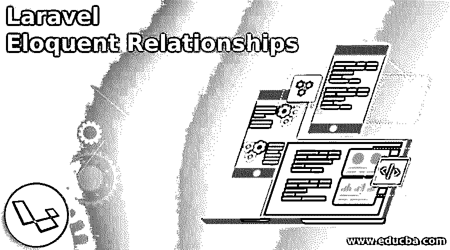

# 拉勒维尔雄辩的关系

> 原文：<https://www.educba.com/laravel-eloquent-relationships/>

## 拉勒维尔雄辩关系简介

数据库表之间通常有一个素关系。例如，如果某个博客帖子有评论，或者某个用户下了订单，就会创建一个相关的链接。Laravel 口才关系管理这样的关系，是不同类型的关系。不同类型的关系都存在，而且都管理得很好。主键和引用键管理数据库表及其关系或链接。数据存储在不同的表中，关系数据库在 Laravel 雄辩关系的帮助下被拆分。

### Laravel 口才关系到底是什么？

Laravel 是一个开源的、非常流行的、广泛使用的 PHP 框架。有一个对象关系映射器，Laravel 有，也就是雄辩的。它用于处理数据库。它处理数据库查询，并提供简单的语法在几秒钟内完成复杂的查询。因此，它有助于您不要编写长的查询。

<small>网页开发、编程语言、软件测试&其他</small>

在现有数据库的上下文中，Laravel concertive 主要使用关系来处理不同表之间的关系。它使用主键和引用键来管理关系。数据库表通常相互关联，因此具有连接和关系。任何用户都可能有许多简档，或者可能发生与特定用户相关的任何事情或事件。Laravel 雄辩术旨在顺利管理这种关系，没有太多忙乱的工作或复杂的编码。用户受益，因为它很容易支持许多不同种类的关系。

存在的不同类型的 Laravel 雄辩关系:

*   一对一
*   一对多(逆也)
*   多对多
*   穿过一个
*   经历了许多
*   一对一(多态)
*   一对多(多态)
*   多对多(多态)

### 拉勒维尔雄辩的关系在拉勒维尔是如何运作的？

与雄辩模型一样，关系也是非常强大的查询生成器。一旦将关系定义为方法，就可以使用方法链接和查询功能。如上所列，根据用户可能已经完成的数据分类，Laravel 雄辩关系提供的许多不同类型的关系可用于用户可能感兴趣的不同需求和方法。让我们看看他们中的每一个，以更好地理解拉勒维尔雄辩的关系。

#### 1.拉勒维尔的一对一关系

在拉勒韦尔，这是一种至关重要的关系。这里，一个表与另一个表相关联，用户提供的数据中只有一个表。例如，如果用户想要创建自己的简档，则该人可以创建一个用户帐户，另一方面，简档或用户帐户可以仅由该人创建。这是对数据的分类，并在定义用户和创建的帐户/配置文件的两个表之间建立关系。下面是一个例子:

**代码:**

`class User {
public function profile() {
return $this -> hasOne(Profile::class);
}
}
class Profile {
public function user() {
return $this -> belongsTo(User::class);
}
}`

#### 2.Laravel 中的一对多关系

当单个表与许多其他表相关联时，可以理解并应用这种关系。如果一个用户想要拥有多个配置文件，那么这种类型的关系就存在。当你把一个方法放在一个有说服力的模型上时，这个一对多的模型很容易定义。在这种情况下，用户可以创建多个简档；但是，该配置文件只能由一个人创建。下面是理解这一点的适当示例:

**代码:**

`class User {
public function profiles() {
return $this -> hasMany(Profile::class);
}
}
class Profile {
public function user() {
return $this -> belongsTo(User::class);
}
}`

#### 3.Laravel 中的多对多关系

这里有一点额外的复杂性。如果一个人有多个移动电话，并且他拥有的移动电话也被另外几个多人使用。这种类型的关系被认为是存在的，Laravel 提供了处理这种关系及其数据库的选项。在这种情况下，用户可能拥有许多电话，而另一方面，这许多电话也被多个其他用户使用。laravel concious 借助关系来管理关系数据。下面是一个明显的例子:

**代码:**

`class User {
public function phones() {
return $this -> belongsToMany(Phone::class);
}
}
class Phone {
public function users() {
return $this -> belongsToMany(User::class);
}
}`

### 进一步理解拉腊维尔雄辩的关系

动态属性是有的，但是它们被认为是延迟加载，因为它们很慢。因此，关系数据需要时间来完美地注册和分析关系。因此，开发人员通常开始使用急切加载来加速数据库中数据关系的加载。这样，关系就被预加载了，并且可以保证在正确加载模型后可以很容易地访问关系。此外，当使用急切加载时，SQL 查询的数量会大幅减少。因此，加载更快，并且数据库被快速关联而没有太多延迟。

在关系类型和连接关系的链接的帮助下，还有许多其他方式来执行操作以过滤必要的数据。通常，这有助于开发人员根据需求快速安排和组织数据。

### 结论

对 Laravel 雄辩关系的上述理解有助于我们清楚地了解关系的功能和各种可用选项，以满足用户组织和安排数据的需要，并根据自动为数据库提供适当结构的要求建立关系，而无需太多的手动组织。因此，它节省了开发人员大量的时间和精力，并避免了错误，因为它是自动化的，组织良好。

### 推荐文章

这是一个拉腊维尔雄辩的关系指南。在这里，我们讨论了拉勒维尔雄辩关系的介绍，它是如何工作的，代码类型，以及解释。您也可以浏览我们的其他相关文章，了解更多信息——

1.  [在 Laravel 中验证](https://www.educba.com/validation-in-laravel/)
2.  [拉勒维尔集体](https://www.educba.com/laravel-collective/)
3.  [Laravel 型号](https://www.educba.com/laravel-models/)
4.  [Laravel 控制器](https://www.educba.com/laravel-controllers/)

