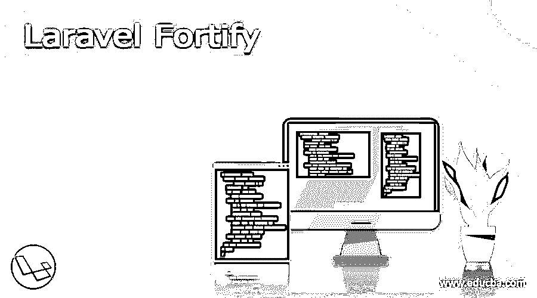
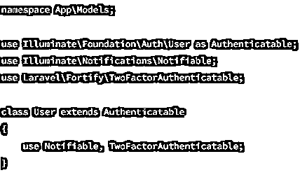
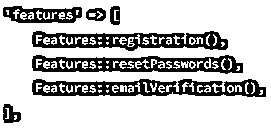
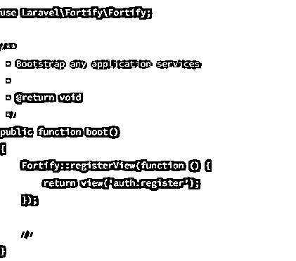

# 拉勒韦尔设防

> 原文：<https://www.educba.com/laravel-fortify/>

## Laravel Fortify 简介

Laravel fortify 是雄辩术中可用的高级功能之一，用于前端认证和后端实现。它注册控制器及其路由，以实现身份验证功能，如密码重置、注册、安装、电子邮件验证等。一旦安装了 Laravel 中的 fortify，用户就可以执行路线并能够查看路线。Fortify 有自己独特的接口，用于配对，请求在 routes 中注册。本文详细解释了 Laravel fortify 的安装、注册和认证。

### 什么是 Laravel Fortify？

简单来说，Laravel 中的 Fortify 选项用于不可知的前端认证和后端特性的实现。Fortify 保存了路由，并且实现了所需的控制器以及 Laravel 身份验证的功能，如登录、密码重置、注册和电子邮件验证。Fortify 是免费的，用于与 Laravel 中的认证服务进行手动交互。如果用户不熟悉 Laravel，初学者工具包会更有帮助，它在用户界面上工作。控制器和路由直接隐含在应用程序中。它使用户能够使用 Laravel 的认证特性。Fortify laravel 作为一个包提供，它不在任何接口上工作，并通过控制器和路线采取行动。它还使用户能够通过应用程序上的身份验证层来支持后端实现，而无需适应前端的任何选项。

<small>网页开发、编程语言、软件测试&其他</small>

### Laravel Fortify 认证

Laravel Fortify 用于呈现应用程序登录和屏幕验证的视图。它用于使用视图部分中接收的数据呈现选项自定义相关的身份验证视图。该逻辑具有可以使用 folder fortify 类中的适当技术定制的呈现。用户可以执行此方法来重新启动服务提供者类中的应用程序。用户可以根据用户检索应用程序数据库的身份验证标准完全自定义登录凭证。简单地说，可以使用下面的语法来执行它，

Fortify::验证使用

这使用接受从 HTTP 中的传入请求接收的完整闭包的技术进行身份验证。这个闭包负责验证随请求提交的登录凭证，并将实例返回给相关用户。如果没有找到凭证或者凭证无效，可以用闭包注释替换它们。它应该在服务提供商的支持下通过引导技术来执行。底层库用于身份验证，并通过撤销或调用类的管道来管理登录请求。如果用户定义了用于处理登录请求的通道，那么应该在接收传入请求的 an_invoke 技术中应用它。它位于 illuminate\ HTTP \ instance 或 request 中，在中间件中，$next 选项用于调用并将请求传递给结构化管道中的其他类。为了定义定制的管道，使用了 fortify:: authenticate through 技术。在这里，它接受闭包方法，并通过登录请求执行数组来处理它们。应该使用应用程序\提供程序\服务提供程序类中的引导技术来执行此方法。

它包含用作起始点的默认管线，并接受它们的所有修改。

### Laravel Fortify 装置

要开始，应该首先安装合成包管理器，

编译器需要 laravel / fortify，可以使用以下语法进行修改:

供应商:发布

使用命令发布增强中的资源。

加强中的动作应用于位于不包含任何值的已创建目录中的应用程序。找到了服务提供者和配置文件，并且可以进行数据库迁移。首先，用户应该迁移数据库。然后，应该在 fortify 中指示应用程序注册表中的功能来保存注册视图。Fortify 是一个无头身份验证库，可用于实现前端组件，对于身份验证，使用应用程序的初学者工具包。在 fortify 视图中，可以使用 laravel\ fortify\ class 位置提供的适当技术定制用于呈现的逻辑。执行方法很简单:在 application \ providers \ service provider 类上重启。

fortify 选项将控制执行视图的注册路线的定义。登记簿的模板应该包含在 Fortify 中记录端点的 POST 请求中。

注册的端点处理字符串的名称、邮件地址、密码、用户名和预期的密码确认字段。邮件名或用户名应该相同，在 fortify 的配置文件应用程序中执行一个已定义的配置值。

### Laravel Fortify 注册

fortify 用于在注册尝试频繁时重定向用户，URI 可以通过应用程序文件中的配置选项进行配置。如果登录中的请求是 XHR 请求，将执行 HTTP 响应 200 值。如果有任何不成功的请求，用户将返回到实际的注册屏幕，并且在验证时发生的所有错误将在共享控制台中可用。$ error 被用作 XHR 请求中的模板变量，所有验证错误都返回一个值为 422 的提示 HTTP 响应。用户验证是通过在以下文件位置进行修改来定制和创建的。app \ actions \ fortify \ new user creation \ user action 已生成，一旦安装在 fortify laravel 中。

### 结论

因此，Laravel fortify 用于注册、认证和邮件配置等简单操作，这些操作可以使用简单的语法来执行。

### 推荐文章

这是拉勒维尔要塞的指南。这里我们讨论 Laravel fortify 的介绍、认证、安装和注册。您也可以看看以下文章，了解更多信息–

1.  [拉勒维尔收银台](https://www.educba.com/laravel-cashier/)
2.  [拉腊夫表单](https://www.educba.com/laravel-orm/)
3.  [拉勒韦尔加入](https://www.educba.com/laravel-join/)
4.  [Laravel Tinker](https://www.educba.com/laravel-tinker/)

