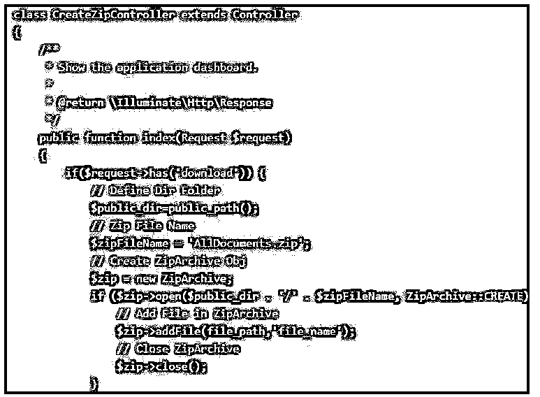
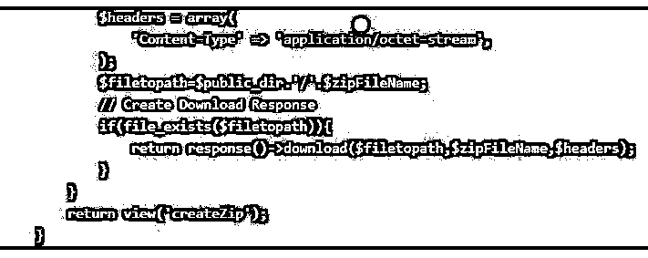

# Laravel Ziparchive

> 原文：<https://www.educba.com/laravel-ziparchive/>


## Laravel Ziparchive 简介

ziparchive 方法允许用户添加文件、创建新目录以及查看 zip 文件夹的内容。Ziparchive 是一个类而不是一个进程，包含多种方式。用户可以在 zip 方法中执行各种功能。例如，用户可以添加新目录、创建新文件、关闭归档文件、提取 ziparchive 的内容以及在 laravel 中执行各种功能。本文解释了使用 laravel 中的 ziparchive 类将许多文件创建成一个 zip 文件的功能。

### 什么是 Laravel Ziparchive？

ziparchive 类中有多种语法，但是没有包含各种方法。Ziparchive 是一个简单的类，它包含了许多 ziparchive 技术，用于访问和读取 zip 的内容。但是语法显示了对处理 ziparchive 类的更好理解。用户可以进行各种操作，如创建新目录、添加新文件、关闭归档文件、检索 ziparchive 中的文件内容以及其他基本操作。

<small>网页开发、编程语言、软件测试&其他</small>

可以使用以下语法打开 Ziparchive:

```
Ziparchive -> open ('user_file_name');
```

用户可以给出上面的语法来传递应该打开的文件名。这些方法可以通过使用 ziparchive 类的实例来实现。

可以使用以下语法关闭 Ziparchive:

```
Ziparchive -> close();
```

用户可以在 ziparchive 实例中调用它的比较方法来退出 ziparchive 类中的文件。为了暗示 ziparchive 类中的任何方法，用户可以实现或调用任何方法，并使用 ziparchive 方法执行 Ziparchive 类中的每个基本操作。

顾名思义，ziparchive 方法用于在 PHP 中计算 zip，但有时 ziparchive 不是一个类或方法；它拥有在 ziparchive 中执行操作的不同方式。为了管理 ziparchive 中的类，用户可以快速实现 ziparchive 的实例并调用任何方法。这个实例帮助用户实现简单的操作，比如打开文件、创建新目录、关闭文件、打开新文件、查看 ziparchive 的内容以及其他基本操作。

用户可以执行 laravel 包，它提供了在压缩中创建功能的选项，并且它很紧凑，易于实现。本文讨论了 zip 文件的创建和 ziparchive 类的管理，这不需要安装额外的包。

### 如何创建 Laravel Ziparchive？

在 PHP 的类中，ziparchive 是与 zip 任务和 zip 功能的所有相关函数一起工作的基本函数之一，例如向 zip 中添加一个额外的文件，在 zip 中创建一个新文件，在 zip 中添加一些目录，在 zip 中添加一个新目录等等。

laravel ziparchive 通过以下步骤创建:

**第一步:** **路线创建**

用户需要使用以下语法在 web.php 文件的路径中创建一个单独的路由。

```
Route:: get ( 'create-zip', 'Create Zip Controller @index') -> name (' create-zip ');
```

**输出:**


**步骤:2** **控制器创建**

一旦在特定路径下创建了路由，用户应该使用 create zip controller 选项创建一个 zip 控制器，或者他可以通过在终端或提示窗口中执行命令来创建。最后，用户可以执行文件中的代码。




创建路由后，用户必须在终端或 cmd 中使用以下命令创建一个 CreateZipController 控制器。

应该使用以下语法:

```
PHP make:: controller Create Zip Controller
```

执行该命令后，将在指定的路径 app/ HTTP/ controllers 上创建特定文件夹中的 zip 控制器文件。接下来，用户应该打开文件并在文件中编译必要的代码。




### 添加更多文件

如果用户想要在创建的 zip 文件夹中添加多个文件，他可以在 ziparchive 类中执行一段代码。


**代码:**

```
If ( $ zip -> new filename open ( $ public_dir. '/' . $ zip File Name, Zip Archive :: CREATE ) = = = TRUE)
{
// to add multiple files
For each ($ file name as $ file)
{
$ zip -> add File ($ file -> path, $ file -> name);
}
$ zip ->close name of the file();
}
```

**创建新的刀片文件:**

创建路由和控制器后，应该使用 HTML 的简单布局来执行刀片文件，以创建 zip 文件。这个 blade 文件使用 HTML 中的代码片段添加了一个 zip 按钮。用户可以根据需要修改功能。

**代码:**

```
< ! DOCUMENT TYPE html>
<html code>
<head of the file>
<title of the file> Create Zip </title of the file>
<link related ="style sheet document" type="text / css" here ref = "https: // maximum cdn. Bootstrap program cdn.com/ bootstrap option/ 3.3.7/ css/ bootstrap. minimum. css script">
</head of the file>
<body of the file>
<div class name ="name of the container">
<h ref =" {
{ route ( 'create-zip', ['download'=>'zip']) }
}"
Class ="btn btn - info" > Download file in the ZIP </a>
</div class name>
</body of the file>
</html>
```

因此，使用 HTML 代码片段在 ziparchive 的类中创建一个类或函数很简单，可以根据用户的偏好进行修改。

**输出:**


### 结论

因此在本文中，zip 文件是在 ziparchive 类中的 laravel 应用程序中创建的，没有使用 laravel 的任何包。所有的过程，如路由创建、控制器创建、多个文件的添加和刀片文件实现，都是使用简单的 HTML 代码片段完成的。

### 推荐文章

这是一本关于 Laravel Ziparchive 的指南。在这里，我们讨论介绍以及如何通过添加更多的文件来创建 laravel ziparchive。您也可以看看以下文章，了解更多信息–

1.  [拉韦勒特征](https://www.educba.com/laravel-traits/)
2.  [Laravel 分页](https://www.educba.com/laravel-pagination/)
3.  [Laravel 视图](https://www.educba.com/laravel-view/)
4.  [不在拉腊维尔的地方](https://www.educba.com/where-not-in-laravel/)


