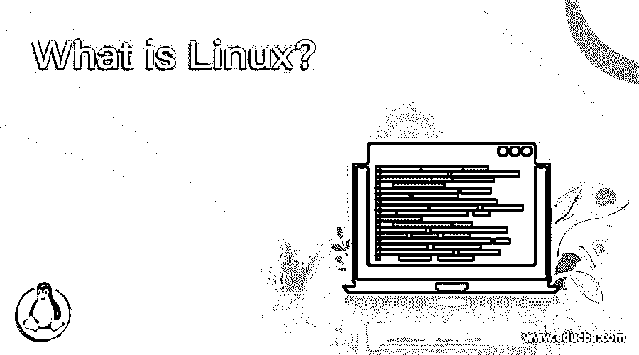

# 什么是 Linux？

> 原文：<https://www.educba.com/what-is-linux/>

## Linux 简介

Linux 是为数不多的开源操作系统之一，它的内核充当了在计算机硬件和系统软件之间建立通信的中央操作单元。Linux 操作系统中的各种必要组件是内核、引导装载程序、图形服务器、守护进程、桌面环境和应用软件。大多数情况下，人们选择 Linux 而不是其他操作系统，是因为它具有一些有益的属性，包括易于获取和使用、更高的安全性、更多的定制选项、低维护、可在任何品牌的设备上访问、高度稳定等。

### Linux 到底是什么？

它是操作系统软件，直接管理你所有的硬件资源或者连接的外围设备，简而言之，我们可以说它绑定了你的硬件设备和你的软件之间的通信媒介。它是由 Linux Torvalds 于 1991 年 9 月 17 日首次发布的基于 Linux 内核的开源免费操作系统。内核是一个操作系统程序，它充当操作系统的心脏，负责基本的任务，例如让硬件与软件通信。Linux 用户可以为计算机、智能手机和其他外围设备创建和修改源代码的各种变体，称为发行版。最常见的用途是作为服务器，但也可以用于台式电脑、电子书阅读器和游戏机、智能手机等。

<small>网页开发、编程语言、软件测试&其他</small>

因此，简而言之，我可以说 Linux 是 Windows 操作系统的一个免费的开源替代品，它主要是由才华横溢的年轻计算机程序员在业余时间开发的。用户认为 Linux 是一个灵活、可扩展和健壮的操作系统。它适用于编程和许多其他用途。批评者指出，这种操作系统缺乏应用程序支持，与另一种操作系统相比，用户友好性较差。Linux 类似于 Linux 内核加上运行在 Linux 内核之上的所有实用程序、库和工具，其中许多都是在 GNU 项目的指导下运行的。

### 什么是 Linux 内核？

作为操作系统的架构，内核是操作系统最重要的部分，因为它管理着机器硬件和软件之间的通信。内核操作的可见性是不可见的，因此最终用户无法访问它。这些用户空间工具只有 GUI 文件系统、web 浏览器和 Bash shell。

Linus 内核实现的一些关键设计原则是:

*   在 Linux 中，一切都是文件哲学
*   多用户能力
*   多任务处理能力
*   GPU 架构之间的可移植性
*   模块性
*   安全性
*   可配置性

### Linux 操作系统的体系结构

让我们看看 Linux 操作系统的一些组件和架构。

#### 1.引导加载程序

这是一个内置的 Linux 软件，可以管理和整合您的台式机、笔记本电脑或计算机的引导过程。对于大多数普通用户来说，理想情况下，这将是一个简单的应用程序屏幕，它会弹出一个警告，并最终引导进入操作系统。

#### 2.内核

这是对整个 Linux os 的一行解释。内核充当系统的心脏，管理内存、外围设备和 CPU。内核位于操作系统的“最低”层。

#### 3 .守护进程

这些部分执行 Linux 操作系统的后台服务，如调度、打印、声音等，这些服务要么在操作系统启动时启动，要么在您登录到您的计算机后启动。

#### 4.图形服务器

它帮助 Linux 操作系统在你的显示器上显示图形。它通常被称为“X”或 X 服务器。

#### 5.桌面环境

这是操作系统中最有趣的部分，因为它就像是用户和系统之间的一个谜题。Linux 操作系统中有大量的桌面环境可供选择，如 Enlightenment、unity、Cinnamon、GNOME、KDE、XFCE 等。每个桌面环境都有大量的内置应用程序，如文件管理器、配置工具、web 浏览器、游戏等。

#### 6.应用程序

桌面环境不能为所有的应用程序提供任何帮助。与 mac 和 Windows 一样，Linux 也提供了数百种高质量的可行软件，这些软件很容易获得，可以随时随地安装。许多最新的 Linux 发行版在它们的应用程序商店中包含了类似工具的软件，可以简化和集中应用程序的安装。我们可以举一个例子，比如一个 Ubuntu 软件中心，它有 Ubuntu Linux 操作系统，允许你在数百个应用程序中快速搜索，并从一个中心位置安装它们。

### 我们为什么要用 Linux？

这里有一个答案，可能是你正在使用的操作系统可能不能正常工作，或者它只是很好。我的意思是说，你是否面临像恶意软件，病毒，维修，速度变慢，服务器问题崩溃等问题。如果你正在努力解决这些操作系统的问题，我敢肯定你可能没有使用操作系统。使用开源和免费的 Linux 操作系统，你可以零成本解决所有这些问题。它是在开放源代码许可证下处理和分发的，该许可证具有以下特定属性:

*   它很容易分享，所以你可以在任何地方帮助你的朋友。
*   您可以将 Linux 用于商业用途，因为它很容易分发。
*   自由地编写程序，把你的改变分享给每个人。
*   你可以在任何地方运行你的程序，这样就很容易访问。

它由一个社区来处理和管理。所以这些变化汇集在一起[创造了一个 Linux](https://www.educba.com/linux-operators/) 平台。它拥有大量不同版本的操作系统，可以应对几乎任何类型的用户。从新用户到核心用户，你会看到 Linux 满足你的需求。这些版本被称为发行版，或者简称为发行版。几乎每一个 Linux 发行版都可以免费下载或保存在硬盘中，并可以安装在任何台式机或笔记本电脑上。

最流行的 Linux 发行版有:

*   Ubuntu Linux
*   Linux 作为
*   Arch Linux
*   Deepin
*   一种男式软呢帽
*   一种自由操作系统
*   opensuse

### 我们能用 Linux 做什么？

所以，据我所知，我们可以用 Linux 做很多很酷的事情。安装 Linux 后，我们可以做的事情有:

*   学会使用终端
*   添加各种带有未测试软件的存储库
*   不播放您的媒体
*   放弃无线网络
*   了解另一个桌面
*   安装 Java
*   修理东西
*   编译内核
*   删除根文件系统
*   更换壁纸
*   其他计算机疑难解答
*   让 Chromebook 更有用
*   托管网站或 Web 应用程序
*   使用硬盘和分区
*   让家里的一切自动化
*   运行家庭服务器进行备份、流式传输、烘焙等
*   创建专用的媒体中心或视频游戏机
*   重温你的黑客技术和安全性
*   恢复旧的或运行缓慢的电脑
*   了解更多关于计算机如何工作的信息

### 所需技能

以下是成为 Linux 管理员所需的特定技能:

*   行业管理和监控框架
*   在高可用性企业系统的结构化变更管理流程中工作
*   VMware
*   Perl、Bash、Python 脚本
*   IT 安全
*   Linux 内核和内核模块的知识
*   熟悉开源工具、监控系统、硬件故障排除、跟踪、解决和安全更新的日常维护
*   对网络存储(SAN、NAS)概念的工作接触
*   红帽星团
*   Solaris 10 体验
*   RHCE 认证
*   FC、NFS 或 iSCSI 等存储技术非常好，而备份技术方面的知识是系统管理员必须具备的。
*   使用 SNMP 或 Nagios 等系统和应用程序监控工具的技能也很重要，因为它们显示了您作为团队环境中的管理员的能力。

所以我们开始了解为什么它如此熟悉，以及在 Linux 上工作需要哪些基本技能。

### 为什么我们应该使用 Linux 而不是 Windows 或 Mac？

以下是我们应该把它作为操作系统的原因。

*   高度安全
*   高稳定性
*   易于维护
*   在任何硬件上运行
*   自由的
*   开放源码
*   易用性
*   定制非常容易
*   教育
*   支持

### 优点和缺点

正如我们所知，每个硬币都有两面。Linux 操作系统也是如此。它有很多优点，所以也有很多缺点。所以我应该首先从 Linux 作为一个操作系统的优点说起。

以下是一些优点:

*   开源自然
*   它非常安全
*   可以恢复旧电脑，也可以增加其工作寿命
*   非常适合程序员
*   持续的软件更新
*   定制非常简单方便
*   内核中的各种分布
*   它是免费的，所以任何人都可以使用它
*   更广泛和更好的社区支持
*   非常可靠
*   Linux 中您需要的隐私
*   性能非常高
*   非常灵活
*   没有兼容性问题
*   多任务处理太简单了
*   快速简单的安装
*   更好地利用硬盘
*   高稳定性
*   无病毒
*   各种发行版
*   高网络支持

所以以上是使用它作为操作系统的真正优势。现在是时候讨论任何软件最难的部分了，那就是它的局限性、缺点和不足。

将其用作操作系统的一些缺点:

*   没有单一的软件打包方式
*   没有标准的桌面环境
*   对游戏的支持差
*   桌面软件仍然很少见
*   没有标准版
*   学习曲线
*   不兼容的软件
*   不支持的硬件
*   它对驱动程序有补丁支持
*   与 windows 相比，没有那么容易使用
*   有些程序不能在上面运行
*   用户提出了与 Linux 驱动程序相关的问题，因为某些硬件或旧硬件与操作系统不兼容。

### Linux 的主要用途

*   使用 Linux，我们可以对任何电脑或笔记本电脑进行故障诊断。
*   我们可以使用 Linux 制作任何网站的服务器，或者我们可以说 Linux 可以在任何地方托管任何网站。现在几乎所有的网站都运行在 Linux 上。
*   创建一个 Linux 服务器是真正负担得起的，因为它的成本效益非常高。
*   无论你看到什么，无论你是台式机、笔记本电脑、汽车还是家用电器，你都可以在 Linux 上工作。都用 Linux。

### Linux 的未来范围是什么？

Linux 是一个巨大的操作系统，你只能通过实践来学习它。看起来，如果你是 Linux 新手，对于一个新用户，我可以建议你从一个简单的发行版开始。我的建议是 mint 或者 tri SQL。完全由你决定。

根据我的经验，你应该做的是精通基于 Debian 的发行版，然后开始使用基于 Redhat 的发行版，因为基于 RedHat 的发行版更容易管理，也更稳定。无论是过去、现在还是将来，Linux 作为一个操作系统的魅力将永远存在。Linux 已经成为许多技术的默认操作系统，如[大数据和 Hadoop](https://www.educba.com/what-is-big-data-and-hadoop/) 或移动或网络应用。它是最新技术创新发生的唯一媒介。因此，Linux 在未来有广阔的发展空间，因为它是开源的，并且有一个很大的社区，所以开发有很广阔的领域。因此，我将推荐 Linux 作为一种操作系统，无论是在开发还是商业目的中，它都可以在任何地方使用

### 推荐文章

这是一个什么是 Linux 的指南？.这里我们讨论了 Linux 的概念、工作、用途、需求、优点和缺点。您也可以浏览我们推荐的其他文章，了解更多信息——

1.  [Linux 简介](https://www.educba.com/introduction-to-linux/)
2.  [什么是肥皂？](https://www.educba.com/what-is-soap/)
3.  [卡珊德拉是什么？](https://www.educba.com/what-is-cassandra/)
4.  什么是 iSCSI？

