# 如何安装 Ubuntu 服务器

> 原文：<https://www.educba.com/install-ubuntu-server/>

## Ubuntu 服务器简介

Ubuntu 是一个非常流行的操作系统。它是免费的，由社区支持。世界各地的开发者更喜欢 Ubuntu 的强大功能。Ubuntu server 是标准 Ubuntu 的变种，是专门为网络和服务设计的。Ubuntu server 可以从一个简单的文件服务器应用程序运行到操作成千上万的节点云。Ubuntu 桌面和服务器的安装过程有明显的区别。Ubuntu Desktop 提供了一个易于安装且直观的图形用户界面，而 Ubuntu Server 没有用于安装的图形程序。

### 安装 Ubuntu 服务器的要求

为了能够在任何机器上设置或安装 Ubuntu 服务器，我们需要首先满足所需的基本硬件。

<small>网页开发、编程语言、软件测试&其他</small>

*   系统应该至少有 2 GB 的可用存储空间。
*   必须有一个用于 DVD 读取的插槽或一个闪存驱动器端口，该端口应该包含用于安装的 Ubuntu 服务器安装软件。

### 安装 Ubuntu 服务器的步骤

下面给出了安装 Ubuntu Server 所需的步骤，如下所示:

#### 步骤 1:从安装介质启动

这通常是安装过程的第一步，我们以 DVD 或 USB 闪存驱动器的形式获得 ubuntu 服务器软件副本，并通过 DVD 播放器或 USB 端口读取它。将软件副本插入驱动器后，几秒钟内会弹出一个对话窗口。一旦有了，就应该进行下一步。

也可能需要重新启动；如果是这样，请重新启动计算机。重启后，可以看到如下所示的消息。

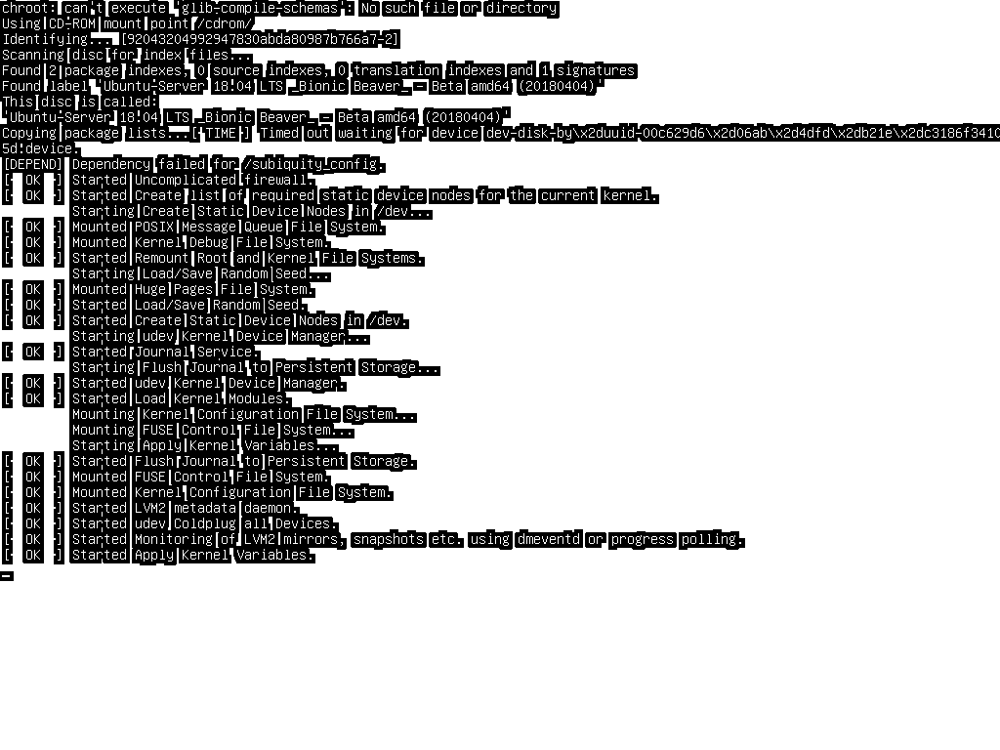

#### 步骤 2:选择安装语言

有几种语言可以安装 Ubuntu。在这一步，我们选择安装语言。对于本教程，我们将选择英语作为我们安装 Ubuntu 服务器的语言。语言选项显示在引导消息之后。

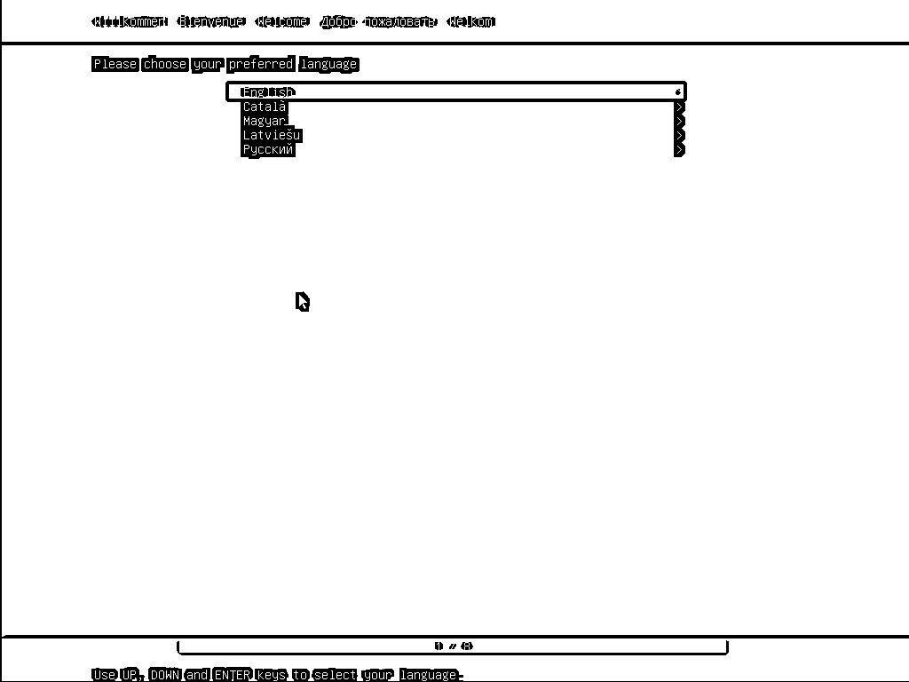

#### 步骤 3:选择正确的键盘布局

一旦选择了安装语言，我们需要选择键盘类型。对于本教程，我们将选择英语美国键盘布局。键盘布局选择很重要，因为在安装过程中，需要向安装向导发送几个命令来进行正确安装，因此需要键盘。

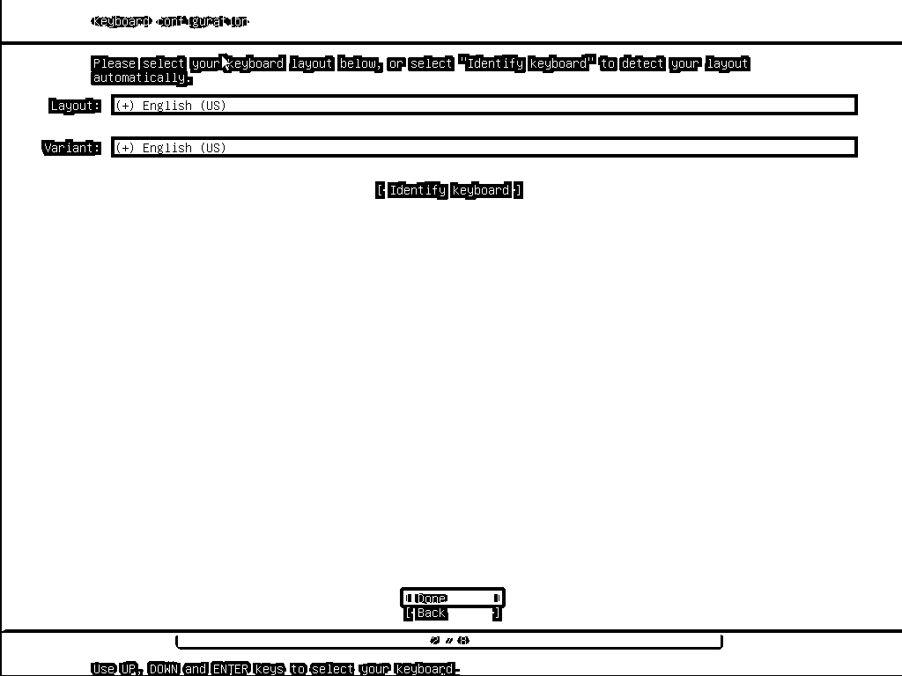

#### 步骤 4:选择安装变体

在此步骤中，我们选择相关版本进行安装。可能有许多选项可用，如安装 ubuntu，安装质量区域控制器，安装质量机架控制器。我们应该选择安装 ubuntu 选项。

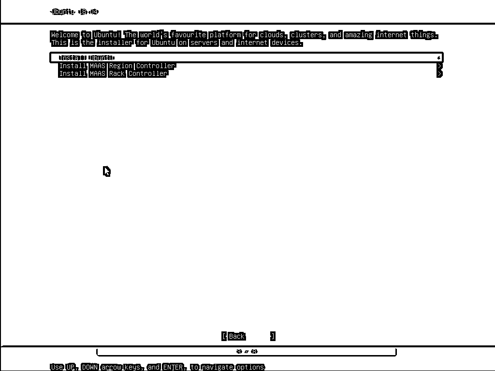

#### 第五步:社交

在此步骤中，安装程序会自动检测并尝试通过 [DHCP](https://www.educba.com/what-is-dhcp/) 交换机配置任何网络连接。这个步骤是自动的，用户不需要做任何事情。但知道这些还是好的。

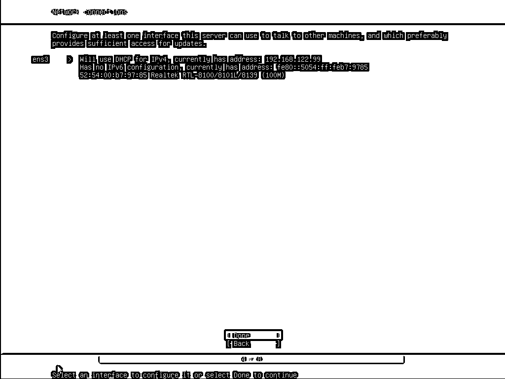

#### 步骤 6:配置存储

下一步，我们需要为存储和运行 Ubuntu 设置内存存储。通常的建议是安装整个磁盘或分区以备用。从下面的截图可以看出，存储步骤有三个选择。我们可以选择整个磁盘，也可以选择手动分区。第三种选择是返回并中止安装过程。

如果需要建立一个定制的或者相当复杂的系统，那么可以选择手动选项。它将允许用户在任何连接的驱动器上根据他/她的要求选择和重新组织分区。

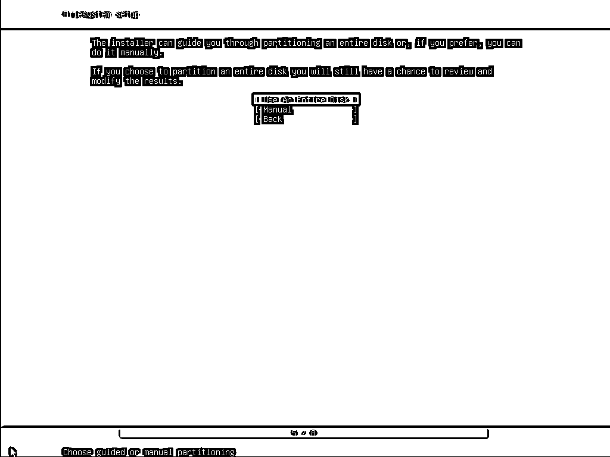

#### 步骤 7:选择设备

此菜单允许用户从系统上显示的所有检测到的磁盘中选择一个磁盘。为了便于识别，驱动器按其系统 ID 列出。用户可以通过箭头键导航并按 enter 键来选择他/她希望使用的磁盘。

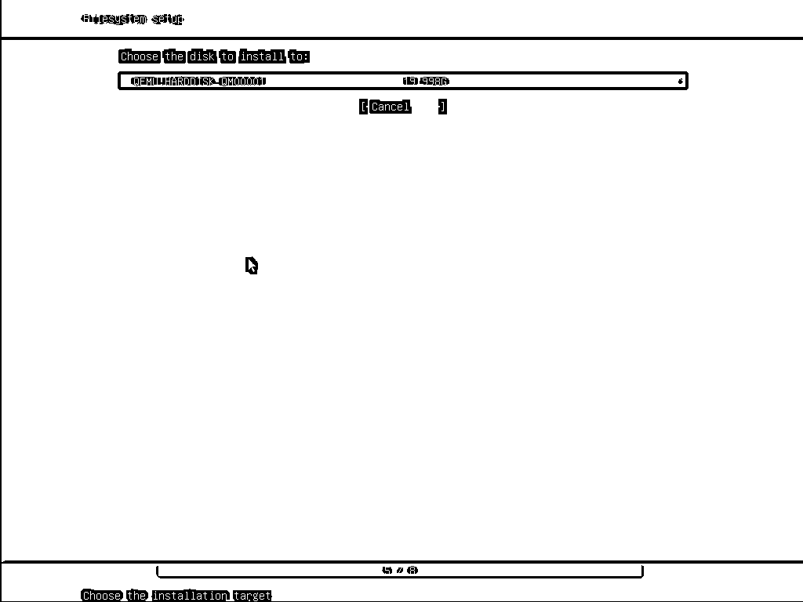

#### 步骤 8:确认分区

既然选择了目标驱动器，安装程序就会计算要创建哪些分区，然后在显示器上显示这些信息。如果用户有不同的偏好或要求，例如您选择了错误的驱动程序，则可以使用箭头键进行更改，或者也可以从屏幕底部的可用选项中选择返回。此操作将返回到之前的菜单选项，用户可以选择不同的驱动器并继续该过程。

手动更改分区也是可能的，这可以通过选择 Edit Partitions 选项来完成。但是，只有在熟悉分区工作原理的情况下，才应该选择这种方式。

完成所有设置后，选择 Done 继续安装 Ubuntu 服务器。

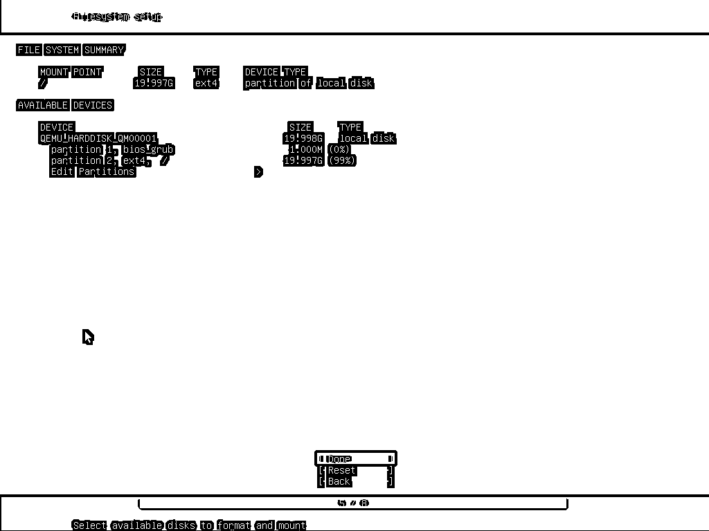

#### 步骤 9:确认更改

这一步非常重要。在安装程序进行任何永久更改之前，它会将此显示为最后的确认步骤。用户应该仔细检查是否一切都符合他的要求，没有错误的设备会被重新格式化。此步骤没有撤销选项，因此一旦确认了更改，指示的设备将被覆盖，所有以前的内容都将丢失。

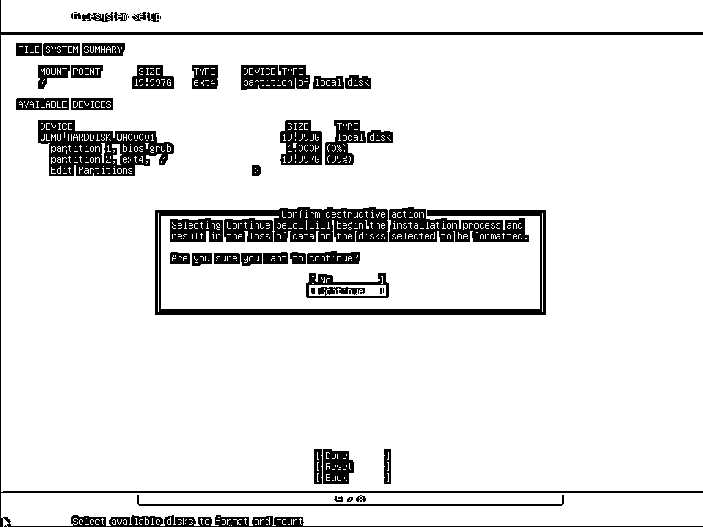

#### 步骤 10:设置配置文件

Ubuntu Server 要求系统至少有一个用户名、密码和主机名。还有一个用于导入 SSH 密钥的字段。SSH 密钥可以从 Launchpad 或 Ubuntu One 或 Github 导入。一旦用户提供了用户名，安装程序将从所选的这些系统中的一个获取相关的密钥，并将它们安装在系统上以供使用。例如，安全 SSH 登录到服务器。这可能看起来很复杂，但却很简单。

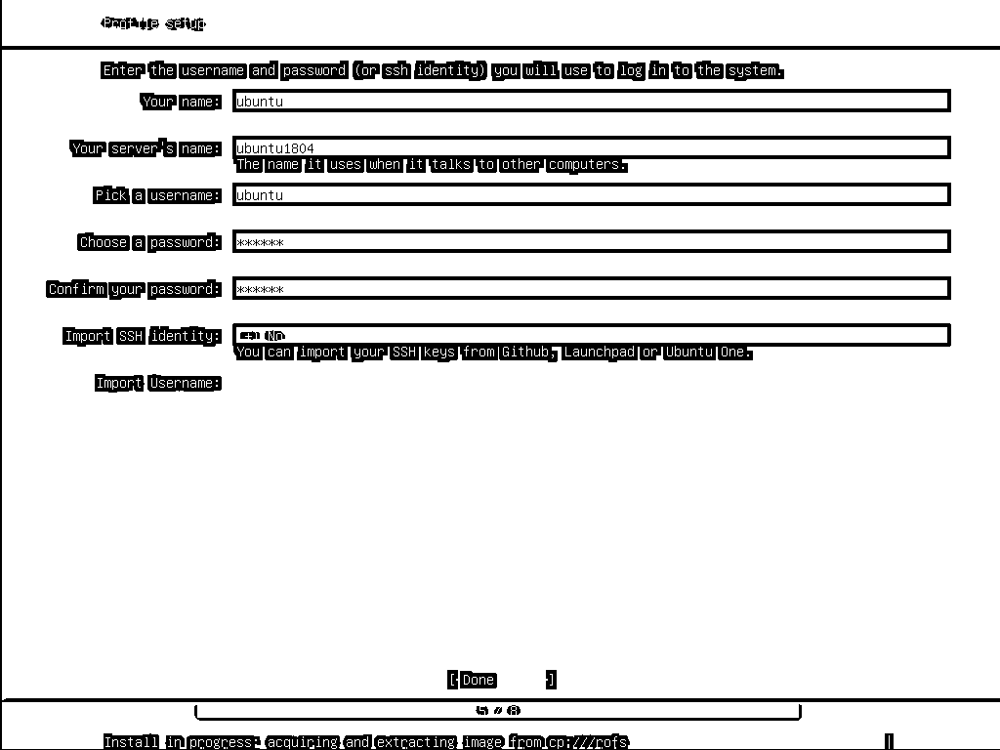

#### 步骤 11:安装软件

输入所有必需的信息后，屏幕开始显示安装程序的进度。Ubuntu Server 只安装非常简洁的软件列表，这是服务器运行的核心要求。这确保了安装和设置所需的时间最短。一旦该步骤完成，即在安装完成之后，可以根据需要安装任何附加软件。

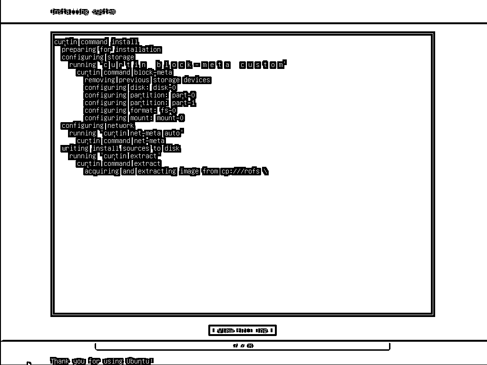

#### 步骤 12:安装完成

当安装过程完成时，用户可以看到类似下面截图的消息。这表明安装过程已经结束，系统可以使用了。现在，用户应该从 DVD 驱动器或闪存驱动器中取出安装介质，然后在使用前最后一次重新启动系统。

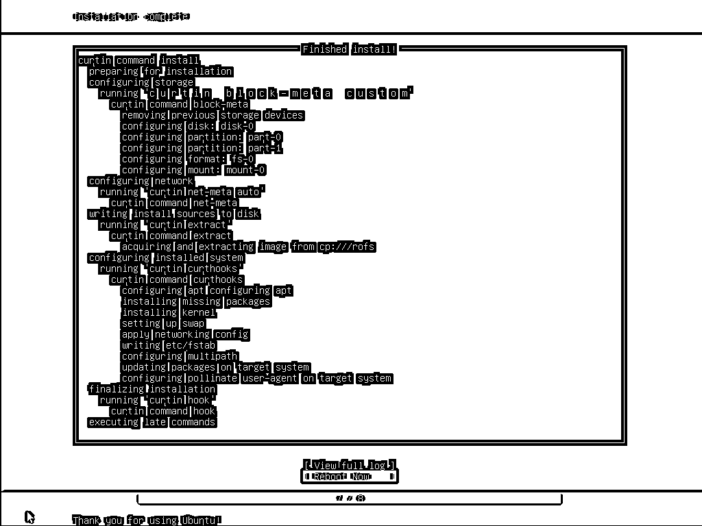

### 推荐文章

这是一个如何安装 Ubuntu 服务器的指南。这里我们已经讨论了安装 Ubuntu Server 的概念和逐步指南。您也可以阅读以下文章，了解更多信息——

1.  [Ubuntu 版本](https://www.educba.com/ubuntu-version/)
2.  [Ubuntu 的使用](https://www.educba.com/uses-of-ubuntu/)
3.  [如何安装 Ubuntu](https://www.educba.com/install-ubuntu/)
4.  [Ubuntu 命令](https://www.educba.com/ubuntu-commands/)

