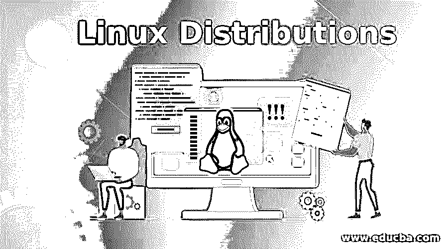
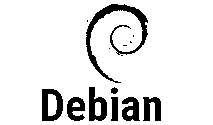
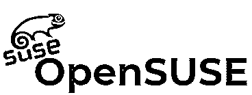
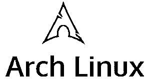
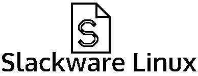

# Linux 发行版

> 原文：<https://www.educba.com/linux-distributions/>

## Linux 发行版简介

Linux 发行版(通常缩写为 distro)是从软件集合中创建的，由 Linux 内核和软件包管理系统组成。简而言之，Linux 发行版结合了 Linux 内核和可用的开源软件，创建了一个完整的包。要安装 Linux，我们需要选择一个发行版。Linux 用户通常通过下载一个 Linux 发行版来获得他们的操作系统。

典型的 Linux 发行版由 Linux 内核、GNU 库和工具以及附加软件组成。通常，使用的软件是自由软件，以源代码形式和编译的二进制形式提供，以便于修改原始软件。大约有 600 个 Linux 发行版，有 500 多个正在开发中。由于有大量可用的发行版，所以出现了各种形式，它们的适用性从台式机到平板电脑各不相同。

<small>网页开发、编程语言、软件测试&其他</small>

### Linux 的分销商

我们有商业辅助的发行版，如 Fedora、Ubuntu 和 openSUSE，也有完全社区驱动的发行版，如 Debian、Gentoo、Slackware 和 Arch Linux。

#### 1.人的本质

Ubuntu 是众所周知的，是领先的 Linux 发行版之一。使用 Ubuntu ，我们不需要技术过硬，这就是为什么它非常受欢迎，也是开始尝试 Linux 的完美地方。Ubuntu 基于 Debian，但是它有自己的软件库。它以前在 GNOME 2 桌面环境下运行，但是现在它有了自己的用户界面 Unity。

Ubuntu 提供了一个简单的安装程序，安装者可以使用任何需要的主要语言。在安装之前，我们可以选择演示 Ubuntu。Ubuntu 安装程序带有一个硬件检测器，使得驱动程序安装变得简单。这个硬件检测器有助于检测、下载和安装我们电脑所需的最佳驱动程序。此外，该软件还配有音乐、视频播放器、办公套件和一些游戏等基本软件。Ubuntu 每六个月发布一次，有很好的文档和社区支持。

#### 2.一种自由操作系统

Debian 是一个操作系统，由自由和开源软件组成。1993 年，伊恩·默多克宣布用 GNU 观点开发一个新的 Linux 发行版。他把这个发行版命名为 Debian，这是他自己的名字和他女朋友的名字 Debra 的组合。Debian 最初是一个小项目，现在是最大的开源项目之一。从那以后，Debian 一直在发布新版本，但它比 Linux Mint 或 Ubuntu 等发行版慢得多，这使它更加稳定，是一些系统的理想选择。

Ubuntu 最初是为了获取 Debian 的[稳定版本的核心部分并对其进行改进，这样就可以更快地完成更频繁的更新，从而产生一个用户友好的系统。](https://www.educba.com/install-debian/)

#### 3.一种男式软呢帽

Fedora 由 Red Hat 支持，是商业项目 Red Hat Enterprise Linux (RHEL)的基础。Fedora 专注于自由软件。与 RHEL 相比，它使用了更新的技术和开源软件包。但与 RHEL 不同，Fedora 不会被支持太久。对于一个更稳定的版本，红帽希望我们使用他们的企业产品，RHEL。

默认情况下，Fedora 拥有 GNOME 3 桌面环境。Fedora 使用上游软件，从而提供一个平台来集成软件，而无需使用定制工具或制作自己的环境桌面或任何其他软件。

#### 4.OpenSUSE

OpenSUSE 是一个社区驱动的 Linux 发行版。它最初是 Slackware 发行版的德语翻译，但后来发展成了自己的发行版。正如我们已经看到的 Fedora 项目如何成为 RHEL 的基础，同样，OpenSUSE 项目也成为即将推出的 SUSE Enterprise 发行版的基础。

OpenSuse 以其 KDE 桌面和稳定性而闻名。OpenSuse 利用 Zypper 及其图形前端 Yast 软件中心进行包管理。在 Ubuntu 之前，SUSE 被认为是为数不多的用户友好的发行版，但最终，Ubuntu 接管了它。

#### 5.Linux 作为

Linux Mint 是构建在 Ubuntu 之上的发行版，它利用了 Ubuntu 提供的软件库。最初，Mint 只是 Ubuntu 的一个替代选项，因为它默认提供独家软件和媒体编解码器，而 Ubuntu 没有，但今天，Mint 有了自己的身份。Mint 使用传统的 MATE 或 Cinnamon 桌面。它对软件更新采取宽松的态度，软件更新不会自动安装。这也是有人称薄荷没有安全感的原因。

#### 6.Arch Linux

与大多数其他 Linux 发行版相比，Arch Linux 更加传统。它被设计成轻便灵活。Arch Linux 并没有提供图形化的好处和脚本来[自动化 Linux 设置](https://www.educba.com/introduction-to-linux/)，因为它被设计得很简单，这让我们负责配置我们的系统和正确安装软件。安装程序打开一个终端，我们在这里运行命令来配置和安装操作系统。

Arch Linux 使用“滚动发布”原型，这意味着整个软件会随着时间的推移自行更新，而不需要手动升级。这使得正在使用的软件总是最新的。这个发行版是为那些知道他们的系统如何工作或者准备学习它如何工作的开发人员设计的。

#### 7.Slackware Linux

Slackware 是最古老的 Linux 发行版之一，至今仍在维护和发布新版本。像 Arch 一样，Slackware 保留了所有多余的图形工具和自动化脚本。默认情况下，它引导到命令行环境。

#### 8.Gentoo Linux

Gentoo 是建立在 portage 包管理系统上的。这很难安装，可能需要几天才能完成安装过程。Gentoo Linux 的一个主要用途是它是为在特定类型的硬件上运行而构建的。

在本文中，我们已经看到了用于安装 Linux 的几个发行版。哪种发行版适合您，将取决于您的需求。Linux 有一个轻微的学习曲线，但它不会是一件烦恼或遗憾的事情。现在就去尝试其中一个 Linux 发行版吧！

### 推荐文章

这是 Linux 发行版的指南。为了更好的理解，我们在这里讨论 linux 的介绍和发行商。您也可以阅读以下文章，了解更多信息——

1.  [Linux 用户](https://www.educba.com/linux-users/)
2.  [Linux 职业生涯](https://www.educba.com/careers-in-linux/)
3.  [Linux comm](https://www.educba.com/linux-comm/)
4.  [Linux 操作员](https://www.educba.com/linux-operators/)

