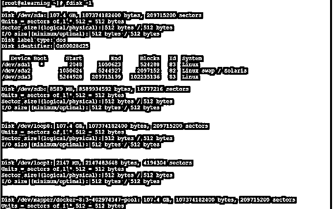
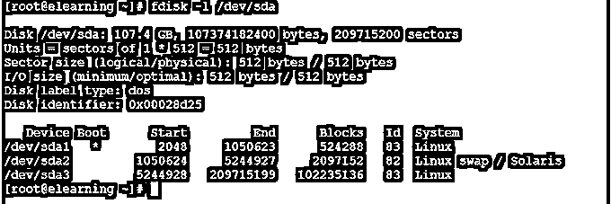
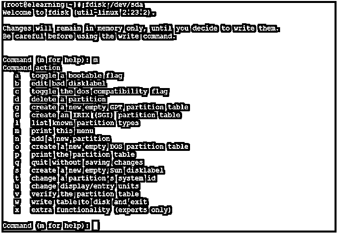
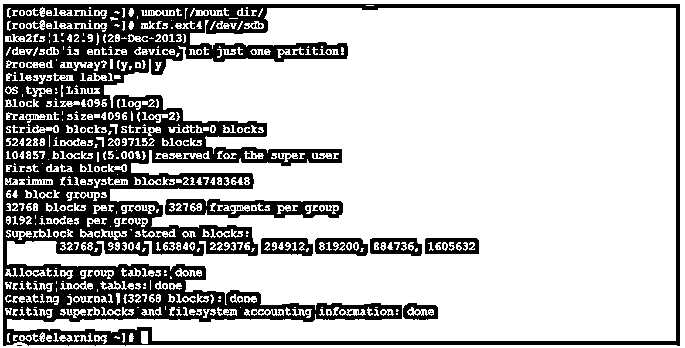
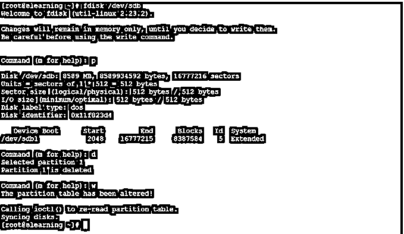

# Linux 格式

> 原文：<https://www.educba.com/linux-format/>

## Linux 格式介绍

在 Linux 操作系统中，我们使用 Linux 格式来格式化磁盘或任何外部存储设备。有不同类型的 Linux 格式，如 btrfs、ext2、ext4、xfs、cramfs、ext3、minix。这种格式与 Linux 操作系统兼容。根据应用程序或作业状态的兼容性，我们可以选择各自的 Linux 格式。Linux 格式主要用于格式化外部块存储。Linux 中有很多不同的工具可以用来格式化内部和外部磁盘，比如 fdisk 等。在 fdisk 中，启用 FDISK_DEBUG 变量来调试输出。同一变量的值为“0xffff”。

**Linux 格式的语法**

<small>网页开发、编程语言、软件测试&其他</small>

[Format Method] [Options] [Device Name]

`fdisk [-uc] [-b sectorsize] [-C cyls] [-H heads] [-S sects] device`

*   **fdisk:** 我们可以在语法或命令中使用“fdisk”关键字。它将采用不同的参数，如扇区信息、报头、不同的选项等。根据提供的参数，它将格式化输入存储。
*   **选项:**我们可以提供不同的标志作为与“fdisk”命令兼容的选项。
*   **设备或设备路径:**根据条件，我们可以向 fdisk 命令提供设备的路径或设备引用。

### Linux 格式如何工作？

在 Linux 环境中，我们有多种工具和实用程序来格式化外部和内部存储。为了格式化存储磁盘，我们通常使用 fdisk 实用程序。它将接受输入，如扇区信息、柱面、格式类型或任何手动输入。根据输入参数，fdisk 命令将格式化输入磁盘。

下面是选项列表，我们可以在格式化磁盘时使用它。

| **选项** | **描述** |
| -b 扇区大小 | 这将有助于指定输入磁盘的扇区大小。该选项将接受 512、1024、2048 和 4096 等值。在旧的内核中，我们需要使用这些值，否则在内核中就不需要定义这些值。 |
| -c[=模式] | 这将有助于定义兼容模式，即 dos 或非 dos。默认值是非 DOS 模式。可以使用带选项的模式(向后兼容) |
| -C 个气缸 | 这将有助于指定输入磁盘的柱面数量。但是在较新的版本中，不推荐使用该选项。 |
| -H 字头 | 这将有助于指定输入磁盘上的磁头数量。基本上不是突出物理数量而是使用分区表的数量等。兼容值为 16 和 255。 |
| -S 教派 | 这将有助于指定输入磁盘上每个磁道的扇区数。基本上不是突出物理数量而是使用分区表的数量等。兼容值为 63 |
| -h | 这将有助于打印兼容选项的数量并退出 |
| -我 | 它将列出输入磁盘的分区表并退出。 |
| -s 分区… | 它将显示输入分区的大小。大小将以块的形式显示 |
| -u[=单位] | 它将有助于列出分区表并显示扇区和柱面信息。默认情况下，它将以扇区显示大小。 |
| -v | 它将打印 fdisk 命令或程序的版本信息并退出 |

### 实现 Linux 格式的示例

下面是一些例子:

#### Linux 格式–磁盘列表

在 Linux 环境中，我们能够列出与环境相关的磁盘数量。我们需要在命令中使用“-l”选项。

**命令:**

`fdisk -l`

**输出:**

**说明:**根据上面的命令，我们可以列出 Linux 环境的存储设备信息的数量。

#### Linux 格式–使用特定磁盘查看

在 Linux 中，可能存在多个磁盘，但是我们可以选择我们需要工作的合适的磁盘。

**命令:**

`fdisk -l /dev/sda`

**输出:**

**说明:**根据上面的命令，我们正在查找与“/dev/sda”存储相关的子存储信息。

#### Linux 格式–打印可用选项列表

在使用 Linux 格式时，我们需要选择任何存储。一次，我们会选择存储。我们可以探索具有相同功能的不同选项。

**命令:**

`fdisk /dev/sda`

**输出:**

**解释:**如果我们使用 fdisk 实用程序格式化 Linux 存储，我们将获得它的选项号。在下面的截图中，你会看到它的可用选项列表。

#### Linux Format–使用 MKFS 格式化 Linux 磁盘或存储

在 Linux 中，我们可以格式化任何类型的存储。在格式化时，我们需要注意格式类型。

注意:数据格式化后，恢复数据将会有所不同(根据我们在格式化存储时使用的选项)。因此，我们在格式化任何存储设备时都会非常小心。

**命令:**

`umount /mount_dir/
mkfs.ext4 /dev/sdb`

**输出:**

截图 1 (a)

截图 1 (b)

**说明:**在屏幕截图 1 (a)中，我们看到“/dev/sdb”存储装载在“/mount_dir”目录中，消耗了 4.1 GB 的数据。在 mkfs 实用程序的帮助下，我们正在用 ext4 格式格式化存储设备“/dev/sdb”(参考截图 1 (b))。

#### Linux Format–用 FDISK 格式化 Linux 磁盘或存储器

在 Linux 中，我们也可以在 fdisk 的帮助下格式化或删除存储。

**命令:**

`fdisk /dev/sdb`

选择分区号用户的" d "选项

**输出:**

**说明:**根据上面的命令，我们正在删除或格式化“/dev/sdb1”分区。

### 结论

我们已经看到了“Linux 格式”的完整概念，以及正确的示例、解释和带有不同输出的命令。根据要求，我们能够在 Linux 环境中格式化不同的存储设备。根据应用程序或工作兼容性，我们需要选择格式类型。

### 推荐文章

这是一个 Linux 格式的指南。这里我们也讨论一下简介和 linux 格式是如何工作的？以及不同的示例及其代码实现。您也可以看看以下文章，了解更多信息–

1.  [Linux Xargs](https://www.educba.com/linux-xargs/)
2.  [Linux 模拟器](https://www.educba.com/linux-emulator/)
3.  [Linux nslookup](https://www.educba.com/linux-nslookup/)
4.  [Linux 加入](https://www.educba.com/linux-join/)

