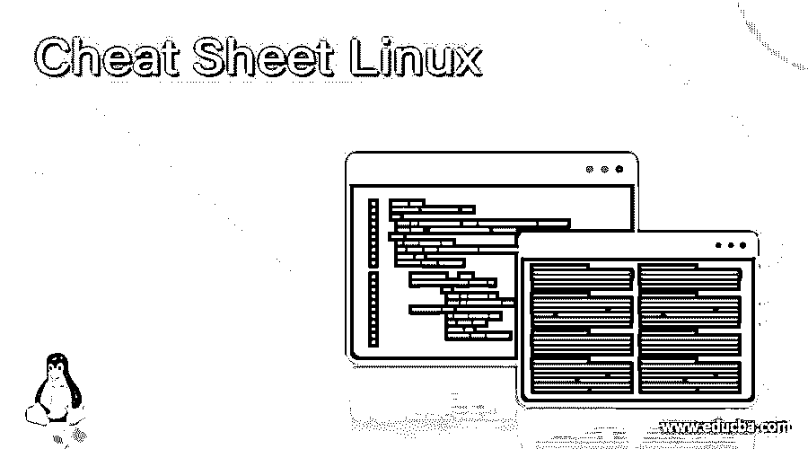

# 备忘单 Linux

> 原文：<https://www.educba.com/cheat-sheet-linux/>

## 备忘单 Linux 简介

下面的文章提供了备忘单 Linux 的概要。Linux 是一个像 Windows 一样的操作系统。但与 Windows 不同，它可以在市场上免费获得。分配资源和协调计算机内部所有细节的计算机程序被称为操作系统或内核。用户通过一个叫做 Shell 的程序与内核通信。Shell 是一个命令行解释器，它翻译用户输入的命令，并将它们转换成内核可以理解的语言。

### 使用 Linux 的优势

下面是提到的优点:

<small>网页开发、编程语言、软件测试&其他</small>

*   Linux 是一个高度可靠和安全的操作系统，而且它还在不断地增强其安全特性。
*   由于其安全性和可靠性特性，Linux 被用于大多数服务器，如 Amazon、Google 等等。
*   Linux 有各种各样的程序或应用程序可供选择，其中许多是免费使用的。

由于 Linux 是免费提供的，所以有很多黑客试图入侵该系统。另一方面，由于这一点，许多组织保持他们的系统是私有的，许多其他组织定制他们自己的版本，并使它公开地可供每个人使用。这些类型的 Linux 操作系统被称为发行版。每个 Linux 发行版都是为满足目标用户的需求而构建的。

### 备忘单 Linux 上的命令

下面是提到的执行不同类型操作的 Cheatsheet Linux 命令:

| **Sr 号** | **命令** | **描述** |
| One | 列表文件
ls
ls–R
ls-al | 

*   Displays the files and directories in the current directory.
*   And all files in subdirectories of the directory.
    It gives the detailed information of the file.

 |
| Two | Creating files
• catviewing files

*   猫<filename></filename>

组合文件
cat 文件 1 文件 2 >新文件名

 | 

*   Create a new file using cat > filename, add details, and control+d returns to the command prompt.
*   Displays the contents of the file.
*   File 1 and file 2 are merged into a new file with the name of newfilename.

 |
| Three | 删除文件
rm 文件名。 | 从系统中删除文件，不提示用户。 |
| Four | 移动文件
mv filename _newfilelocation。 | 将文件移动到指定的新位置，需要超级用户权限。 |
| Five | 男人 | 打开一本 Linux 手册。如果没有得到任何命令，可以写 man <commandname>。它会给出命令的所有解释。</commandname> |
| Six | 历史 | 显示您过去在当前终端会话中使用的所有命令。它有助于引用您输入的所有旧命令，并在您的操作中重用它们。 |
| Seven | 清楚的 | 清除终端上的所有数据，并为您提供一个干净的工作窗口。 |
| Eight | 公共关系 | 当您要打印文件时，帮助格式化文件。 |
| Nine | 须藤 | 允许普通用户以超级用户的安全权限运行程序。 |
| Ten | 邮件–s '主题'–c '抄送地址'–b '密件抄送地址' '收件人地址' | 发送电子邮件的命令。 |
| Eleven | 容易得到 | 用于安装和更新软件包的命令。 |
| Twelve | 砰 | 检查与服务器的连接是否正常。 |
| Thirteen | 著名图象处理软件 | 它类似于 windows 中的任务管理器。显示在一个用户下运行的所有进程。 |
| Fourteen | 杀死 PID | 终止 Linux 机器上正在运行的进程。 |
| Fifteen | 锥齿轮 | 将进程发送到后台。 |
| Sixteen | 细粒 | 将进程置于前台。 |
| Seventeen | 系统信息

*   uname–a
*   uname–r
*   准时
*   主机名
*   主机名
*   Last restart

 | 

*   Display linux system information
*   Display kernel system information
*   How long has the system been running?
*   System hostname
*   IP address of host
*   System restart history

 |
| Eighteen | 硬件信息

 | 

*   Displays the messages in the kernel ring buffer.
*   Show free and used memory.
*   PCI display device.
*   USB display device.

 |

### 使用备忘单 Linux 命令时的免费提示和技巧

下面是一些使用 Linux 命令的免费提示和技巧。

*   备忘单 Linux 命令是区分大小写的。因此，在编写语法时应该给予适当的关注。
*   Linux 中的隐藏文件以“.”开头符号。
*   [Bash Shell](https://www.educba.com/bash-shell-in-linux/) 终端是静音型。它永远不会给出“命令成功执行”的消息。但是它会给出已经发生的任何错误的错误消息。
*   [Cat 命令可用于](https://www.educba.com/cat-command-in-linux/)合并文件，但只有测试文件可使用该命令合并和显示。
*   Linux 中的每个文件都有 3 种类型的用户。

*   [Linux 将文件权限](https://www.educba.com/linux-file-permissions/)分为读、写、执行，分别用 r、w、x 表示。
*   对目录的读写权限意味着您可以列出目录的内容，并添加、删除和重命名存储在目录中的文件。
*   分配的权限可以通过“chmod”命令更改，该命令可以进一步分为绝对权限和符号权限。
*   管道“|”将一个命令的输出作为另一个命令的输入发送。
*   “grep”命令可以用来在文本文档中查找字符串和值。
*   Less、pg 和 more 命令用于将一个长文件分成可读的比特。
*   Linux 可以通过下面提到的方法安装到您的系统中:

*   cheat sheet Linux 与其他不同的计算机、网络和远程用户之间的通信。
*   FTP 是发送和接收大文件的首选协议。您可以建立到远程主机的 FTP 连接，然后使用命令上传、下载文件、检查文件和浏览文件。
*   Tenet 实用程序有助于在远程 Linux 计算机之间建立连接。
*   一个进程的优先级索引在 Linux 中叫做 NICE。默认值为 0，在 20 到-19 之间变化。美好指数越低，赋予任务的优先级越高。

### 结论

小抄 Linux 是第一个开源操作系统。这意味着任何人都可以下载代码，并根据自己的需要进行定制。Linux 不需要定期重启或者因为内存泄漏而变慢。它提供了最佳性能，可以同时处理大量用户。它有大量的发行版，让用户有机会根据需要进行选择。

Linux 提供了更多的控制，但是你需要花更多的时间来习惯命令。但是小抄 Linux 是最安全的操作系统之一。Linux 用户可以选择并安全下载软件，从包含数千个高质量软件包的在线仓库中免费下载。

### 推荐文章

这是一个指南备忘单 Linux 命令。在这里，我们已经讨论了内容和命令，以及免费的提示和技巧。您也可以阅读以下文章，了解更多信息——

1.  【UNIX 备忘单
2.  [备忘单 HTML](https://www.educba.com/cheat-sheet-html/)
3.  [备忘单 JQuery](https://www.educba.com/cheat-sheet-jquery/)
4.  [备忘单 SQL](https://www.educba.com/cheat-sheet-sql/)

