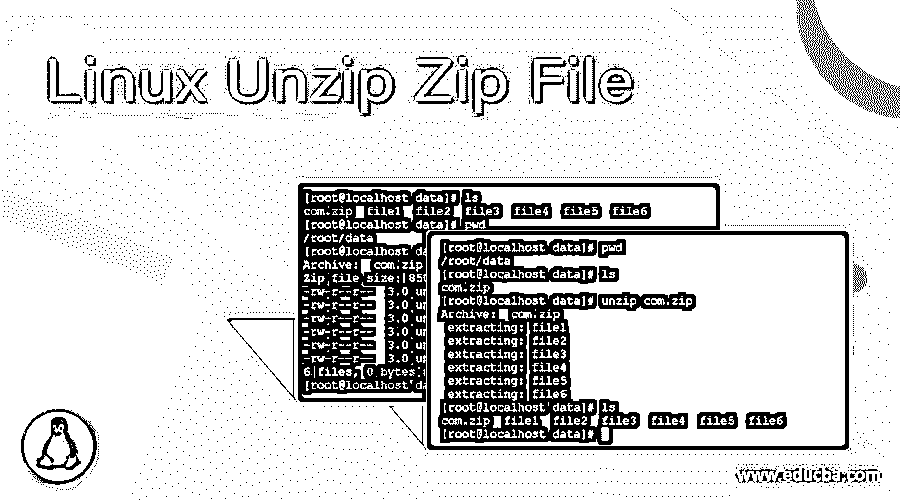
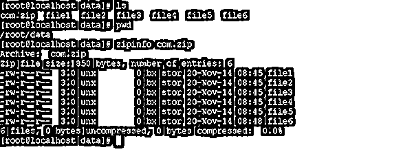

# Linux 解压缩 zip 文件

> 原文：<https://www.educba.com/linux-unzip-zip-file/>

## Linux 解压缩 zip 文件简介

在 Linux 操作系统中，zip 命令用于归档压缩数据。zip 实用程序主要在 windows 操作系统中使用。但是我们也可以在 Linux 平台上使用相同的 zip 实用程序。类似地，像 zip 实用程序一样，我们有不同的实用程序来压缩或 zip 数据。tar、tar.gz 和 tar.bz2 等。在 zip 家族下，有多个实用程序，如 zipdetails、zipsplit、zipcloak、zipinfo 等。并非所有的 Linux 发行版都有相同的包。我们需要手动安装，但是在 Ubuntu 版本中，比如 18.04，18.10，19.04，18.10。这些包是可用的。在这个主题中，我们将学习 Linux 解压缩 zip 文件。

从 1997 年到 2008 年，zip 实用程序的版权属于 Info-ZIP。但是目前，zip 实用程序属于 Info-ZIP 许可。

<small>网页开发、编程语言、软件测试&其他</small>

**Linux 解压缩 zip 文件的语法**

`zip [ OPTIONS ] [ ADD ZIP FILE NAME ] [ LIST OF FILES ] unzip [ ZIP FILE NAME ]`

*   **zip:** 我们可以在语法或命令中使用“zip”关键字。它需要不同的参数，比如期权。添加 zip 文件名和要压缩的输入文件列表。按照提供的参数，它将压缩输入文件列表并创建。zip”文件。
*   **解压:**在解压的帮助下，我们能够提取或解压 zip 文件。
*   **选项:**我们可以提供不同的标志作为与“zip”命令兼容的选项。
*   **文件列表:**根据需要，我们可以为 zip 命令提供文件或文件路径。

### Linux 解压 zip 文件是如何工作的？

zip 和 unzip 实用程序都可以在 Linux 环境中使用。但是它没有附带最小安装；我们需要单独下载或安装软件包。在使用 zip 实用程序时，我们需要注意一些事情，如 zip 或 unzip 命令兼容选项、zip 文件的名称以及作为输入提供的文件或目录列表。根据所提供的参数，zip 命令将使用压缩技术并将数据压缩到单个文件中，即。zip”格式。zip 文件在电子邮件附件中非常有用。与其他普通数据文件相比，它是轻量级的。

以下是与 zip/unzip 命令兼容的选项列表。

| **服务请求编号** | **选项** | **描述** |
| One | -a–ascii | 系统正在使用 EBCDIC。这将有助于把文件翻译成 ASCII 格式。 |
| Two | -A–调整-sfx | 这将有助于调整自解压可执行文件。自解压可执行文件将能够通过在现有文件前添加 SFX 存根来创建。注意:Amiga 是自解压档案中的一个特例。 |
| Three | –二进制 | VM 文件或 CMS 和 MVS 强制文件读取二进制文件。默认格式是文本。 |
| Four | –条目-注释 | 我们能够为每个文件添加单行注释。 |
| Five | -C–保存盒 | 在虚拟机中，保留的案例都在虚拟机上。同一个选项的反面将是(-C-)向下的情况。 |
| Six | -C2–保存案例 2 | 在虚拟机中，虚拟机上的保留案例 ODS2。同一个选项的反面将是(-C-)向下的情况。 |
| Seven | -C5–保存案例-5 | [在虚拟机中，虚拟机上的保留案例 ODS5。同一个选项的反面将是(-C-)向下的情况。 |
| Eight | -d–删除 | 这将有助于从 zip 存档中移除或删除条目。 |
| Nine | -db–显示字节 | 这将有助于显示运行字节计数，显示压缩的字节。要走的字节。 |
| Ten | -du–显示-使用 | 这将有助于显示每个条目的未压缩大小。 |
| Eleven | -dv–显示音量 | 这将有助于在磁盘上打印每个条目的卷号。它将是只读格式的 |
| Twelve | -D –no-dir-entries | 在同一个选项的帮助下，我们不会在 zip 存档中为目录创建条目。默认情况下，会创建目录条目。因此，我们能够将属性保存在 zip 存档中。我们可以像 ZIPOPT 一样使用环境变量。在同一个选项的帮助下，我们能够更改默认选项。 |

### 实现 Linux 解压 zip 文件的例子

下面举几个例子

#### 1.Linux Zip 命令:压缩单个文件

在 Linux 环境中，我们也能够从单个输入文件创建 zip 文件。

**命令:**

`zip com.zip file1`

**说明:**

按照上面的命令，我们压缩单个文件，即 file1。

**输出:**

#### 2.Linux Zip 命令:压缩多个文件

在 zip 命令中，我们可以压缩文件。类似地，我们有在单个 zip 命令中压缩多个文件的功能。

**命令:**

`zip com.zip file1 file2 file3 file4 file5`

**说明:**

按照上面的命令，我们在“/root/data”位置有多个文件。我们将多个文件压缩到 com.zip 文件中。

**输出:**

#### 3.Linux Zip 命令:添加额外文件

我们有在 zip 实用程序中向现有 zip 文件添加额外文件的功能。

**命令:**

`zip -u com.zip file6`

**说明:**

我们将单个 file6 文件添加到 com.zip 文件中。

**输出:**

#### 4.Linux Zip 命令:获取 Zip 文件数据/内容

在 Linux 中，我们有将 zip 文件内容放入其中的功能。

**命令:**

`zipinfo com.zip`

**说明:**

按照上面的命令，我们可以获得 com.zip 文件中可用文件的列表。

**输出:**

#### 5.Linux Unzip 命令:解压缩 zip 文件

在 Linux 中，我们有解压 zip 文件的功能。

**命令:**

`unzip com.zip`

**说明:**

按照上面的命令，我们正在解压缩 com.zip 文件。

**输出:**

### 结论

我们已经看到了“Linux Unzip Zip 文件”的完整概念，以及正确的示例、解释和带有不同输出的命令。根据用途，我们可以用这个工具进行文件或数据压缩。与视频文件相比，文本的压缩率较高。

### 推荐文章

这是一个 Linux 解压 zip 文件的指南。在这里，我们讨论 Linux 解压 zip 文件的工作原理和例子，以及命令和输出。您也可以看看以下文章，了解更多信息–

1.  [Linux 容器](https://www.educba.com/linux-container/)
2.  [Linux Sed 替换](https://www.educba.com/linux-sed-replace/)
3.  [Linux 观察命令](https://www.educba.com/linux-watch-command/)
4.  [在 Linux 中创建文件夹](https://www.educba.com/create-folder-in-linux/)

