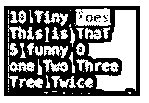
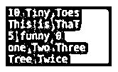
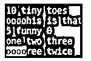

# Linux 中的 SED 命令

> 原文：<https://www.educba.com/sed-command-in-linux/>

## Linux 中 SED 命令简介

下面的文章提供了 Linux 中 SED 命令的概要。SED 是我们经常使用的文本操作工具，我们认为很多 shell 脚本都经常使用，SED 代表流编辑器，基本上允许您在不打开文件的情况下操作文本文件替换、替换、搜索、插入、删除。此外，SED 使我们能够使用正则表达式来匹配文件中的表达式并执行文本操作。

**语法:**

<small>网页开发、编程语言、软件测试&其他</small>

`sed OPTIONS [SCRIPT] INPUTFILE`

一些可用的选项有:

*   **-n，–静音，–静音:**抑制图案空间的自动打印。
*   **-f 脚本文件，–file =脚本文件:**添加脚本文件。
*   **-e 脚本，–expression = script:**将脚本添加到要执行的命令中。
*   **-l N，–line-length = N:**为“l”命令指定所需的换行长度 N。

### Linux 中 SED 命令的示例

下面给出了 Linux 中 SED 命令的示例:

#### 示例#1

**代码:**

`cat test|sed 's/t/T'`

**输出:**

**说明:**

*   我们要说替代正斜杠正斜杠正斜杠。我们将在第一个和第二个正斜杠之间给出我们想要替换的内容，我们想要替换的字符串，以及第二个要替换的内容，例如，我可以在这里说 T，然后在这里放一个大写的 T，因为我们要用大写的 T 替换小写的 T，如果我在这里按 enter，我们将会看到文本文件中的行。尽管如此，我们只是将每行的第一个 T 修改为大写；你会注意到那一行的第二个 T，第三个 T 和另一个 T 都不起作用，所以基本上，在这一点上，我们还没有修改原始文件。

#### 实施例 2

**代码:**

`sed 's/t/T/g text`

**输出:**

**说明:**

*   g，代表全局，意思是找到所有小写的 T 并转换它们，这就是我们现在得到的，我们得到了每一个 T，现在每一行都是大写的，我们还没有修改实际的文件。

#### 实施例 3

**代码:**

`sed 's/t/T/g text>new.txt`

**说明:**

*   我们可以通过重定向来创建一个新文件，这样我们就可以把它的输出放入 new.txt 或者你想叫它什么都可以，现在我们可以把 new.txt 取出来了。

#### 实施例 4

**代码:**

`sed -i 's/t/T/g text
Cat text`

**输出:**

 

**说明:**

*   原始文件现在已更改。

#### 实施例 5

**代码:**

`sed 's/^t/oooo/g text`

**输出:**

**说明:**

*   比方说，我只是想在每行的开始替换 T，所以这是这样的，tree 都是行的开始，所以我们要在行的开始找一个 T，我们可以在这里给它一个脱字符，在标准键盘上，不同的键盘上没有什么困难，但在大多数键盘上，它超过了 6。现在它说这个脱字符号表示行的开始，所以它说我们在 t 行中寻找开始，因此，它仍然有点像是字符串的一部分，你知道它是我们，我们要做的是用 oooo 替换它，所以现在我将再次按 enter，我们不是，我们没有–I，所以我们不修改原始文件，我们只是以不同的方式显示它，我们将在这里输入。你可以看到并不是所有的 T 都被替换了，只有每行开头的 T 被替换了。

#### 实施例 6

**代码:**

`sed 's/t$/oooo/g text`

**说明:**

*   我们可以对行尾做同样的事情，现在插入符号表示行首，美元符号表示行尾，所以这将找到每一行以 T 结尾的行，因为它将是 T，然后是行尾，我们将用 oooo 替换它。我敲回车，你可以看到 T 就在那里。哦，我们也可以轻松地做到这一点；在这种情况下，我们将 or 任意字符串。还有，我们有三个 E 结尾和两个 E 结尾，它们都在我们要输入的结尾对齐，你可以看到这里有 O 和 O，当然，如果我们做了两个 E，它只会影响三个，因为只有一个 E 和两个，然后是行尾。

#### 实施例 7

**代码:**

`sed 's/[0-9]/*/g text`

**输出:**

 

**说明:**

*   我们要寻找的是，我可以在方括号中说 0-9，意思是查看所有数字字符，我可以说替换每个数字字符，所以我们不是在查看字母字符，我们不是在查看字母表中的字母，而是在查看数字，并用一个严格的替换它们，这也是在文本文件中没有，我听到有人在修改文件，只是改变了输出，你可以看到到处都有一个数字，现在有一个星号，现在我可以用破折号 z 做同样的事情。

#### 实施例 8

**代码:**

`sed 's/[a-zA-Z]/*/g' text`

**输出:**

 

**说明:**

*   正在搜索[a-zA-Z]并用*替换。

#### 实施例 9

**代码:**

`sed 's/[A-Z]i/*/g' text`

**输出:**

 

**说明:**

*   我们会说替换所有大写字母，后面跟着一个 I，所以这里我们它替换了 T 和 I，因为它在寻找这两个东西，并且替换为它不是寻找一个或另一个，而是寻找两个在一起，眼睛跟随大写字母的唯一地方是单词 tiny。

### 结论

我们已经看到了使用 SED 命令替换字符串、查找和替换或将结果重定向到新文件或修改同一个文件的逐步定义和示例。

### 推荐文章

这是 Linux 中 SED 命令的指南。这里我们分别用例子来讨论 Linux 中 SED 命令的介绍。您也可以看看以下文章，了解更多信息–

1.  [Linux Ping](https://www.educba.com/linux-ping/)
2.  [Linux nslookup](https://www.educba.com/linux-nslookup/)
3.  [Linux 大小](https://www.educba.com/linux-size/)
4.  [Linux 存储库](https://www.educba.com/linux-repository/)

