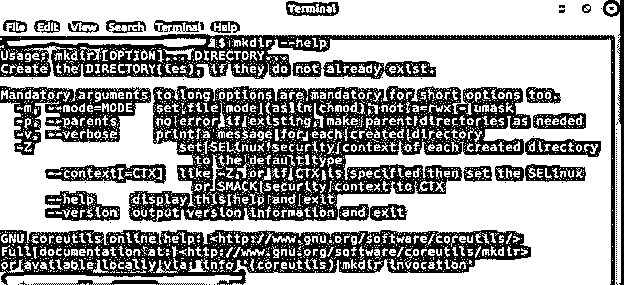

# Linux 中的 Mkdir 命令

> 原文：<https://www.educba.com/mkdir-command-in-linux/>

## Linux 中 Mkdir 命令简介

我们知道 Linux 系统是由文件和目录组成的。可能需要在我们的系统中创建目录，这对于某些操作是至关重要的。所以我们需要随意创建这样的目录或文件夹。在 Linux 中，有一个名为 mkdir 的命令，用于在操作系统中创建目录或文件夹。在本文中，我们将讨论如何使用带有各种命令行选项的 mkdir 命令。

命令描述:mkdir 命令用于在我们的 Linux 操作系统中创建目录。每个需要创建的目录还会包含一些用户想要的文件或子目录。在 mkdir 命令的帮助下，我们可以通过设置目录的权限来创建多个目录。没有许可，我们不能创建目录，我们将面临一个错误说“许可被拒绝”。必须创建的目录需要命名，以便 mkdir 命令在该名称下不存在目录时创建该目录。但是如果该名称已经存在，该命令将不会创建该目录。可以命名创建多个目录，也可以使用 mkdir 命令以特定顺序命名子目录。

<small>网页开发、编程语言、软件测试&其他</small>

### 句法

下面给出了 Linux 中 Mkdir 命令的语法。

`mkdir  [OPTION]... DIRECTORY...`

这个命令是创建目录的基本命令。我们只需要命名我们想要创建的目录。如果我们想创建多个目录，我们可以使用下面的命令。

`mkdir Doc media pics`

为了创建多个目录，我们需要给出目录名，中间要有一个空格。

### Linux 中 Mkdir 命令的选项

mkdir 命令可以使用很多选项。让我们逐一讨论。

`mkdir [-m=mode] [-p] [-v] [-Z=context] directory [directory ...]`

mkdir 命令可以使用很多选项。

让我们逐一讨论:

**-m 选项:**该-m 选项用于设置目录的模式，即对于创建的目录的读、写、执行等权限。

`$ mkdir -m a=rwx [directories]`

**-p 选项:**该选项允许用户根据需要创建父目录。如果目录已经存在，将不会显示任何错误。

`$ mkdir -p [directories]`

**-v，–verbose:**此选项显示创建的每个目录的详细信息。

`$ mkdir -v [directories]`

**–版本:**该选项将打印版本信息并退出。

`$ mkdir –version`

**–帮助:**该选项将显示 mkdir 命令的信息。它将列出命令的语法以及 mkdir 命令中使用的选项和每个选项的简要描述。

`$ mkdir --help`

**-Z 选项:**该选项用于在创建时设置特定目录的缺省 SELinux 规则。

`$ mkdir -Z [directories]`

### 在 Linux 中实现 Mkdir 命令的例子

让我们讨论几个例子，以便更好地理解:

#### 示例#1

`$ mkdir pics`

上述命令将有助于在用户的当前目录中创建名为 pics 的目录。

#### 实施例 2

`$ mkdir ~pics`

上面的命令将在用户的主目录中创建名为 pics 的目录

#### 实施例 3

要一次创建多个目录，请使用以下命令。

`mkdir sample1 sample2 sample3`

如果目录 sample1、sample2 和 sample3 不存在，上述命令将创建它们。

#### 实施例 4

`mkdir a/b`

上述命令将在目录 a 中创建名为 b 的目录。如果目录 **a** 不存在，则会显示一条错误消息。如果父目录不存在，使用–p 选项将创建父目录。

#### 实施例 5

`rmdir –p a/b`

它与示例 3 中显示的命令相同。mkdir 命令将创建目录 a(如果它不存在),并在目录 a 中创建一个名为 b 的目录。

### 在 Linux 中使用带选项的 Mkdir 命令

现在我们将讨论如何使用 mkdir 命令和选项。

*   如何使用 Mkdir 命令创建父目录？

`$ mkdir -p test/testdir`

上面的命令将在目录 test 中创建名为 testdir 的目录。如果目录测试由于–p 选项的存在而不存在，则将创建目录。要检查创建的目录，请使用选项-v。

**输出:**

*   如何获得 Mkdir 命令的帮助？

要获得有关 mkdir 命令的帮助，请使用以下命令。

`$ mkdir --help`

**输出:**

您也可以使用 man 命令来显示 **rmdir** 命令的手册页。

`$ man mkdir`

*   **如何显示 Mkdir 命令的版本信息？**

要显示版本信息，使用–version 选项和 **mkdir** 命令，如下所示。

`$ mkdir --version`

**输出:**

*   **如何为创建的目录设置权限？**

您可以使用–m 命令行选项为创建的目录设置权限。要设置权限，请使用下面显示的命令。

`$ mkdir –m a=rwx sample1`

上面的命令将创建一个名为 sample1 的目录，所有访问该目录的用户都可以使用该目录的读、写和执行权限。如果你想给用户只读权限，你可以设置值 a=r，如果你想给用户读写权限，你可以设置值 a=rw。

*   **如何在详细模式下创建目录？**

我们可以使用–v 选项在详细模式下创建新目录。当您使用此选项创建新目录时，它将在屏幕上生成以下详细输出。

**输出:**

### Linux 中 Mkdir 命令的优点

*   它可以一次创建多个目录。
*   mkdir 命令简单易用，初学者和专家都可以使用。

### 结论

在本文中，我们讨论了 mkdir 命令以及如何将 mkdir 与各种命令行选项一起使用。这个命令简单易用，新手和专家都可以使用。希望这篇文章有用。谢谢你。

### 推荐文章

这是 Linux 中 Mkdir 命令的指南。这里我们讨论 Linux 中 Mkdir 命令的介绍、语法、例子和选项，并附有解释。您也可以浏览我们的其他相关文章，了解更多信息——

1.  [Unix 命令](https://www.educba.com/unix-commands/)
2.  [Ubuntu 命令](https://www.educba.com/ubuntu-commands/)
3.  [Linux 过滤命令](https://www.educba.com/linux-filter-commands/)
4.  [Linux tee 命令](https://www.educba.com/linux-tee-command/)

