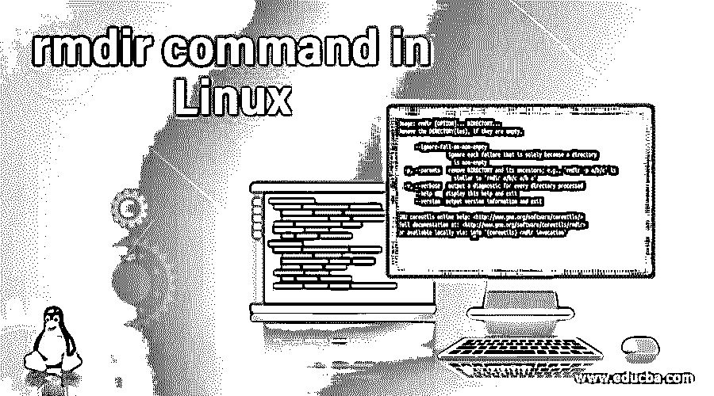

# Linux 中的 rmdir 命令

> 原文：<https://www.educba.com/rmdir-command-in-linux/>

## Linux 中 rmdir 命令简介

我们知道 Linux 系统是由文件和目录组成的。我们的系统中可能有大量不再需要的目录。所以我们需要定期清理它们。在 Linux 中，有一个名为 rmdir 的命令，用于从我们的 Linux 文件系统中删除目录。在本文中，我们将讨论如何使用带有各种命令行选项的 rmdir 命令。

### rmdir 命令描述

rmdir 命令用于从我们的 Linux 操作系统中删除空目录。每个需要删除的目录都不应该包含任何文件或子目录。否则，rmdir 命令无法从我们的文件系统中删除该目录。

<small>网页开发、编程语言、软件测试&其他</small>

如果指定的目录不为空，则 rmdir 命令不会删除该目录，它会尝试删除命令中指定的其他目录。目录按照在命令行中指定的顺序删除，即从左到右。

要同时删除父目录和父目录的子目录，应该首先提到子目录，这样父目录就为空，rmdir 可以删除它。rmdir 命令有点类似于 rm -d 命令。如果您希望删除一个非空目录，那么您可以使用带有递归选项的 rm 命令。

#### 句法

rmdir 命令的语法如下所示。

`rmdir [-p] [-v, --verbose] [--ignore-fail-on-non-empty] [ directory names....]`

这里 p、v 和 ignore-fail-on-non-empty 是在 **rmdir** 命令中使用的选项。

#### 选择

rmdir 命令可以使用很多选项。让我们逐一讨论。

*   **-help:** 这将显示 rmdir 命令的语法以及选项。它还将提供每个选项的简要说明。
*   **-p 选项:**该选项将删除指定的目录及其父目录。在此选项中，每个指定的目录名将被视为从最后一个组件开始删除所有目录的路径名。
*   **–ignore-fail-on-non-empty:**通常当你试图使用 **rmdir** 命令删除一个非空的目录时，会产生一个错误信息。此选项不会报告纯粹因为非空目录而出现的失败消息。
*   **-v，–verbose:**该选项显示正在处理的每个目录的详细信息。
*   **-v，–版本:**该选项将打印版本信息并退出。

### Linux 中 rmdir 命令的示例

让我们讨论几个例子来更好地理解 rmdir 命令。

#### 示例#1

`rmdir sampledir1`

如果名为 sampledir1 的目录为空，上述命令将删除该目录。如果它不为空，则会产生错误消息。

在这种情况下，您必须先移除目录内容，然后再删除它。

#### 实施例 2

要一次删除多个目录，请使用以下命令。

`rmdir sample1 sample2 sample3`

如果目录 sample1、sample2 和 sample 3 为空，上述命令将删除它们。如果任何目录不为空，则将显示该特定目录的错误消息，其他目录将从文件系统中删除。

**输出:**

#### 实施例 3

`rmdirdir/subdirect dir`

如果目录为空，上述命令将删除名为 dir/subdirect 的目录，然后如果目录 dir 在 dir/subdirect 删除后为空，则目录 dir 也将被删除。

#### 实施例 4

`rmdir -p dir/subdirect`

它与示例 3 中显示的命令相同。rmdir 命令将删除目录 dir/subdirect，然后它将删除目录 dir。

### 如何忽略非空目录？

默认情况下，如果您试图删除一个非空目录，rmdir 命令将产生一条错误消息。要忽略删除非空目录时出现的错误消息，请使用–ignore-fail-on-non-empty 选项。

**语法:**

`$ rmdir--ignore-fail-on-non-empty test-dir`

**输出:**

### 如何使用 rmdir 命令删除父目录？

rmdir 命令还可以对父目录执行操作。它能够一次性删除目录及其父目录。您可以借助-p 选项来利用这个特性。

考虑下面的例子。

`$ rmdir -p test/testdir/`

上述命令将删除 test 和 testdir 目录。为此，除了要删除的空目录之外，所有父目录都应该为空。

### 如何获得 rmdir 命令的帮助

要获得关于 rmdir 命令的帮助，请使用以下命令。

`$ rmdir --help`

以下输出显示了对 **rmdir** 命令的详细描述。

**输出:**

您还可以使用 man 命令来显示 rmdir 命令的手册页。

`$ man rmdir`

### 如何显示 rmdir 命令的版本信息？

要显示版本信息，请使用–version 选项和 rmdir 命令，如下所示。

`$ rmdir --version`

将产生以下输出。

**输出:**

### rmdir 和 RM–r 之间的区别

您还可以通过在 rm 命令旁边使用-r 选项来使用该命令删除目录。那么这两个命令的基本区别是什么呢？答案很简单。rm 命令也可用于删除非空目录，但 rmdir 命令仅用于删除空目录。绝对没有办法使用 rmdir 命令删除非空目录。

### Rmdir 命令的优点

*   rmdir 命令只删除空目录，这有助于我们避免意外丢失数据。这是一个重要的特性，因为在 Linux 系统中，一旦数据被删除，就很难恢复。
*   它可以一次删除多个目录。
*   rmdir 命令简单易用，初学者和专家都可以使用。

### 推荐文章

这是一个 Linux 中 rmdir 命令的指南。在这里，我们还讨论了 rmdir 命令的介绍和如何获得帮助，以及一个例子和它的代码实现。您也可以看看以下文章，了解更多信息–

1.  [Linux 中的 Mkdir 命令](https://www.educba.com/mkdir-command-in-linux/)
2.  [Linux 中的 PS 命令](https://www.educba.com/ps-command-in-linux/)
3.  [删除目录 Linux](https://www.educba.com/remove-dir-linux/)
4.  [Linux 过滤命令](https://www.educba.com/linux-filter-commands/)

